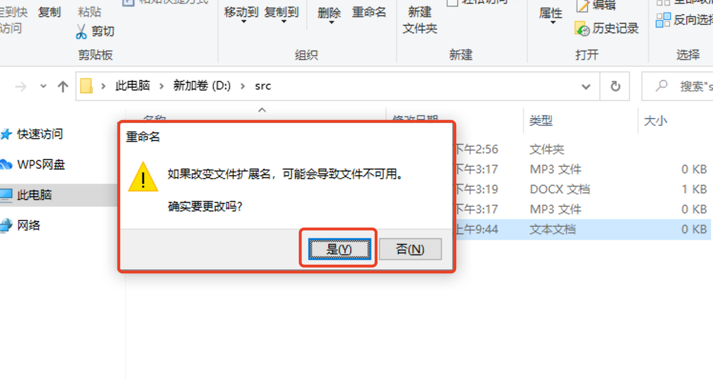
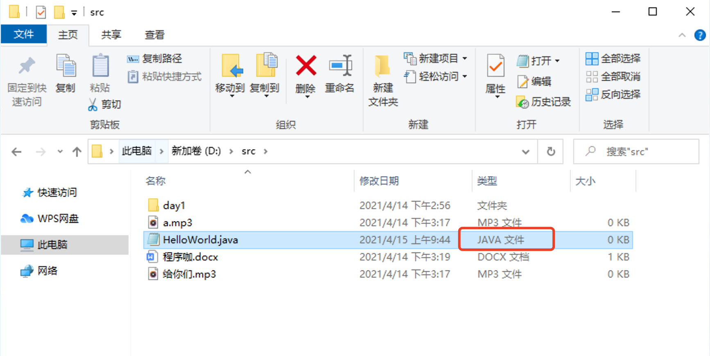
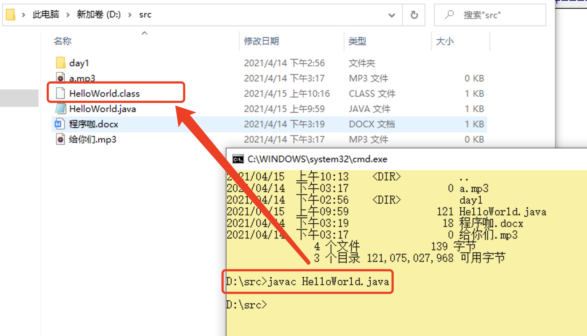
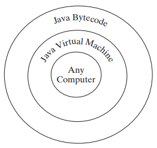
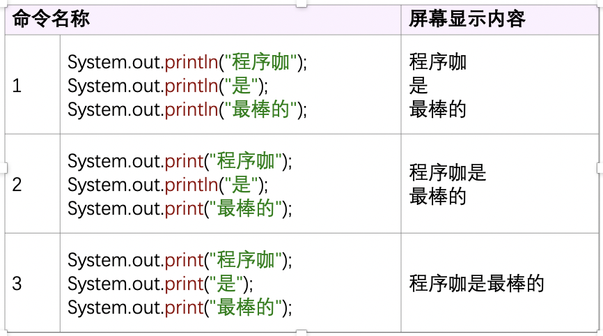
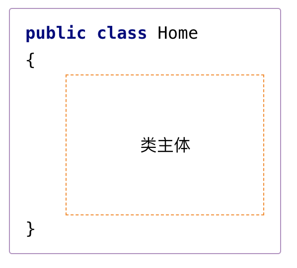

## 人生中的第一个Java程序：HelloWorld

> 作者：韩茹
>
> 公司：程序咖（北京）科技有限公司
>
> 程序咖：IT职业技能评测平台
>
> 网址：https://www.chengxuka.com


任务

```
1.编写HelloWorld程序
2.尽可能的理解程序
3.编译源文件
4.运行程序
```


我们已经做好了足够的准备，现在可以编写我们人生中的第一个Java程序了。有米有一种跃跃欲试的赶脚。。。

### 一、编写HelloWorld程序

编写Java的源文件，就是后缀是.java的文件。可以使用任何文本编辑器来创建和编辑源文件。

首先现在我们的电脑D盘的src目录下，新建一个文本文档：


然后修改文件名字为HelloWorld，文件后缀由txt改为java。


此时会弹框问是否要修改后缀，我们选择是。



要注意，文件类型一定是java类型：




**<font color="red" size="5">踩坑：要设置文件夹选项，显示文件扩展名。如果不显示文件扩展名，那创建的源文件实际上还是个txt文件。</font>**


创建好java的源文件后，我们需要在里面编写java的代码。使用文本编辑器打开，此处我使用的是editplus，你也可以选择其他，我们在里面编写以下代码：

```java
public class HelloWorld 
{
	public static void main(String[] args) 
	{		
		System.out.println("Hello World!");
	}
}
```


### 二、编译源文件

编写好java的源文件后，我们需要进行编译程序，也就是说需要将.java为后缀的文件，编译为.class为后缀的字节码文件。

打开dos窗口：

```shell
//先切换到d盘：
C:\Users\ruby>d:
//进入src文件夹
D:\>cd src
//查看该目录下的内容
D:\src>dir
```


接下来我们就可以编译这个源文件了，在dos窗口下继续输入命令：

```
//javac 源文件名.java
D:\src>javac HelloWorld.java
```




javac是Java编程语言的编译器。它可以获取源文件，并将其内容转换为Java虚拟机可以理解的指令。该文件中包含的指令称为字节码。这个过程就是我们所说的编译过程。指的就是将java的源文件编译生成字节码文件。

所以我们使用javac这个命令，HelloWorld.java是要编译的java源文件。如果源文件中的代码没有问题，那么编译成功后，就会在该目录下生成.class文件。当然，如果有错误，那么你需要根据错误提示信息，先排错。然后再重新编译。

如果执行的类文件不存在， 则会发生**NoClassDefFoundError** 。如果您执行的类文件没有 **main** 方法，或者您错误键入了 **main** 方法（例如，不小心写成了mian等），则会发生**NoSuchMethodError**。


### 三、运行程序

到此，已经生成了字节码文件，我们就可以去运行这个字节码文件了。Java应用程序启动器工具（java）使用Java虚拟机来运行应用程序。

继续在dos窗口下输入：

```
//java 字节码文件名
D:\src>java HelloWorld
```


java是运行java字节码文件的一个命令。后面跟着要执行的字节码文件名。

程序的运行结果是在这里打印出Hello World！

**<font color="red" size="5">踩坑：执行程序时， 请勿在命令行中使用扩展名 .class。使用 java ClassName 运行该程序。如果 在命令行中使用 java ClassName.class，则系统将尝试获取 ClassName.class.class</font>**

### 四、关于HelloWorld程序的说明

接下来，让我们看看源代码中class，public，static，void，main，String []，System.out.println（）等含义是什么。

- class关键字用于在Java中声明一个类。

- public关键字是表示可见性的访问修饰符。这意味着它对所有人可见。

- static是一个关键字。如果我们将任何方法声明为静态方法，则称为静态方法。静态方法的核心优点是不需要创建对象来调用静态方法。main方法由JVM执行，因此不需要创建对象来调用main方法。这样可以节省内存。

  如果这些我们目前还理解不了，也没有关系，先记住，后面面向对象中会详细讲解。

- void是方法的返回类型。这意味着它不返回任何值。

- main代表程序的起点。

- String [] args用于命令行参数。我们将在稍后学习。

- System.out.println（）用于打印语句。


注意：

```
1. 如果类不是public修饰的 ， 类名可以和源文件的名字不同，但是如果 类名是public修饰的，那源文件的名字必须和	类名相同
2. 一个源文件中可以有多个类
3. 一个源文件中至多只有一个用public修饰的类
```

执行Java程序时，JVM首先使用称为**类加载器**的程序将**类**的字节码加载到内存中 。如果您的程序使用其他类，则类加载器会在需要它们之前动态加载它们。装入类后，JVM使用称为**字节码**验证程序的程序 检查**字节码** 的有效性，并确保字节码不违反Java的安全性限制。Java强制执行严格的安全性，以确保Java类文件不会被篡改并且不会损害您的计算机。

**<font color="red" size="5">踩坑：如果声明类时有public修饰符，那么类名必须和源文件名一致。</font>**

### 五、最后

最后，让我们再来梳理一下如何编写出第一个程序，以及它的运行。

首先，我们要编写源代码。HelloWorld.java。

其次，我们要将源文件进行编译，生成对应的字节码文件。

​	javac命令进行编译

最后，我们就可以执行字节码文件了。

​	java命令进行执行


最后Java字节码可以在装有Java虚拟机的任何计算机上执行。




附带一段大白话来解释这一节：

首先，“程序就是一组（系列）命令。首先，执行第一个命令，然后执行第二个命令，然后执行第三个命令，依此类推。执行完所有命令后，程序就结束了。”

比如说你可以给一只狗下命令：‘坐！’，‘叫！’；对一只猫下命令：‘嘘！’；对一个人下命令：‘别动，否则我开枪了！’；

用 Java 语言编写的程序由 Java 虚拟机 (JVM) 来执行。JVM 是一个特殊的程序，它知道如何执行用 Java 语言编写的程序。

它的命令列表涵盖范围很大。例如，这个System.out.println()命令可以用来在屏幕上显示‘HelloWorld！’。

这是一个超级简单的命令：

```java
System.out.println("Hello World!");
```

下面是一些命令的例子：”

| 命令名称                            | 命令描述（它做什么）       |
| ----------------------------------- | -------------------------- |
| `System.out.println(1);`            | 在屏幕上显示数字 `1`       |
| `System.out.println("HelloWorld");` | 在屏幕上显示`"HelloWorld"` |
| `System.out.println("程序咖！");`   | 在屏幕上显示`"程序咖！"`   |

“实际上，这只是一个 `System.out.println` 命令。我们使用圆括号将参数传递给命令。根据参数的值，相同的命令可以执行不同的操作。”

如果要在屏幕上显示一些文本，可以在文本两侧加上双引号。

单引号是这样的：`'`。双引号是这样的：`"`。双引号与两个单引号是不同的。请不要将它们混淆。双引号的键位于键盘上的 Enter 键旁边。


打印命令有两个版本：`System.out.println()` 和 `System.out.print()`

如果你使用几次 `System.out.println()` 命令，就会发现每次传递给该命令的文本都会显示在单独的行上。如果你使用 `System.out.print()` 命令，则文本显示在同一行。例如：



请记住这一点： `println` 不会从新行开始打印文本。它会在当前行上打印文本，但会使下一个文本打印在新行上。


其次，我们聊聊一些"原则"。

第一个原则，在 Java 编程语言中，每个命令都单独占用一行。分号必须放在命令的末尾。

假设我们想在屏幕上三次显示‘Hello，程序咖！’。应该这样编写：

该程序由三个命令组成：

```java
System.out.println("Hello，程序咖！");
System.out.println("Hello，程序咖！");
System.out.println("Hello，程序咖！");
```

第二个原则，一个程序不能只包含命令。

想象一下公寓里的一个房间。一个房间不能独立存在。它是某个公寓的一部分。一个公寓也不能独立存在。它是某个建筑的一部分。另一方面，我们可以说一个建筑物被分为多个公寓，而一个公寓被分为多个房间。

一个命令就像一个房间。在 Java 编程语言中，命令不能单独存在。它是函数的一部分（在 Java 语言中，‘函数’也称为‘方法’）。方法是类的一部分。换句话说，类被划分为多个方法，而方法被划分为多个命令。

因此，类就是一个公寓楼，函数/方法是一个公寓，而命令是一个房间。

Java 中的程序由类组成。 可能有数万个类。最小程序含有一个类。对于每个类，都创建一个单独的文件。文件的名称与类的名称相匹配。

假设你决定创建一个描述住宅 (home) 的类。你需要创建一个将保存在 Home.java 文件中的 Home 类。

如果你想在程序中描述一只猫 (cat) ，那么你必须创建一个 Cat.java 文件，并在文件中声明 Cat 类，等等。

这些文件包含用 Java 编程语言编写的代码（文本）。通常一个类的代码由‘类名’和‘类主体’组成。类主体写在大括号内。这就是 Home 类（Home.java文件）的样子：



类主体可能包含多个变量（也称为数据）和方法（‘函数’）。此处先不做过多描述。后面慢慢学习。

启动程序的类可以有任何名称，但用于启动程序的‘main’方法必须是固定格式：


main()函数内部，就是我们要执行的各种命令了。