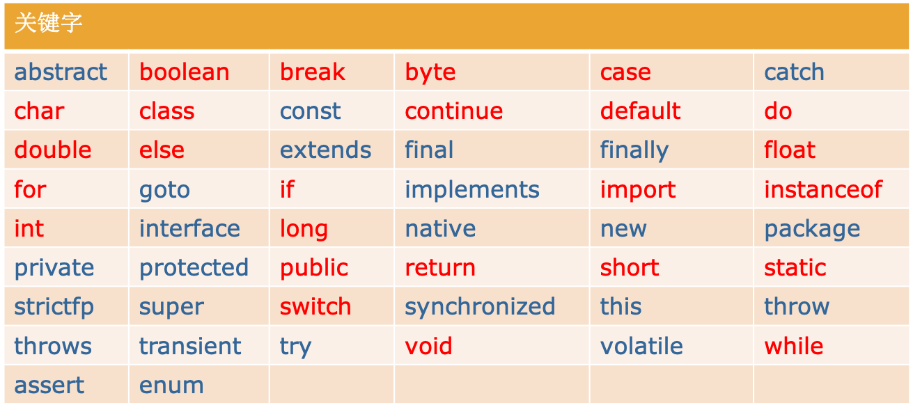

## Java编码规范

> 作者：韩茹
>
> 公司：程序咖（北京）科技有限公司
>
> 程序咖：IT职业技能评测平台
>
> 网址：https://www.chengxuka.com


任务

```
1.书写格式
2.注释
3.标识符
4.关键字和保留字
```


### 一、书写格式

- 代码层级之间必须锁进(Tab：一个制表位)

- 一行只写一句代码
- 每行代码要以分号结束
- 所有的符号必须都是英文的
- Java代码严格区分大小写
- {},()等都成对使用


### 二、注释

作用：用于解释说明程序：类，方法，变量，一行代码。。。

> 给程序员看的，JVM不关心，也不执行注释。


#### 2.1 单行注释 

用的最多的一种注释。

```java
//     适用于注释一行
```

```java
//喝醉了，稍后再修复错误
//魔法。请勿触摸
//此处是冒泡排序
//当我编写这段代码时，只有上帝和我明白我在做什么，但现在，只有上帝才知道
//。。。
```


#### 2.2 多行注释

通常用于解释一段代码的。

```java
/*多行注释     适用于同时注释很多行*/
```

```java
/*
* 我把所有这些代码，都献给我的老公王二狗，
* 感谢他一直以来对我工作的支持，
* 照顾我们的三个孩子，一条狗，两只猫,
* 期待某一天软件被公开发行
*/
```


#### 2.3 文档注释 

```java
 /**  
  	要求放在类上面， 标注本类的作用  作者  时间等信息
 */
//可以生成帮助文档：javadoc -d 目录 源文件名
```


```java
/**
 * 我人生中的第一个java程序
 * @author hanru
 *
 */
public class HelloWorld {
	/**
	 * 此处是主函数，程序的入口
	 * @param args 这个参数，暂时还未用到
	 */
	public static void main(String[] args) {
		System.out.println("Hello World!");
	}
}

```


最后，强调一下，注释对于一个程序，一个项目来讲，非常的重要，我们要习惯添加注释。


### 三、标识符

#### 3.1   什么是标识符	 

```
Java对包、类、方法、参数和变量等要素命名时使用的字符序列称为标识符。
```

#### 3.2 标识符的命名规则

```
1. 由字母（含英、中、日、俄等）、数字、下划线（_）和美元符号（$ 音：dollar）组成。
2. 不能以数字开头。
3. 区分大小写。
4. 长度无限制。（一般不要超过15个字符）
5. 不能是Java中的保留字和关键字。
```

#### 3.3 标识符命名习惯

```
1. 标识符命名习惯：见名知意。(英文单词)
2. 变量名，方法名，参数名: 首字母小写，如果多个单词组成，第一个单词首字母小写，剩下的单词首字母大写（驼峰式命名法）
3. 类名：单词首字母大写，多个单词组成每个单词首字母大写（帕斯卡命名法）    
```


### 四、关键字和保留字

关键字：Java中有一些赋予特定的含义，有专门用途的字符串称为关键字（keyword）。全部为小写
保留字：没有定义用途，但保留备用。goto、const




