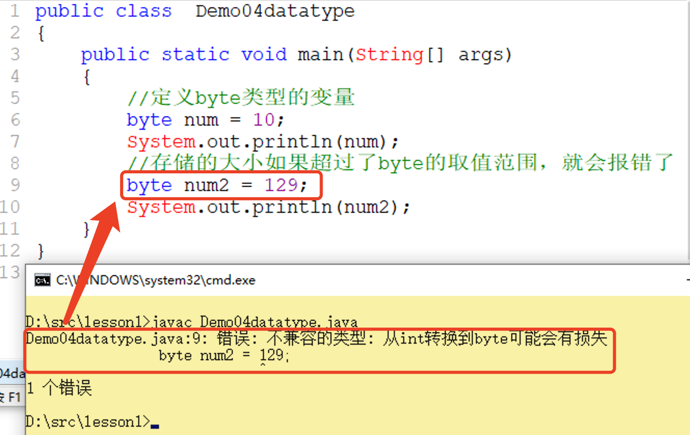
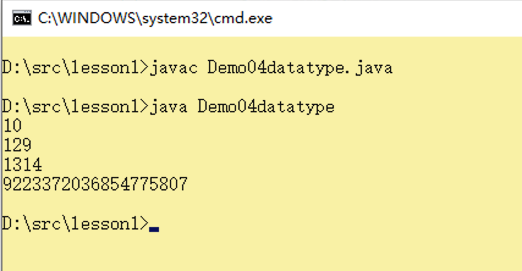
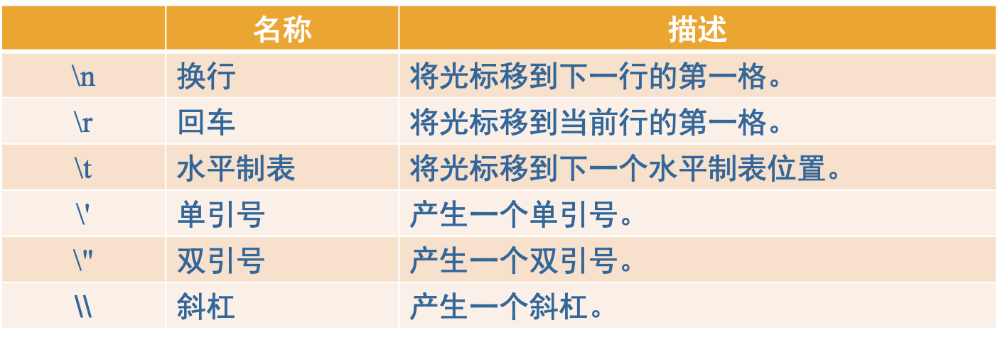
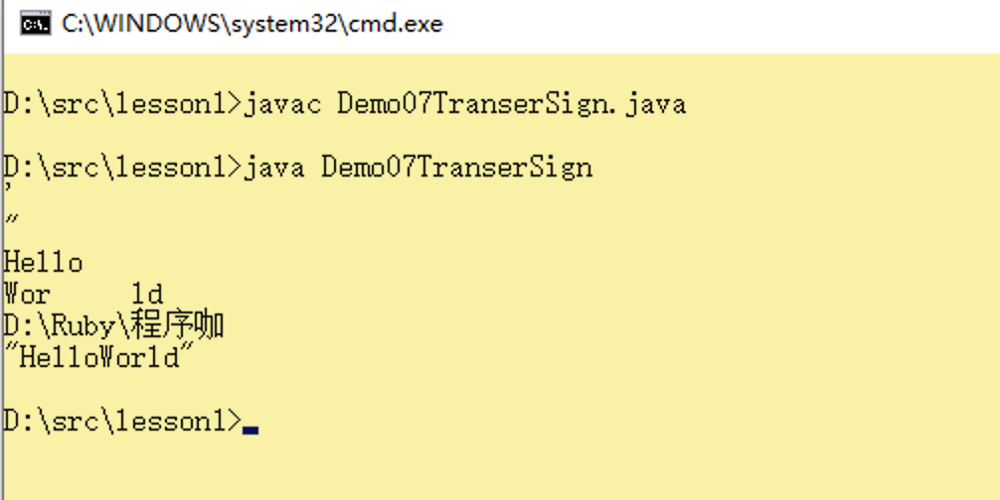
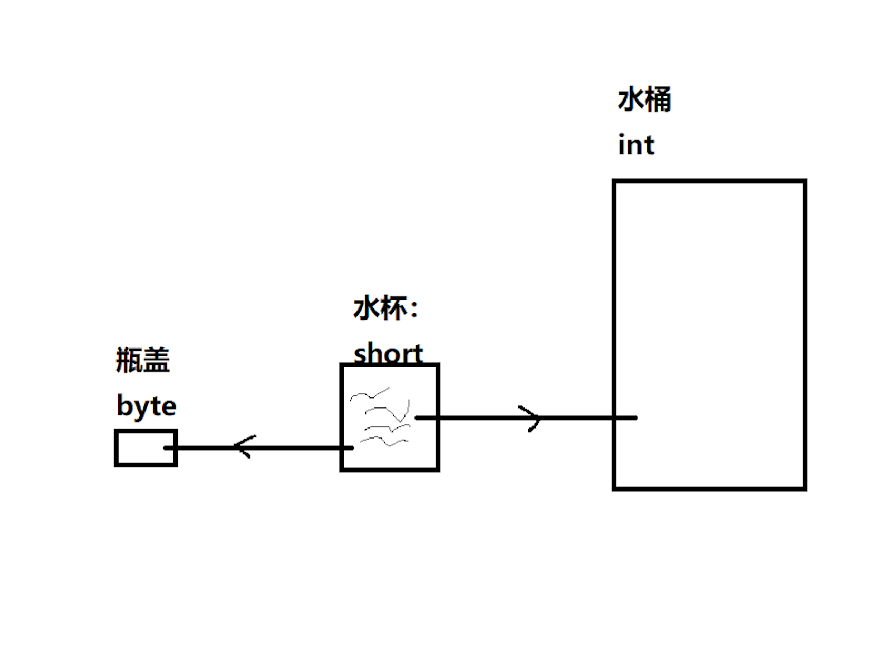

## Java的数据类型

> 作者：韩茹
>
> 公司：程序咖（北京）科技有限公司
>
> 程序咖：IT职业技能评测平台
>
> 网址：https://www.chengxuka.com


任务

```
1.数据类型的分类
2.基本数据类型有哪些
3.每种基本数据类型所占用的内存空间以及取值范围
4.数据类型之间的转换
```


Java语言是强类型语言：对数据类型的要求很严格。**声明是什么类型的变量，就要存储什么类型的数值。**

### 一、数据类型的分类

Java数据类型可分为两大类:**基本数据类型**和**引用类型**

基本数据类型：byte、short、int、long、float、double、char、boolean

引用数据类型：类、接口、数组、枚举（后面讲解）

本小节，我们先来探讨基本数据类型。


### 二、基本数据类型

#### 2.1 基本数据类型

基本数据类型，也叫原始数据类型。在Java中，有八种原始数据类型：布尔型，字符型，字节型，短型，整型，长型，浮点型和双精度。基本数据类型有以下4类8种：

- 整数型---- byte（字节）, short（短整型）, int（整型）, long（长整型）

  用于存储整数。

- 浮点型---- float（单精度浮点型）, double（双精度浮点型）

  用于存储小数。

- 字符型---- char

  用于存储字符

- 布尔型---- boolean

  用于存储true和false，表示对和错。


#### 2.2 基本数据类型的存储

Java中所有的基本数据类型都有固定的存储范围和所占内存空间的大小，而不受具体操作系统的影响，以保证Java程序的可移植性 。

##### 2.2.1 整数型


**byte：**它可以容纳-128到127之间的整数。通常用于节省内存，并且可以确定数字在字节数据类型指定的限制内。

```java
public class  Demo04datatype
{
	public static void main(String[] args) 
	{
		//定义byte类型的变量
		byte num = 10;
		System.out.println(num);
		//存储的大小如果超过了byte的取值范围，就会报错了
		byte num2 = 129;
		System.out.println(num2);
	}
}

```

定义变量进行赋值的时候，不能超出该种数据类型的取值范围：




**short：**短整型，就大小而言，它大于字节，并且小于整数。其范围是-32768到32767。


**int：**当short不足以容纳数字时使用，它的取值范围更大，int类型也是我们平时使用最多的一种整型类型。它也是整数类型中的默认类型。


**long：**当int的大小不足以容纳该值时使用，它的范围比int数据类型的范围更广，范围从-9,223,372,036,854,775,808到9,223,372,036,854,775,807。

**要声明long型可以加"l"或者"L"，小写l或者大写L。**

```java
public class  Demo04datatype
{
	public static void main(String[] args) 
	{
		//1.定义byte类型的变量
		byte num = 10;
		System.out.println(num);
		//存储的大小如果超过了byte的取值范围，就会报错了
		//byte num2 = 129;
		//System.out.println(num2);

		//2.short类型的变量，
		short s = 129;//取值范围：-32768~32767，共(65536个数值)
		System.out.println(s);

		//3.int类型的变量
		int i = 1314;//取值范围：-2147483648~2147483647
		System.out.println(i);

		//4.long类型的变量
		long l1 = 9223372036854775807L;//加L表示该数值是long类型的
		System.out.println(l1);


		int age = 19;
		long l2 = 100000000L;
	}
}

```

运行结果：



最后：

```java
Java语言的整型数值默认为int型，如：int i = 3;
要声明long型可以加‘l’或‘ L’，如：long  l = 3L;
注意:在数值超过int的表述范围时(2147483647),需要加上l/L对long赋值
```


##### 2.2.2 浮点型

浮点型所存储的数据，就是我们平时所说的小数。带精度的。


- float: 单精度浮点数（精度6,7位） 4个字节
- double:双精度浮点数 (精度15,16位)  8个字节


**注意：Java浮点型常量默认为double型，如要声明一个float型，则需在赋值的数字后面加f或F**，如： double  d = 3.14; float  f = 3.14f;

```java
Java浮点类型常量有两种表示形式
十进制数形式，必须含有小数点，例如:
3.14       314.0      0.314 
科学记数法形式，如
3.14e2      3.14E2      314E2 

注意：float double存储的数据都是近似值。
```


示例代码：

```java
public class Demo05FloatAndDouble 
{
	public static void main(String[] args) 
	{
		//1.单精度浮点数：float
		float f = 3.14f;
		System.out.println(f);

		//2.双精度浮点数：double
		double d = 1.23;//java中的小数，默认类型是double
		System.out.println(d);


		//科学计数法
		double d2 = 2000;//int,隐含了数据类型的自动转换
		System.out.println(d2);

		double d3 = 2000.0;//double
		System.out.println(d3);

		double d4 = 2E3;//相当于2*10的3次方
		System.out.println(d4);

		//1.7E308,相当于1.7乘以10的308次方。17后有307个0
		double d5 = 17000000000000000000000000.0;//double
		System.out.println(d5);


		//1.浮点类型：IEEE754标准。
	}
}

```

运行结果：


**<font color="red" size="5">踩坑：计算机中表示小数使用工业标准IEEE754，所以小数的加减运算，都是带精度的近似数，不一定和你口算的结果完全相同。</font>**

##### 2.2.3 字符型

char型数据用来表示通常意义上“字符”。表示单个的字符，使用单引号引起来的，但本质上是个数值，因为对应的字符编码值。Java字符采用Unicode编码，每个字符占两个字节，因而可用十六进制编码形式表示(Unicode是全球语言统一编码)。

- 可以通过单个字符直接赋值。

```java
char c1 = 'a';
```


- 也可以赋值为一个汉字(汉字也是一个字符，中文字符)

```java
char c2 = '中';
```


- 还可以通过编码进行赋值

```java
char c3 = 97;//ASCII美国标准信息交换码，相当于'a'
```


- 还可以通过16进制的编码值进行赋值

```java
char c4 = '\u0061';//相当于’a’
```


ASCII编码表：


示例代码：

```java
public class Demo06Char 
{
	public static void main(String[] args) 
	{
		//字符类型：char，使用单引号引起来
		char c = 'A';
		System.out.println(c);

		//使用编码值进行存储
		char c2 = 65;//65是字符A的编码值
		System.out.println(c2);

		//采用unicode编码：16进制赋值
		char c3 = '\u0041';
		System.out.println(c3);

		char c4 = '中';
		System.out.println(c4);
		System.out.println((int)c4);//将c4这个字符按照数值打印：其实就是该字符的编码值

		char c5 = 20013;
		System.out.println(c5);//中

		char c6 = '国';//22269
		System.out.println((int)c6);

		char c7 = 22269;
		System.out.println(c7);
	}
}


```

运行结果：


- 转义字符：Java语言中还允许使用转义字符，来将其后的字符转变为其它的含义。

  将字符进行转义-->语法上使用\
  1、将有特殊作用的字符，转为普通的字符，不再起作用
  				\',\",\\
  2、还可以将一些普通的字符，转为有特殊含义的作用
  				\n,\t




示例代码：

```java
public class Demo07TranserSign 
{
	public static void main(String[] args) 
	{
		/*
		转义字符：将字符进行转义-->语法上使用\
			1、将有特殊作用的字符，转为普通的字符，不再起作用
				\',\",\\
			2、还可以将一些普通的字符，转为有特殊含义的作用
				\n,\t
		*/

		char c = '\'';//'
		System.out.println(c);
		char c2 = '"';//"
		System.out.println(c2);

		System.out.println("Hello\nWor\tld");
		System.out.println("D:\\Ruby\\程序咖");//路径
		System.out.println("\"HelloWorld\"");//打印带双引号的helloworld
	}
}

```

运行结果：




##### 2.2.4 布尔类型

boolean类型适于逻辑运算，一般用于程序流程控制 
boolean类型数据只允许取值true或false，不可以用0或非0的整数替代true和false。

示例代码：

```java
public class Demo08Boolean 
{
	public static void main(String[] args) 
	{
		//定义一个boolean类型 的变量
		//该类型，只有2个值：true，false
		boolean b1 = true;
		boolean b2 = false;

		//"表达式"，就是一个式子，数值和一些运算符组成的
		// 3 + 5 -->8
		boolean b3 = 3 > 5;//3 > 5的计算结果：false
		//当给boolean类型变量赋值的时候，
		//可以直接赋值：true，false
		//也可以赋值为一个表达式：该表达式的计算结果是true或者false

		System.out.println(b1);
		System.out.println(b2);
		System.out.println(b3);//false


		
	}
}

```

运行结果：


##### 2.2.5 基本数据类型总结


### 三、基本数据类型的转换

Java语言是一种强类型语言，定义的变量数据类型和赋值的数据类型需要统一。但是允许程序上做一定程度的数据类型转换。分为以下两种：

- 自动类型转换
- 强制类型转换

**注意：boolean类型不能和其他类型进行转换。**



#### 3.1 自动类型转换

自动类型转换：容量小的类型自动转换成容量大的数据类型。这里的容量是指该数据类型的取值范围。

```
自动类型转换：数据类型取值范围小的转为取值范围大的
    1.byte ---> short--->int--->long--->float --->double
    2.char---> int
    3.byte,short,char三者在计算时会转换成int类型  （了解）
    4.int整型常量和字符常量在合理范围内可以直接赋值给 byte、short、int、char （了解）
```


示例代码：

```java
public class Demo09Convert 
{
	public static void main(String[] args) 
	{
		//1.自动类型转换：取值范围小的自动转为取值范围大的。
		short s1 = 123;//
		int i1 = s1;//隐含着将s1这个数值由short类型转为int，再赋值给i1这个变量
		System.out.println(s1);
		System.out.println(i1);

		byte b1 = 10;
		int i2 = b1;//byte-->int
		System.out.println(i2);
	}
}

```

运行结果：


#### 3.2 强制类型转换

强制类型转换：容量大的类型，被强制转换成容量小的数据类型。有可能造成精度降低或数据溢出，使用时要小心。

```java
强制类型转换：数据类型取值范围大的 转为 取值范围小的。
    long l = 100L;
		int i = (int)l;
但有可能造成精度降低或数据溢出，使用时要小心。

```

​    

需要使用强制转换符：就是在要转换的数值前，使用小括号扩起来要转换的数据类型。

```
(要转换的类型)要转换的数据
```


示例代码：

```java
public class Demo09Convert 
{
	public static void main(String[] args) 
	{
		//1.自动类型转换：取值范围小的自动转为取值范围大的。
		short s1 = 123;//
		int i1 = s1;//隐含着将s1这个数值由short类型转为int，再赋值给i1这个变量
		System.out.println(s1);
		System.out.println(i1);

		byte b1 = 10;
		int i2 = b1;//byte-->int
		System.out.println(i2);

		//2.强制类型转换
		//byte的取值范围：-128~127之间
		byte b2 = (byte)s1;//将s1由short类型，强制转为byte类型，再赋值给byte类型的变量b2
		System.out.println(b2);//123

		short s2 = 128;
		byte b3 = (byte)s2;//-128
		System.out.println(b3);

		double d1 = 2.5;
		int i3 = (int)d1;//强制转换：浮点到整数：直接截取整数部分，忽略小数
		System.out.println(i3);

		long l1 = 100L;
		float f1= l1;
		System.out.println(f1);


	}
}

```

运行结果：


最后：

	自动转换：
		A：两种类型兼容
		B：目标类型的取值范围  大于 源类型取值范围
	强制转换：
		A：两种类型兼容
		B：目标类型的取值范围	小于 源类型的取值范围
	
		需要加强制转换符的语法：说明要强制转为哪种类型
				(要转换的类型)数值
	
	取值范围：
		byte-->short-->int-->long-->float-->double
		char

