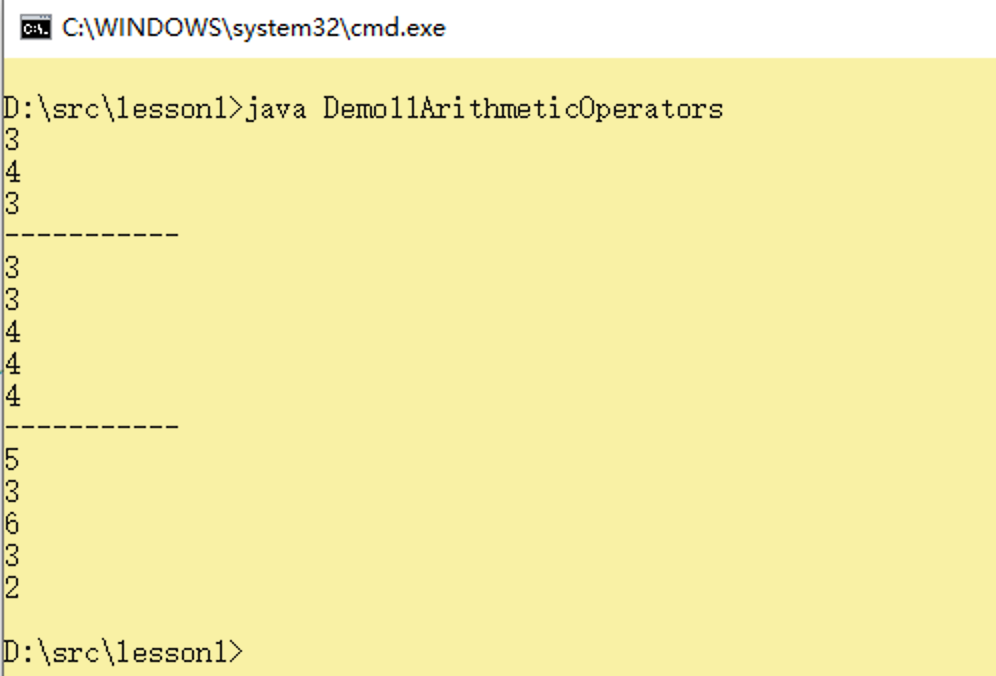
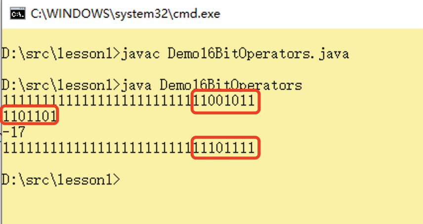
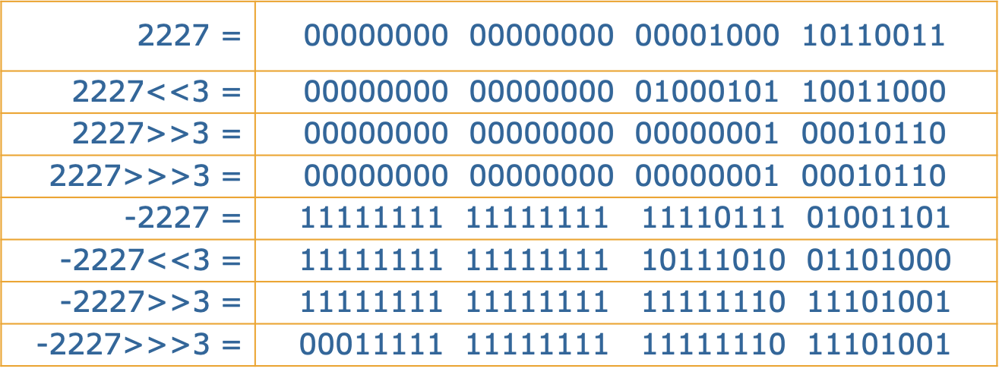

## Java中的运算符

> 作者：韩茹
>
> 公司：程序咖（北京）科技有限公司
>
> 程序咖：IT职业技能评测平台
>
> 网址：https://www.chengxuka.com


任务

```
1.算术运算符
2.赋值运算符
3.比较运算符
4.逻辑运算符
5.位运算符
6.位移运算符
7.三元运算符
```


### 一、表达式和运算符

**表达式**：表达式是符合一定语法规则的运算符和操作数的序列 

```java
a
5.0 + a
(a - b) * c - 4
i < 30 && i % 10 != 0 

  
表达式的类型和值
对表达式中操作数进行运算得到的结果称为表达式的值 
```


- 表达式的值

  对表达式中操作数进行运算得到的结果称为表达式的值

- 表达式的类型

  表达式的值的数据类型即为表达式的类型

- 表达式的运算顺序

  首先应按照运算符的优先级从高到低的顺序进行

  优先级相同的运算符按照事先约定的结合方向进行

**运算符：**什么是运算符？

a + b - 3

上面这个叫做表达式，其中a，b，3叫做操作数，中间的+，-就叫做运算符。

Java中的运算符，有以下几种：

```
算术运算符：+ 、 - 、 * 、 / 、 % 、 ++ 、 --
赋值运算符：= 、 += 、 -= 、 *= 、 /= 、 %=
关系运算符：> 、 < 、 >= 、 <= 、 == 、 !=
逻辑运算符：! 、 & 、 | 、 ^ 、 && 、 ||
位运算符：& 、 | 、 ^ 、 ~ 、 >> 、 << 、 >>>(了解)
字符串连接运算符：+
三目运算符 ?:  
```


### 一、算术运算符

算术运算符可以进行一些数学计算：

| 运算符 | 运算规则   | 范例            | 结果   |
| ------ | ---------- | --------------- | ------ |
| +      | 正号       | +3              | 3      |
| +      | 加         | 2+3             | 5      |
| +      | 连接字符串 | “中”+“国”       | “中国” |
| -      | 负号       | int a=3;-a      | -3     |
| -      | 减         | 3-1             | 2      |
| *      | 乘         | 2*3             | 6      |
| /      | 除         | 5/2             | 2      |
| %      | 取模       | 5%2             | 1      |
| ++     | 自增       | int a=1;a++/++a | 0      |
| --     | 自减       | int a=3;a--/--a | 3      |

说明：

- 加法运算符+，在连接字符串时要注意，只有直接与字符串相加才会转成字符串。

- 除法“/”当两边为整数时，取整数部分，舍余数。当其中一边为浮点型时，按正常规则相除。

- “%”取模(取余数)，小数取余没有意义。

- ++运算符：会在原有值得基础上自增1

- --运算符：会在原有值得基础上自减1


**使用算术运算符需要注意**

```
1.+有多种使用方法，
	对于一个操作数，可以作为正号，表示正数。
	对于两个操作数，可以用于求和运算。
	对于两个字符串，可以进行字符串的拼接。注意：+只要遇到字符串就起连接作用
2.-有两种使用方法，
	对于一个操作数，可以作为负号，表示负数。
	对于两个操作数，可以用于做减法运算。
3.对于java语言来讲，除法分为两种情况，一种是取商，一种是取余，也叫取模。
	取商：/
	取余：%
4.自增和自减，++，--，是对于整数来讲的。不要对其他类型进行操作。
```


基本的算术运算，示例代码：

```java
/*
算术运算符
*/
public class Demo10ArithmeticOperators 
{
	public static void main(String[] args) 
	{
		/*
		算术运算符：+，-，*，/,%,++,--
		*/
		int a = 10;
		int b = 3;
		//1.正数负数
		System.out.println(+a);
		System.out.println(-b);
		//2.加减乘除
		int sum = a + b;//求a+b的和，将结果赋值给sum变量
		System.out.println(sum);
		int sub = a - b;//求a-b
		System.out.println(sub);
		int mul = a * b;//求aXb
		System.out.println(mul);
		//除法：取商，取余
		int div = a / b;//取商
		System.out.println(div);//3

		int mod = a % b;//取余，取模
		System.out.println(mod);//1

	}
}

```

运行结果：


自增和自减，示例代码：

```java
/**
*算术运算符
*/
public class Demo11ArithmeticOperators 
{
	public static void main(String[] args) 
	{
		/*
		i++,++i，自增1
			i++和++i，都是给i进行加1运算
			执行结束后，i的值都会加1的。

			区别：过程不一样
				i++的值相当于i本身。执行之后，i给自己加了1.
					先计算，再加1

				++i的值相当于i+1.
					先加1，再计算

		i--,--i，自减1
		*/
		//1.自增和自减
		int x = 3;
		System.out.println(x);//3

		x++;//给自己自增1
		System.out.println(x);//4

		x--;//给自己自减1
		System.out.println(x);//3
		System.out.println("-----------");
	
		//2，前加和后加
		int i = 3;
		System.out.println(i);//3
		System.out.println(i++);//3
		System.out.println(i);//4

		i = 3;
		System.out.println(++i);//4
		System.out.println(i);//4
		System.out.println("-----------");

		//3.参与其他运算
		int j = 2;
		int res = j++ + 3; //2 + 3=5
		System.out.println(res);//5
		System.out.println(j);//3

		j = 2;
		res = ++j + 3; //3 + 3
		System.out.println(res);//6
		System.out.println(j);//3

		i = 2;
		i = i++;
		System.out.println(i);//2
	}
}

```

运行结果：




+遇到字符串，起连接作用。示例代码：

```java
public class Demo12ArithmeticOperators
{
	public static void main(String[] args) 
	{
		int num = 520;
		String msg = "程序咖";
		System.out.println(msg + num);


		int a = 3;
		int b = 2;
		//打印a加b的和，为5
		System.out.println(a + b);//5
		//此处因为遇到""内容了， 那么后面的+都起连接作用
		System.out.println(a + " + " + b + " = " + a + b);//3 + 2 = 32
		//想求a加b，可以尝试用小括号括起来
		System.out.println(a + " + " + b + " = " + (a + b));//3 + 2 = 5
	}
}

```

运行结果：


**<font color="red" size="5">踩坑：在进行除法计算的时候，如果除0程序就会报错，计算机无论如何也不会进行除0运算的，不信你打开计算器试试。😂</font>**


### 二、赋值运算符

在java语言中，我们需要使用赋值运算符给一些变量，或者常量等，进行赋值操作。我们一般使用等号=进行赋值。

| 运算符 | 运算规则   | 范例          | 结果 |
| ------ | ---------- | ------------- | ---- |
| =      | 赋值       | int a=2       | 2    |
| +=     | 加后赋值   | int a=2，a+=2 | 4    |
| -=     | 减后赋值   | int a=2，a-=2 | 0    |
| *=     | 乘后赋值   | int a=2，a*=2 | 4    |
| /=     | 整除后赋值 | int a=2，a/=2 | 1    |
| %=     | 取模后赋值 | int a=2，a%=2 | 0    |


赋值运算符：

```java
int a = 2;
int b = a * 3;
```

上面的运算符作用：将=右侧的数值2，赋值给=左侧的变量a。

如果等号右侧比较复杂，会将等号右侧进行计算，会将结果自动强转成等号左边的数据类型，再赋值给等号左边的变量。


在等号=的基础上，还有一些扩展的赋值运算符：+=，-=，*=，/=，%=。

```java
int a = 2;
a += 3;//相当于a = a + 3
```

上面两行代码，先定义变量a并进行赋值为2。第二行代码表示给a加3，然后再重新赋值给a。


示例代码：

```java
/**
*赋值运算符
*/
public class Demo13AssignmentOperators 
{
	public static void main(String[] args) 
	{
		/*
		赋值运算符：=，+=，-=，*=，/=,%=
			=：将=右侧的数值，赋值给=左侧的变量
			+=: a += b;//相当于：a = a + b
			-=: a -= b;//相当于：a = a - b
			*=：a *= b;//相当于：a = a * b
			/=：a /= b;//相当于：a = a / b
			%=：a %= b;//相当于：a = a % b
		*/
		int a = 3;//将3这个数值，赋值给变量a
		System.out.println(a);


		a += 2;//相当于：a = a + 2，就是将a加2后，再赋值给a
		System.out.println(a);//5

		a -= 1;//相当于：a = a - 1
		System.out.println(a);//4


		a %= 2;//相当于：a = a % 2
		System.out.println(a);//0

		a = 2;
		int b = 3;
		a *= ++b; // 相当于a =a*(++b)
		System.out.println(a);//8
		System.out.println(b);//4
	}
}

```

运行结果：


### 三、关系运算符

比较运算符，又叫关系运算符，它是用来判断两个操作数的大小关系及是否相等关系的，结果是布尔值true或者false 。

| **运算符** | **运算规则** | **范例** | **结果** |
| ---------- | ------------ | -------- | -------- |
| ==         | 相等于       | 4==3     | False    |
| !=         | 不等于       | 4!=3     | True     |
| <          | 小于         | 4<3      | False    |
| >          | 大于         | 4>3      | True     |
| <=         | 小于等于     | 4<=3     | False    |
| >=         | 大于等于     | 4>=3     | True     |

示例代码：

```java
/*
*关系运算符
*/
public class Demo14RelationalOperators 
{
	public static void main(String[] args) 
	{
		/*
		关系运算符：表示两个数的关系的，计算结果是boolean类型的。True,False
		>,<,>=,<=,==,!=

		==，比较两个数值相等。如果相等，结果就是true，否则就是false
		!=，
		*/
		int a = 4;
		int b = 4;
		boolean res = a > b;

		boolean res2 = a <= b;

		System.out.println(res);//true

		System.out.println(res2);//false

		boolean res3 = a == b;// 4 == 4,true
		System.out.println(res3);

		boolean res4 = a != b;// 4!= 4,false
		System.out.println(res4);//false
	}
}

```

运行结果：


### 四、逻辑运算符

逻辑运算符，它是用于布尔值进行运算的，运算的最终结果为布尔值true或false


| **运算符** | **运算规则**   | **范例**      | **结果** |
| ---------- | -------------- | ------------- | -------- |
| &          | 与，理解为并且 | false&true    | False    |
| \|         | 或，理解为或者 | false\|true   | True     |
| ^          | 异或           | true^false    | True     |
| !          | 非             | !true         | False    |
| &&         | 短路与         | false&&true   | False    |
| \|\|       | 短路或         | false\|\|true | True     |


- &：与运算，运算规则：多个操作数，如果都为true，结果就为true，有一个为false，结果就为false。

​	一假则假，全真才真

- |：或运算，运算规则：多个操作数，如果都为false，结果就为false，有一个为true，就为true

​	一真则真，全假才假

- &&：短路与，遇到一个false就返回结果为false，后面不再计算

- ||：短路或，遇到一个true就返回结果为true，后面不再计算

- ！：取非，取反

- ^：异或操作，操作数值不同，结果为真，相同反而为假。


示例代码：

```java
/**
*逻辑运算符
*/
public class Demo15LogicalOperators
{
	public static void main(String[] args){
		/*
		逻辑运算符：&，|,!,&&,||,^
		&："与操作"
			运算规则：所有的操作数如果都为真，结果才为真，有一个为假，结果就为假

			总结：相当于"并且"。一假则假，全真才真。
				女生眼中的男生：一处错，就全盘否定。

		|："或操作"
			运算规则：所有的操作数如果都为假，结果才为假，有一个为真，结果就为真

			总结：相当于"或者"。一真则真，全假才假。
				男生眼中的女生：一个亮点，就全身发光。

		&&："短路与"
			运算结果和&操作是相同的。
			运算过程不同：&会将整个式子都计算，给一个最终的结果。
					      &&在计算过程中，如果遇到一个false，就直接返回结果为false，后面的不再计算了。

		||："短路或"
			运算结果和|操作是相同的。
			运算过程不同：|会将整个式子都计算，给一个最终的结果。
						  ||在计算过程中，如果遇到一个true，就直接返回结果为true，后面的不再计算
		
		
		!："取非，取反"
			!true--->false
			!false--->true

		^："异或"
			运算规则：不同为真，相同反而为假。
			异-->不同
			两个操作数，如果数值相同，异或的结果是假
						如果数值不同，异或的结果是真
		*/
		boolean b1 = true;
		boolean b2 = false;
		boolean b3 = true;

		boolean res1 = b1 & b2 & b3;
		System.out.println(res1);//false

		boolean res2 = b1 | b2 | b3;
		System.out.println(res2);//true

		boolean res3 = b1 && b2 && b3;
		System.out.println(res3);//false

		boolean res4 = b1 || b2 || b3;
		System.out.println(res4);


		boolean b4 = true;
		System.out.println(b4);//true
		System.out.println(!b4);//false

		boolean res5 = b1 ^ b2;//异或
		System.out.println(res5);//true
		boolean res6 = b1 ^ b3;
		System.out.println(res6);//false


	}
}
```

运行结果：


### 五、位运算符

位运算符对两个操作数中的每一个二进制位都进行运算。

位运算符功能

- 按位取反：～
- 按位与：&
- 按位或：｜
- 按位异或：^

- 

| **运算符** | **运算规则**                         | **范例**           | **结果** |
| ---------- | ------------------------------------ | ------------------ | -------- |
| ~          | 原来为1转为0，原来为0转为1           | ~01001111          | 10110000 |
| &          | 对应位上都是1结果位1，有一个为0就位0 | 11001011&01101101  | 01001001 |
| ｜         | 对应位上都是0结果位0，有一个为1就位1 | 11001011\|01101101 | 11101111 |
| ^          | 对应位上数值相同为0，不同为1         | 11001011^01101101  | 01101101 |

按位取反：是对于一个操作数来说的，先将该数值转为二进制。然后按位取反。

例如，对于数值79，我们需要先转为二进制，才能按位去分析计算。79转为二进制是：01001111，然后进行按位取反，原来是1的转为0，原来是0的转为1。那么结果就是-80。


示例代码：

```java
/**
*位运算
*/
public class Demo16BitOperators 
{
	public static void main(String[] args) 
	{
		
		
		//1.按位取反
		//定义一个int类型的整数
		int a = 79;
		//其实它对应的二进制表示：0100 1111

		System.out.println(Integer.toBinaryString(a));
		
		
		int res = ~a;
		/*
		* 按位取反：
		* a=79
		* 原始二进制：0100 1111
		* 按位取反后：1011 0000
		* 那么最终的计算结果，就是-80
		*/
		System.out.println(res);
		System.out.println(Integer.toBinaryString(res));

	}
}


```

运行结果：


按位与：将两个操作数都转为二进制，然后对应位进行与运算。

例如，一个操作数为-53，另一个为109。先将-53转为二进制为11001011，数值109转为二进制为01101101。然后对应位上进行与运算。计算结果位01001001，转为十进制就是73。


示例代码：

```java
/**
*位运算
*/
public class Demo16BitOperators 
{
	public static void main(String[] args) 
	{
		//2.按位与
		int x = -53;
		int y = 109;
		System.out.println(Integer.toBinaryString(x));
		System.out.println(Integer.toBinaryString(y));
		/*
		*按位与
		*-53		1100 1011
		*109		0110 1101
		*按位与		0100 1001
		*结果为：73
		*/
		int res2 = x & y;
		System.out.println(res2);
		System.out.println(Integer.toBinaryString(res2));	
	}
}


```

运行结果：


按位或：将两个操作数都转为二进制，然后对应位进行或运算。

例如，一个操作数为-53，另一个为109。先将-53转为二进制为11001011，数值109转为二进制为01101101。然后对应位上进行或运算。计算结果位11101111，转为十进制就是-17。


示例代码：

```java
/**
*位运算
*/
public class Demo16BitOperators 
{
	public static void main(String[] args) 
	{
		//3.按位或
		int x = -53;
		int y = 109;
		System.out.println(Integer.toBinaryString(x));
		System.out.println(Integer.toBinaryString(y));
		/*
		*按位或
		*-53		1100 1011
		*109		0110 1101
		*按位或		1110 1111
		*结果为：-17
		*/
		int res3 = x | y;
		System.out.println(res3);
		System.out.println(Integer.toBinaryString(res3));

	}
}


```

运行结果：




按位异或：将两个操作数都转为二进制，然后对应位进行异或运算。

例如，一个操作数为-53，另一个为109。先将-53转为二进制为11001011，数值109转为二进制为01101101。然后对应位上进行与运算。计算结果位10100110，转为十进制就是-90。


示例代码：

```java
/**
*位运算
*/
public class Demo16BitOperators 
{
	public static void main(String[] args) 
	{
	
		//4.按位异或
		int x = -53;
		int y = 109;
		System.out.println(Integer.toBinaryString(x));
		System.out.println(Integer.toBinaryString(y));
		/*
		*按位异或
		*-53		1100 1011
		*109		0110 1101
		*按位异或	1010 0110
		*结果为：-90
		*/
		int res4 = x ^ y;
		System.out.println(res4);
		System.out.println(Integer.toBinaryString(res4));
		
	}
}


```

运行结果：


### 六、位移运算符

位移运算符，是指将数值转为二进制后，按位左移或者右移。

有以下三种：

- 左移："a<<b; "

  将二进制形式的a逐位左移b位，最低位空出的b位补0

- 带符号右移："a>>b; "

  将二进制形式的a逐位右移b位，最高位空出的b位补原来的符号位

- 无符号右移："a>>>b;"

  将二进制形式的a逐位右移b位，最高位空出的b位补0

以2227为例：



示例代码：

```java
/**
*位移运算
*/
public class Demo17ShiftBitwiseOperators 
{
	public static void main(String[] args) 
	{
		int x = 2227;
		System.out.println(Integer.toBinaryString(x));
		/*
		*2227		00000000 00000000 00001000 10110011
		*左移3位	00000 00000000 00001000 10110011  000，低位补3个0
		*右移3位	000  00000000 00000000 00001000 10110，低位舍弃后3位，高位补0
		*无符号右移		正数同右移
		*
		*-2227		11111111 11111111 11110111 01001101
		*左移3位	11111 11111111 11110111 01001101  000，低位补3个0
		*右移3位	111  11111 11111111 11110111 01001101，低位舍弃后3位，高位补1
		*无符号右移	000  11111 11111111 11110111 01001101，低位舍弃后3位，高位补0	
		*/
		//左移3位
		int num1 = x << 3;
		System.out.println(num1);//17816
		System.out.println(Integer.toBinaryString(num1));//100010110011000
		//右移3位
		int num2 = x >> 3;
		System.out.println(num2);//278
		System.out.println(Integer.toBinaryString(num2));//100010110
		//无符号右移
		int num3 = x >>> 3;
		System.out.println(num3);//278
		System.out.println(Integer.toBinaryString(num3));//100010110

		System.out.println("-------");

		int y = -2227;
		System.out.println(Integer.toBinaryString(y));
		//左移3位
		int num4 = y << 3;
		System.out.println(num4);//-17816
		System.out.println(Integer.toBinaryString(num4));//11111111111111111011101001101000
		//右移3位
		int num5 = y >> 3;
		System.out.println(num5);//-279
		System.out.println(Integer.toBinaryString(num5));//11111111111111111111111011101001
		//无符号右移
		int num6 = y >>> 3;
		System.out.println(num6);//536870633
		System.out.println(Integer.toBinaryString(num6));//11111111111111111111011101001
	}
}


```

运行结果：


### 七、三元运算符

所谓三元运算符，是指该运算符同时操作三个操作数，所以叫做三元。那么对应的，类似于a+b，c/d等这种运算符，同时操作两个操作数的就叫做二元运算符。类似于i++，!a，等这种对应一个操作数的运算符，就叫做一元运算符。

三元运算符的语法结构是：

```
X ? Y : Z
1.X必须是boolean类型表达式。
2.Y和Z必须数据类型保持一致。

执行顺序
先执行X    
	true  执行  Y  
	false   执行 Z
	
先计算x的值，若为true，整个三目运算的结果为表达式y的值，否则整个运算结果为表达式z的值。

```


三元运算符其实实现的是一种分支选择，X可以看作是它条件，两种情况分别是Y和Z，到底选择哪种，取决于X是否成立，如果成立就选择Y，不成立就选择Z。

当然，如果你想实现多种情况选择一种，就需要三元运算符的嵌套了。但是它的代码可读性并不太好，就是看起来丑。下一章节可以通过分支语句实现多选一。可读性要比三元运算符好很多。

示例代码：

```java
/**
*三元运算符
*/
public class Demo18TernaryOperation 
{
	public static void main(String[] args) 
	{
		/*
		三元运算符：目的，根据条件，选择一种结果。
		运算符：
			  ?   :
			X ? Y : Z
			X：布尔类型的表达式：true/false
			Y：结果1
			Z：结果2

			X的值为true，那么整个三元运算符结果就是Y。
			X的值为false，那么整个三元运算符的结果就是Z。
		*/
		int score = 59;
		String res = score == 100 ? "满分" : "不是满分";
		System.out.println(res);

		//给定一个成绩，判断是否及格？及格，不及格

		String res2 = score >= 60 ? "及格" : "不及格";
		System.out.println(res2);


		String res3 = !(score < 60) ? "及格" :"不及格";
		System.out.println(res3);

		//给定一个数值，判断是正数还是负数，还是0
		int num = -5;
		String res4 = num > 0 ? "正数" : num < 0 ? "负数" : "0";
		System.out.println(res4);


	}
}

```

运行结果：


**<font color="red" size="5">踩坑：三目运算符是可以进行嵌套的，但是初学者要注意语法结构。</font>**


### 九、优先级

优先级就是运算符计算的优先顺序。

- 一元运算符的优先级要高于二元运算符。
- 我们可以通过添加小括号的方式，来改变一个表达式的计算顺序。


