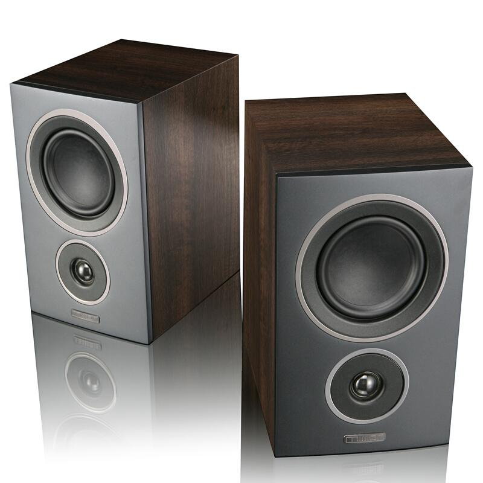
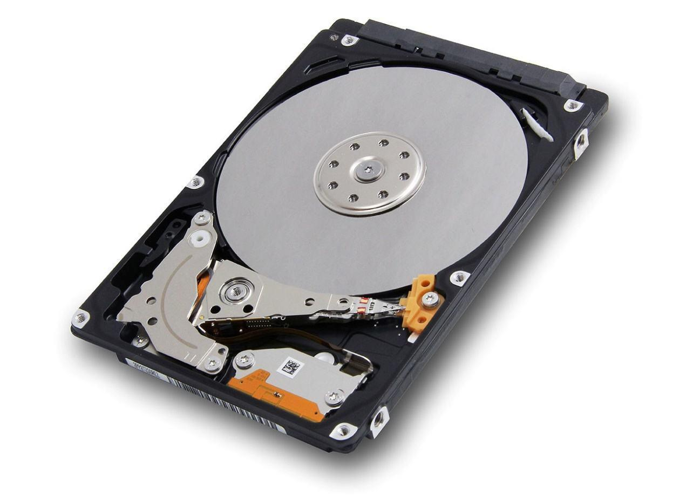
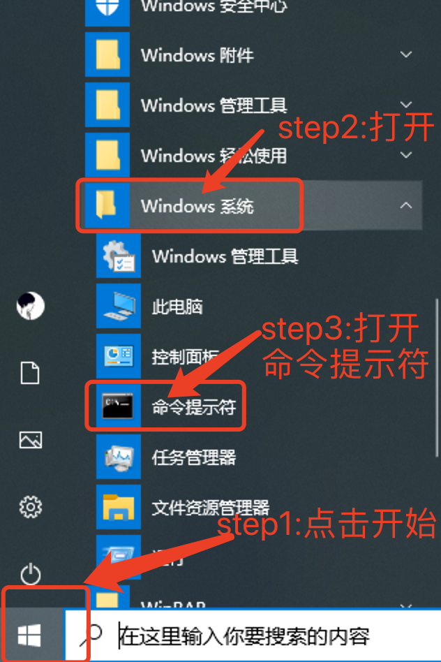
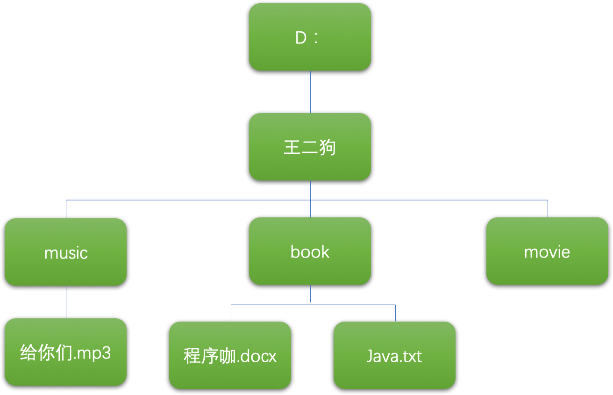
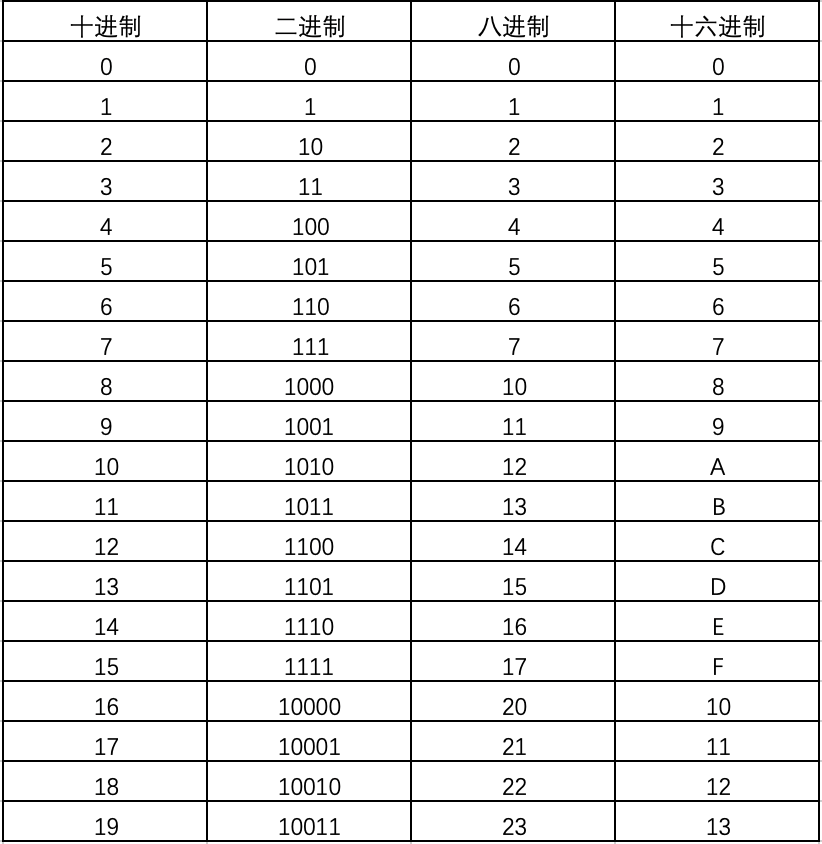

## 正式学习前的扫盲

> 作者：韩茹
>
> 公司：程序咖（北京）科技有限公司
>
> 程序咖：IT职业技能评测平台
>
> 公众号：程序咖订阅号
>
> 网址：https://www.chengxuka.com


任务

```
1.计算机组成
2.常用的DOS命令
3.进制以及转换
```


### 一、计算机组成

计算机组成包括**硬件**和**软件**两大部分。

#### 1.1 硬件

​	硬件是指完成输入、存储、处理、输出功能的具体设备。


##### 	1.1.1 硬件主要包括：

- 输入设备：键盘、鼠标、摄像头、扫描仪等。

  键盘：键盘是用于操作计算机设备运行的一种指令和数据输入装置。
  
  


​		鼠标：鼠标，是计算机的一种外接输入设备，也是计算机显示系统纵横坐标定位的指示器，因形似老鼠而得名。


​		摄像头：摄像头(CAMERA或WEBCAM)又称为电脑相机、电脑眼、电子眼等，是一种视频输入设备，被广泛的运用于视频会议]，远程医疗及实时监控等方面。普通的人也可以彼此通过摄像头在网络进行有影像、有声音的交谈和沟通。另外，人们还可以将其用于当前各种流行的数码影像，影音处理等。


扫描仪：扫描仪（scanner），是一种捕获影像的装置。


- 输出设备：显示器、打印机、音箱等。

  显示器：显示器（display）通常也被称为监视器。显示器是属于电脑的输入输出设备。它是一种将一定的电子文件通过特定的传输设备显示到屏幕上再反射到人眼的显示工具。

  

  

  

  打印机：打印机（Printer) 是计算机的输出设备之一，用于将计算机处理结果打印在相关介质上。

  

  
  
  
  
  音箱：音箱指可将音频信号变换为声音的一种设备。
  
  


- CPU(Central Processing Unit)，中央处理单元：主要厂商有Intel、AMD


- 存储器：主要包括内存、硬盘、U盘等


内存条：内存(Memory)是计算机的重要部件之一，也称内存储器和主存储器，它用于暂时存放CPU中的运算数据，与硬盘等外部存储器交换的数据。


硬盘：电脑硬盘是计算机最主要的存储设备。




U盘：U盘是USB(universal serial bus)盘的简称，据谐音也称“优盘”。U盘是闪存的一种，故有时也称作闪盘。U盘与硬盘的最大不同是，它不需物理驱动器，即插即用，且其存储容量远超过软盘，极便于携带。


- 其他设备：主板、机箱等

主板：主板，又叫主机板（mainboard）、系统板（systemboard）、或母板（motherboard），是计算机最基本的同时也是最重要的部件之一。


机箱：机箱作为电脑配件中的一部分，它起的主要作用是放置和固定各电脑配件，起到一个承托和保护作用。此外，电脑机箱具有屏蔽电磁辐射的重要作用。


##### 	1.1.2 CPU主要性能指标：

​		主频：CPU内核工作的时钟频率，也就是CPU工作频率

​		例如：Intel 酷睿 i5 2.4G、i7  2.6G 

##### 	1.1.3 存储单位:

​	 计算机存储器以位和字节计量

**基本储存单元**

位（bit）：二进制数中的一个数位，可以是0或者1，是计算机中数据的最小单位。

字节（Byte，B）：计算机中数据的基本单位，每8位组成一个字节。各种信息在计算机中存储、处理至少需要一个字节。例如，一个ASCII码用一个字节表示，一个汉字用两个字节表示。


**扩展的存储单位**

在计算机各种存储介质（例如内存、硬盘、光盘等）的存储容量表示中，用户所接触到的存储单位不是位、字节和字，而是KB、MB、GB等，但这不是新的存储单位，而是基于字节换算的。

KB：

```
1KB = 1024B
```

 早期用的软盘有360KB和720KB的，不过软盘已经很少使用。

MB：

```
1MB = 1024KB
```


 早期微型机的内存有128MB、256MB、512MB，目前内存都是1GB、2GB甚至更大。

GB：

```
1GB = 1024MB
```


 早期微型机的硬盘有60GB、80GB，目前都是500GB、1TB甚至更大。

TB：

```
1TB = 1024GB
```


 目前个人用的微型机存储容量也都能达到这个级别了，而作为服务器或者专门的计算机，不可缺少这么大的存储容量。


```
1B(Byte 字节)=8bit

1KB (Kilobyte 千字节)=1024B;

1MB (Megabyte 兆字节 简称“兆”)=1024KB;

1GB (Gigabyte 吉字节 又称“千兆”)=1024MB;

1TB (Trillionbyte 万亿字节 太字节)=1024GB，其中1024=2^10 ( 2 的10次方);

1PB（Petabyte 千万亿字节 拍字节）=1024TB;

1EB（Exabyte 百亿亿字节 艾字节）=1024PB;

1ZB (Zettabyte 十万亿亿字节 泽字节)= 1024 EB;

1YB (Yottabyte 一亿亿亿字节 尧字节)= 1024 ZB;

1BB (Brontobyte 一千亿亿亿字节)= 1024 YB。
```


#### 1.2 软件

软件有两大类 ：系统软件和应用软件

系统软件：控制和支持计算机系统，例如：DOS、Windows7、Windows10、Mac、Linux。。

应用软件：通常指一些应用软件，例如：Office、PhotoShop、WinRAR等。


### 二、DOS命令

DOS是Disk Operating System的缩写，即磁盘操作系统。

DOS命令，计算机术语，是指DOS操作系统的命令，是一种面向磁盘的操作命令，主要包括目录操作类命令、磁盘操作类命令、文件操作类命令和其它命令。


>  为了学习Java，此处我们先学习几个常用的dos命令。但是此处并不是系统的学习所有的dos命令。如果你在学习Java语言的时候，直接使用eclipse、IntelliJ IDEA等集成开发工具，也可以跳过此小节，不用学习dos命令。


#### 2.1打开命令提示符

有以下几种方式打开

方法一：点击开始-->找到Windows系统-->打开命令提示符



 

方法二：使用快捷键：win+R。弹出运行窗口，然后输入cmd，回车即可。


方法三：如果是windows10系统，直接在任务栏上搜索框内输入cmd，回车即可。


通过以上哪种方式都可以，打开命令提示符窗口，也就是所谓的dos窗口：


> 该窗口的样式，可以设置，此处忽略。

#### 2.2 常用的DOS命令	

* cd 命令：改变当前目录

  ```
  cd [盘符:][路径名][子目录名]
  cd .. 返回上一级目录
  cd \或cd /  返回根目录，推荐使用cd \
  注意：如果需要访问非当前根目录下的目录文件，应该先输入该盘符，敲回车，然后再用cd命令
  如：
   d: 切换盘符d盘
   cd src 进入src目录
  ```

示例图：


* dir命令：列出当前目录下的文件以及文件夹

  ```
  dir  [盘符:][目录路径] [/p]  [/s]  [/w]  [/o]  
  /p 分页显示下一页内容，按任意键查看下一屏
  /s 显示所有目录及其子目录下所有文件
  /w 宽屏显示
  /o 分类顺序显示
  ```

* md命令：创建目录

  ```
  md  [盘符:][路径名]<文件夹名>  
  md myFile 在当前目录下创建myFile文件夹
  md myPhoto\aaa\bbb 在当前目录下创建myPhoto\aaa\bbb多级目录
  注意：md命令还可以创建以.开头的文件夹。
  ```

* copy命令：复制一个或一组文件到指定磁盘或目录中

  ```
  copy  <源文件路径> [目标路径]   
  copy a.txt d:\myFile 复制a.txt文件到d:\myFile文件夹中
  copy myFile myPhoto  只赋值myFile文件夹下的所有文件到myPhoto中,不包括子文件夹中的文件
  如果要复制所有子文件夹下文件可使用:
  xcopy myFile myPhoto /s  不能复制空目录
  xcopy myFile myPhoto /e  复制空目录
  ```

* rd命令：删除目录

  ```
  rd  [盘符:][路径名]<子目录名>
  只能删除空目录，不能删除当前目录
  rd myFile 删除myFile目录
  rd myFile\aaa 只能删除aaa目录，不能删除myFile目录
  ```

* del命令：删除文件

  ```
  删除目录中的一个或一组文件,不能删除目录
  del info.txt 删除info.txt文件
  del myFile\* 删除myFile目录下所有的文件
  ```

* cls命令：清空屏幕

* exit命令：退出dos命令行

* mspaint：打开画图板

* notepad：打开记事本

**上机练习：**




```
参考代码
D:\>md 王二狗
D:\>cd 王二狗
D:\王二狗>md music
D:\王二狗>md book
D:\王二狗>md movie
进入music目录 cd music
D:\王二狗\music> type nul>给你们.mp3  (type nul>给你们.mp3 创建空文件)
进入book目录  
cd.. 首先退回到上一目录
cd book
D:\王二狗\book> echo 我们喜欢学习java>程序咖.docx   (echo 内容> *.* 创建非空文件 )
表示在book目录下创建了一个文件：程序咖.docx，里面存储内容为：我们喜欢学习java
D:\王二狗\book> echo HelloWorld>Java.txt
```


### 三、进制

#### 3.1 普及二进制

```java
计算机中的数据都以二进制数字保存。
二进制：逢二进一。即只有0、1两个值。
如：十进制的10在计算机内保存为二进制的1010
计算机中信息的存储单位
位（bit）：表示一个二进制数码0或1，是计算机存储处理信息的最基本的单位。
```

#### 3.2 其他进制

```
常用的进制有：
二进制：0，1
八进制：0，1，2，3，4，5，6，7
十进制：0，1，2，3，4，5，6，7，8，9
十六进制：0，1，2，3，4，5，6，7，8，9，A，B，C，D，E，F
```




#### 3.3 进制转换

```java
1. 二进制转十进制
	要从右到左用二进制的每个数去乘以2的权次方，然后相加。
2. 十进制转二进制
	除2取余，逆序排列
```


此处只是提供了进制转换的算法，了解即可。

#### 


