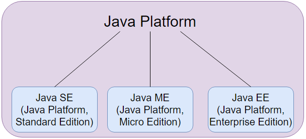
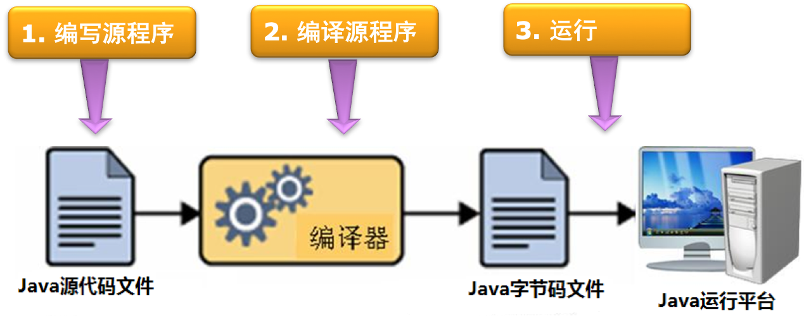
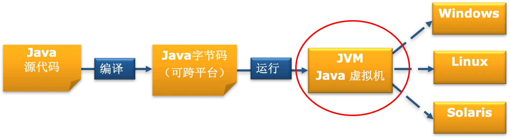

## Java介绍

> 作者：韩茹
>
> 公司：程序咖（北京）科技有限公司
>
> 程序咖：IT职业技能评测平台
>
> 网址：https://www.chengxuka.com


任务

```
1.什么是Java
2.Java发展历史
3.Java语言的特点
4.Java的应用场景
5.Java平台体系
6.Java的专业术语
7.Java运行核心机制
```


### 一、什么是Java

Java是一种通用的，基于类的，面向对象的编程语言。它是用于应用程序开发的计算平台。因此，Java是快速，安全和可靠的。它被广泛用于在笔记本电脑，数据中心，游戏机，科学超级计算机，手机等中开发Java应用程序。Java遵循WORA（Write Once, Run Anywhere。一次写入，到处运行）的原理，并且与平台无关。它也简单易学。

### 二、Java发展历史

Java是世界上使用最广泛的编程语言之一。Java最初由Sun Microsystems在1990年代开发，用于开发从Web应用程序到移动应用程序到批处理应用程序的所有内容。Java最初是一种纯粹的面向对象的语言，但现在已经发展成为一种多范例语言，可以高度适应任何情况。拥有庞大的开发人员社区和支持库，Java是开发几乎所有类型的应用程序的理想选择。

Java是最初由开发James Gosling(詹姆斯·高斯林，他被称为Java编程语言之父)在Sun Microsystems公司（现已经被Oracle收购），并于1995年发布了作为Sun公司的一个核心组成部分Java平台。

James Gosling(詹姆斯·高斯林)，Mike Sheridan(迈克·谢里丹)和Patrick Naughton(帕特里克·诺顿)于1991年6月启动了Java语言项目。Java最初是为交互式电视设计的，但在当时的数字有线电视行业来说太先进了。该语言最初是在James Gosling(詹姆斯·高斯林)办公室外的一棵橡树之后被称为Oak的。后来，该项目以*Green*命名，并最终从Java coffee(印度尼西亚的一种咖啡)重命名为*Java*。

Java的创始人：James Gosling(詹姆斯·高斯林)


历史版本：

截至2021年3月，最新版本是Java 16。从2020年9月开始，支持Java 8和11作为长期支持（LTS）版本，并且支持一个更高的非LTS版本。 Java的主要发行版本及其发行日期：

|    版本    |      日期      |
| :--------: | :------------: |
| JDK测试版  |     1995年     |
|   JDK1.0   | 1996年1月23日  |
|  JDK 1.1   | 1997年2月19日  |
|  J2SE 1.2  | 1998年12月8日  |
|  J2SE 1.3  |  2000年5月8日  |
|  J2SE 1.4  |  2002年2月6日  |
|  J2SE 5.0  | 2004年9月30日  |
| Java SE 6  | 2006年12月11日 |
| Java SE 7  | 2011年7月28日  |
| Java SE 8  | 2014年3月18日  |
| Java SE 9  | 2017年9月21日  |
| Java SE 10 | 2018年3月20日  |
| Java SE 11 | 2018年9月25日  |
| Java SE 12 | 2019年3月19日  |
| Java SE 13 | 2019年9月17日  |
| Java SE 14 | 2020年3月17日  |
| Java SE 15 | 2020年9月15日  |
| Java SE 16 | 2021年3月16日  |

### 三、Java语言的特点

1. 一种面向对象的编程语言。

    按照对象集合的方式组织程序是一种面向对象的编程思维。

   面向对象编程的四个主要概念是：抽象化，封装，继承，多态。

2. 一种与平台无关的语言。(它提供了在不同平台下的解释运行环境)

   编译器将源代码转换为字节码，然后JVM执行编译器生成的字节码。该字节码可以在Windows，Linux和macOS的任何平台上运行，这意味着如果我们在Windows上编译程序，则可以在Linux上运行，反之亦然。每个操作系统具有不同的JVM，但是在字节码执行后，所有操作系统产生的输出都是相同的。这就是为什么我们称Java为平台无关的语言。

3. 简单

     Java是简单的语言之一，因为它不具有指针，运算符重载，多重继承，显式内存分配等复杂功能。 

4. 一种健壮的语言，吸收了C/C++语言的优点。

    Java语言健壮，意味着可靠。它以这样的方式开发：尽力尽早检查错误，这就是Java编译器甚至能够检测到其他编程语言不易检测到的那些错误的原因。使Java健壮的Java主要功能是垃圾收集，异常处理和内存分配。

5. 具有较高的安全性。(自动回收垃圾，强制类型检查，取消指针)

   在Java中，我们没有指针，因此我们无法访问越界数组，如果尝试这样做，它将显示ArrayIndexOutOfBoundsException。这就是为什么在Java中无法利用堆栈破坏或缓冲区溢出之类的一些安全漏洞的原因。   

6. 分布式

   我们可以使用Java编程语言创建分布式应用程序。远程方法调用和企业Java Bean用于在Java中创建分布式应用程序。Java程序可以轻松地分布在通过Internet连接相互连接的一个或多个系统上。

7. 多线程

   Java支持多线程。它是Java的一项功能，它允许并发执行程序的两个或更多部分，以最大程度地利用CPU。

8. 可移植

   众所周知，在一台机器上编写的Java代码可以在另一台机器上运行。Java的平台无关功能，其中可以将其平台无关字节码带到任何平台上执行，从而使Java可移植。

9. 开源

   

    


### 四、Java的应用场景

1. 桌面GUI应用程序

   桌面应用程序可以使用Java轻松开发。我们使用AWT，Swing，JavaFX等API来构建这些应用程序。

2. 移动应用

   移动应用程序是为手机和平板电脑创建的应用程序。在当今时代，大多数电话和智能设备都具有Android操作系统，没有Java就不可能进行Android开发。Java Micro Edition（Java ME或J2ME）是一种流行的跨平台框架，用于构建可在所有功能手机和智能手机上运行的应用程序。

3. 企业应用

   企业应用程序是一个大型软件系统，可以在公司环境中运行，以满足组织而不是单个用户的需求。

4. 科学应用

   科学应用程序是一种使用数学影响实际活动的应用程序。Java由于其强大的功能而支持科学应用程序的开发。

5. Web应用

   Web应用程序是通过浏览器界面在Internet上交付的客户端-服务器程序。

6. 嵌入式系统

   一个嵌入式系统，也被称为集成系统，是组装在一起以执行专用功能的更大的系统的许多小的计算单元的组合。嵌入式系统随处可见。例如，电机系统，汽车中的娱乐和多媒体，电子商务，无线通信，移动计算和联网都使用嵌入式系统。

   嵌入式系统使用Java进行开发。最初，Java是为开发嵌入式系统而设计的。

7. 大数据技术

   大数据一词定义为“可以分析以提取模式，趋势和有用信息的极大型和复杂数据集。它是最新技术领域中最受欢迎的主题之一。Java是大数据的视角。如今，许多开发人员正在将职业转向大数据技术。

8. 分布式应用

   分布式应用程序是在网络内的多台计算机上执行或运行的应用程序或软件。分布式应用程序或系统具有许多共同的要求，尤其是由于它们在其上运行的平台的分布式和动态特性而产生。Java提供了实现这些应用程序的选项。

9. 基于云的应用

   云计算意味着通过Internet按需交付IT资源，包括具有按需付费定价模式的存储，服务器，数据库，网络和软件。它可以低成本为IT基础架构提供解决方案，因为我们可以将文件保存在远程数据库中并按需检索它们。长期以来，Java一直是为Web应用程序提供结构的编程语言，由于它的分布式特性，现在它已经进入了云应用程序。

10. 奋斗奋斗

    Web服务器是一种计算机程序，它使用HTTP（超文本传输协议）和其他协议来存储，处理和响应通过WWW（万维网）发出的客户端请求。Web服务器是运行网站并向用户交付网页的系统。Java生态系统包含多个Java Web服务器和应用程序服务器。Java提供了Web服务器，包括Apache Tomcat，Simple，Jo！，Rimfaxe Web服务器（RWS）Apache HTTP服务器，Resin，Adobe JRun和Project Jigsaw。

11. 软件工具

    软件工具是开发人员用来开发，分析，维护，调试或支持其他应用程序和程序的一组计算机程序。许多开发人员使用Java编写和开发有用的软件工具。比如Eclipse，IntelliJ Idea和NetBeans IDE。

12. 游戏应用

    Java被证明是开发二维游戏的最佳平台之一。如今，几乎每个人都拥有装有Android游戏的Android手机。没有Java，就无法构建Android游戏。


我们知道Java是一种“蓝领”语言，涉及软件开发的各个领域。可以根据业务需要使用。通过这些应用程序，我们意识到现实中对Java的需求。当我们需要开发安全且可扩展的应用程序时，我们绝对应该选择使用Java，因为Java具有主要的安全功能。这就是为什么最好用Java开发许多需要很多安全问题的银行应用程序的原因。因此，如果我们的业务规格与其功能相匹配，我们可以选择该语言。许多技术和编程语言都在发展，但是Java的普及程度仍然是其他语言无法比拟的。

### 五、Java平台体系

1. Java SE（Java Platform Standard Edition）。Java SE 以前称为 J2SE。它允许开发和部署在桌面、服务器、嵌入式环境和实时环境中使用的 Java 应用程序。
2. Java EE（Java Platform Enterprise Edition）。这个版本以前称为 J2EE。
	开发企业级的应用
3. Java ME（Java Platform Micro Edition）。这个版本以前称为 J2ME。Java ME 为在移动设备和嵌入式设备（比如手机、PDA、电视机顶盒和打印机）上运行的应用程序提供一个健壮且灵活的环境.



### 六、Java的专业术语

首先了解两个计算机术语：

**1.计算机程序：**

为了让计算机执行某些操作或解决某个问题而编写的一系列有序指令的集合

编写程序的工具就是计算机语言，Java就是多种语言中的一种

**2.软件：**

软件是计算机程序、程序所用的数据以及有关文档资料的集合。


在学习Java之前，必须熟悉这些Java通用术语。

**1. Java虚拟机（JVM：Java Virtual Machine）：** 通常称为JVM。程序分为三个执行阶段。他们被编写，编译并运行程序。

- 像你和我这样的Java程序员都可以编写程序。
- 编译由**JAVAC**编译器完成，**JAVAC**编译器是Java开发工具包（JDK）中包含的主要Java编译器。它以Java程序作为输入，并生成字节码作为输出。
- 在程序的运行 阶段，**JVM**执行编译器生成的字节码。

现在，我们了解到Java虚拟机的功能是执行编译器产生的字节码。每个操作系统都有不同的JVM，但是在执行字节码后它们在所有操作系统上产生的输出都是相同的。这就是为什么Java被称为**独立**于**平台的语言的原因。**

**2.开发过程中的字节码**：  JDK的Javac编译器将Java源代码编译为字节码，以便可以由JVM执行。编译器将其另存为**.class**文件。要查看字节码，可以使用像javap这样的反汇编程序。

**3. Java开发工具包（JDK）：**当我们使用术语JDK时，当我们了解字节码和JVM时。因此，顾名思义，它是一个完整的Java开发工具包，其中包括编译器，Java运行时环境（JRE），Java调试器，Java文档等所有内容。要在Java中执行该程序，我们需要在我们的计算机上安装JDK为了创建，编译和运行Java程序而在计算机上运行。

**4. Java运行时环境（JRE）：** JDK包括JRE。在我们的计算机上安装JRE可以运行Java程序，但是，我们无法对其进行编译。JRE包括浏览器，JVM，小程序支持和插件。为了运行Java程序，计算机需要JRE。

**5.垃圾收集器：**在Java中，程序员无法删除对象。要删除或重新收集该内存，JVM拥有一个名为Garbage Collector的程序，简称GC。垃圾收集器可以重新收集未引用的对象。因此，Java通过处理内存管理使程序员的工作变得轻松。但是，程序员是否应该使用自己的代码，无论他们使用的对象已经使用了很长时间了。因为垃圾无法恢复被引用对象的内存。

**6. CLASSPATH中**的类路径是文件路径ava运行时和Java编译器找**的.class**文件加载。默认情况下，JDK提供了许多库。如果要包括外部库，则应将它们添加到类路径中。


### 七、Java运行核心机制

刚刚提到了Java程序执行的三个阶段，我们再来详细的说一下：

计算机的高级编程语言类型：

* **编译型** C /C++/Pascal//Golang等，会生成二进制文件。比如：.exe文件。
* **解释型** Basic/Python/JavaScript / Perl /Shell不会生成二进制文件

而Java 语言是两种类型的结合；**先编译,再解释执行**




Java虚拟机(Java Virtual Machine) JVM

```
1 JVM可以理解成一个可运行Java字节码的虚拟计算机系统。 
它有一个解释器组件，可以实现Java字节码和计算机操作系统之间的通信
对于不同的运行平台，有不同 的JVM。
2 JVM屏蔽了底层运行平台的差别，实现了“一次编译，随处运行”。
```

所以Java语言是跨平台的。




JVM可以理解成一个可运行Java字节码的虚拟计算机系统。

- 它有一个解释器组件，可以实现Java字节码和计算机操作系统之间的通信

- 对于不同的运行平台，有不同 的JVM。

JVM屏蔽了底层运行平台的差别，实现了“一次编译，随处运行”。


