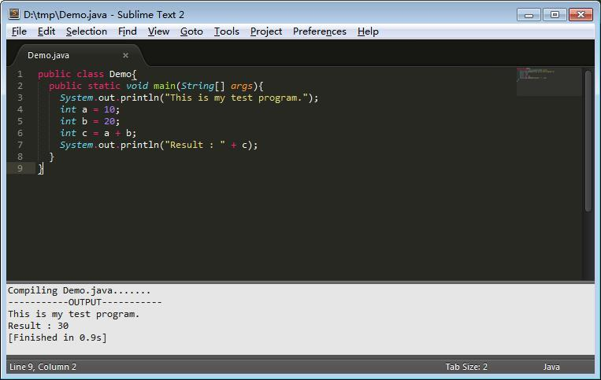
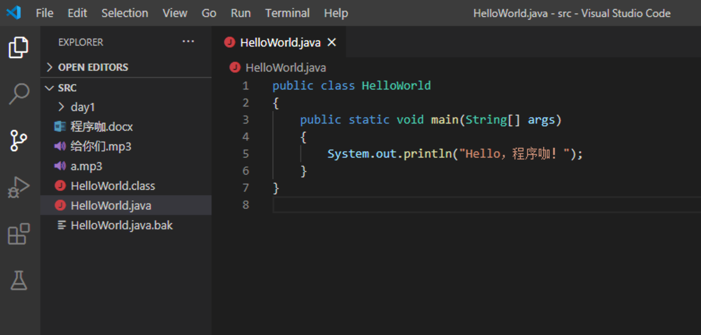

## 带你安装编辑器

> 作者：韩茹
>
> 公司：程序咖（北京）科技有限公司
>
> 程序咖：IT职业技能评测平台
>
> 网址：https://www.chengxuka.com


任务

```
1.安装一款编辑器
```


我们已经知道了Java开发的步骤，无论我们是编写代码还是查看代码，我们在哪里编写，用什么去看，就需要安装文本编辑器了。当然，你也可以使用windows自带的记事本，但是它真的丑哭了。。

**强调一下：在学习java的基本语法的时候，为了更轻松的掌握java的编译程序和运行程序等过程，不建议你在初学阶段安装eclipse或者Intellij IDEA等集成开发工具。后面的章节中会介绍集成工具的安装和使用。**

### 一、editplus

[官网下载](https://www.editplus.com/)

我喜欢的文本编辑器。😄


### 二、sublime text

[官网下载](http://www.sublimetext.com/)

这个我也喜欢，尤其是写html的时候，其实主要还是因为它长的好看。😂




### 三、vscode

Visual Studio Code，	[官网下载](https://code.visualstudio.com/)

这个我也喜欢。😄




### 四、nodepad++

这个也行。

[官网下载][http://notepad-plus-plus.org/](https://notepad-plus-plus.org/)


### 五、atom

Atom 是一款由 GitHub 开发的，也可以。


### 六、Vim

Vim是从 vi 发展出来的一个文本编辑器。


### 七、UltraEdit

这个也好。


### 八、其他

