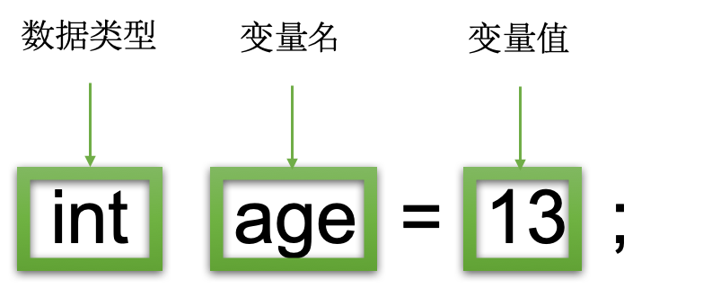
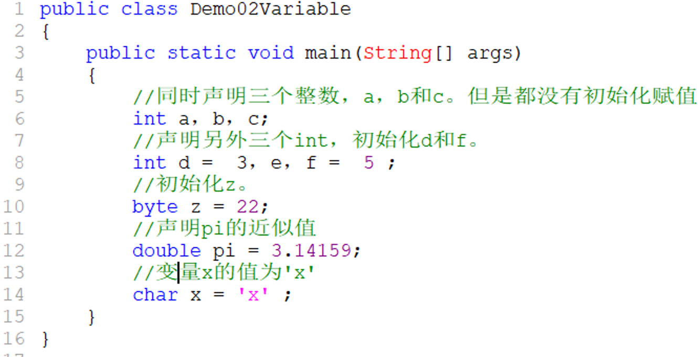
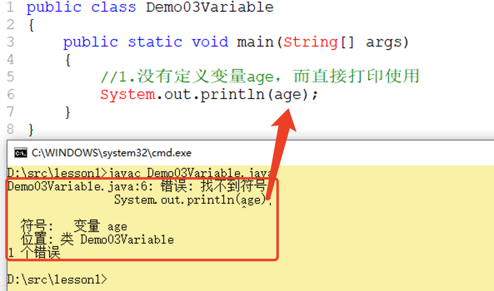

## 变量&常量

> 作者：韩茹
>
> 公司：程序咖（北京）科技有限公司
>
> 程序咖：IT职业技能评测平台
>
> 网址：https://www.chengxuka.com


任务

```
1.数据常量
2.变量的使用
3.变量的注意点

```


### 一、常量

常量：程序中持续不变的值，它是值不能改变的数据。

常见的**数据常量**：

- 整型常量：123
- 浮点数(实型)常量：3.14
- 字符常量：‘a’
- 布尔(逻辑)常量：true、false
- 字符串常量：“a”、“hello world” String
- null常量：表示对象的引用为空

```
Java语言整型的三种表示形式： 
十进制整数：如12, -314, 0,8,7。 
八进制整数：要求以0开头，如0127表示八进制的127 。
十六进制数：要求0x或0X开头，如0x1df3。
```

**注意：**

区分字符常量和字符串常量

“常量”还会用在另外语境中表示值不可改变的变量。当我们学习了final关键字，一般常量的定义需要结合final来使用。用以限制它的数值不可以更改。


### 二、变量

变量是在执行Java程序时保存值的容器。变量分配有数据类型。变量是赋予存储位置的名称。它是程序中存储的基本单位。

1. 可以在程序执行期间更改存储在变量中的值。
2. 变量只是给存储位置指定的名称，对变量执行的所有操作都会影响该存储位置。
3. 在Java中，必须先声明所有变量，然后才能使用它们。

简而言之，变量用于保存程序执行中的数据。

```java
变量其实是内存中的一小块区域，使用变量名来访问这块区域。因此，每一个变量使用前必须要先申请，或者叫声明，然后必须进行赋值(填充内容)，才能使用。
```

#### 2.1 变量的声明初始化

在Java中，必须先声明所有变量，然后才能使用它们。变量声明的基本形式如下所示：

```
变量的声明格式：
1.先声明，再赋值
 		数据类型  变量名； 
 		变量名 = 变量值；
2. 声明和赋值写一起
		数据类型  变量名 = 变量值；
3.多个变量统一声明，就是写在一起声明：同种类型
		数据类型 变量名1，变量名2，变量名;
	

```

在这里，数据类型是Java的基本数据类型之一，或者是类或接口等。在本小节我们先以基本数据类型和String为例，至于类类型或接口类型等，在后面的章节中，再深入的学习。变量名就是一个标识符，满足标识符的命名规范即可。通过=来给变量进行赋值操作。




在src目录下创建子目录lesson1，你可以右键直接创建，也可以通过dos命令创建。然后新建一个java源文件：Demo01Variable.java

```java
public class Demo01Variable
{
	public static void main(String[] args){
		//定义一个int类型的变量，变量名为age，赋值为13
		int age = 13;
		//打印输出这个变量
		System.out.println(age);
		//定义一个字符串类型的变量，用于存储名字
		String name = "王二狗";
		//打印这个变量
		System.out.println(name);
	}
}
```


变量可以存储一个数值，也可以改变变量中存储的数值，重新赋值即可。但要注意，这会覆盖掉原来的数值。


新建一个java源文件：Demo02Variable.java

这是各种类型的变量声明的几个示例。请注意，其中一些包含初始化赋值。

```java
public class Demo02Variable 
{
	public static void main(String[] args) 
	{
		//同时声明三个整数，a，b和c。但是都没有初始化赋值
		int a，b，c; 
		//声明另外三个int，初始化d和f。
		int d =  3，e，f =  5 ; 
		//初始化z。
		byte z = 22; 
		//声明pi的近似值
		double pi = 3.14159; 
		//变量x的值为'x'
		char x = 'x' ; 
	}
}


```





#### 2.2 变量的分类

```java
1. 按所属的数据类型划分：
  基本类型变量：持有原始值。(原始数据类型)
  引用类型变量：持有引用值。(某个对象的引用，不是该对象本身)String 字符串
2. 按被声明的位置划分：
  局部变量：方法或语句块内部定义的变量
  全局变量：方法外部、类的内部定义的变量
```

#### 2.3 局部变量和全局变量的区别

```java
1. 声明的位置不同：
 局部变量的作用域就是它所在的方法或语句块
 全局变量的作用域是整个类体。
2. 是否拥有默认值：
 全局变量有默认值
 局部变量没有默认值	
```

目前我们所写的变量都是声明在main()函数中，都是局部变量。在以后学习的面向对象中，我们会接触到全局变量等。

#### 2.4 变量的注意事项

**<font color="red" size="5">踩坑：变量的坑有以下4点。</font>**

```
变量的注意点：
1、变量需要先声明，再使用
2、定义局部变量必须先初始化(赋值)，才能使用
3、变量声明的类型，和赋值的类型需要一致。---java语言是强类型的语言
4、变量名不能冲突(同一个作用域)
```

在lesson1下再新建一个java文件：Demo03Variable.java

**<font color="red" size="5">踩坑1：变量需要先声明，再使用，否则报错找不到符号。</font>**

```java
public class Demo03Variable 
{
	public static void main(String[] args) 
	{
		//1.没有定义变量age，而直接打印使用
		System.out.println(age);
	}
}

```




**<font color="red" size="5">踩坑2：定义局部变量必须先初始化(赋值)，才能使用，否则报错尚未初始化。</font>**

```java
public class Demo03Variable 
{
	public static void main(String[] args) 
	{
		//1.没有定义变量age，而直接打印使用
		//System.out.println(age);
		//2.没有给age赋值，而直接打印使用
		int age;
		System.out.println(age);
	}
}

```


**<font color="red" size="5">踩坑3：变量声明的类型，和赋值的类型需要一致。否则无法赋值成功。</font>**

```java
public class Demo03Variable 
{
	public static void main(String[] args) 
	{
		//1.没有定义变量age，而直接打印使用
		//System.out.println(age);
		//2.没有给age赋值，而直接打印使用
		//int age;
		//System.out.println(age);
		//3.所赋值的数据类型和声明的变量类型不同
		int age = "王二狗";
		System.out.println(age);
	}
}

```


说明：变量所赋值的数据类型，如果可以自动转型为声明的变量类型也是可以的。但是关于数据类型的转换，无论是自动转换还是强制转换，都是下一节数据类型里要讲解的。


**<font color="red" size="5">踩坑4：变量名不能冲突(同一个作用域)。</font>**

```java
public class Demo03Variable 
{
	public static void main(String[] args) 
	{
		//1.没有定义变量age，而直接打印使用
		//System.out.println(age);
		//2.没有给age赋值，而直接打印使用
		//int age;
		//System.out.println(age);
		//3.所赋值的数据类型和声明的变量类型不同
		//int age = "王二狗";
		//System.out.println(age);
		//4.不同声明同名的变量
		int age = 18;
		int age =15;
		System.out.println(age);
	}
}

```


注意区别定义重复的变量和更改变量的值，不是一回事儿。

