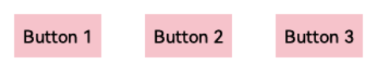
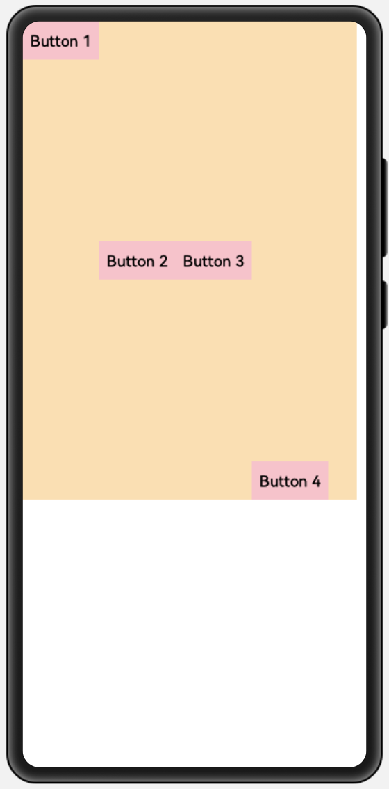
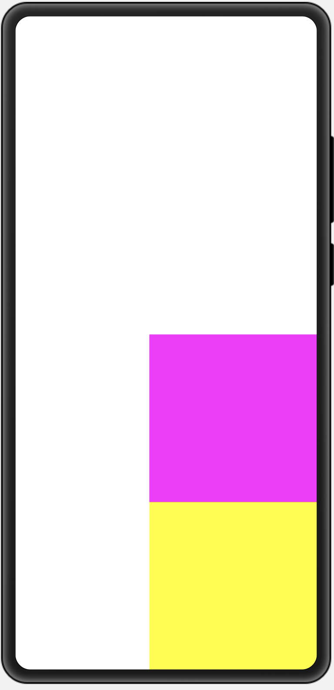
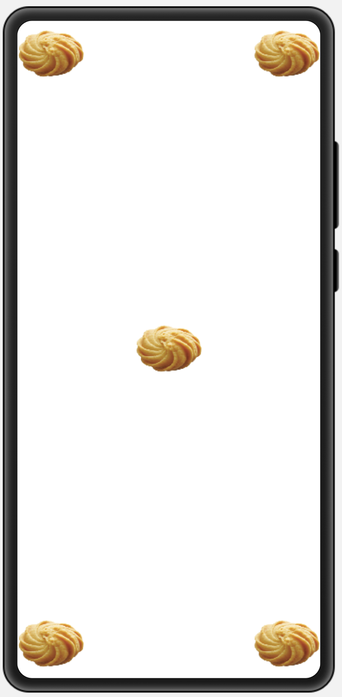
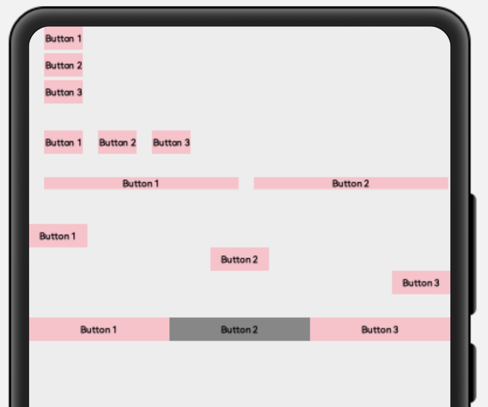

# HarmonyOS界面布局


> 作者：韩茹
>
> 公司：程序咖（北京）科技有限公司
>
> 程序咖：IT职业技能评测平台
>
> 网址：https://www.chengxuka.com


## 一、定向布局DirectionLayout


DirectionalLayout是Java UI中的一种重要组件布局，用于将一组组件(Component)按照水平或者垂直方向排布，能够方便地对齐布局内的组件。该布局和其他布局的组合，可以实现更加丰富的布局方式。

DirectionalLayout示意图


### 1.1、支持的XML属性

DirectionalLayout的共有XML属性继承自：[Component](https://developer.harmonyos.com/cn/docs/documentation/doc-guides/ui-java-component-common-xml-0000001138483639)


| 属性名称   | 中文描述                                         | 取值                                   | 取值说明               | 使用案例                                                     |
| ---------- | ------------------------------------------------ | -------------------------------------- | ---------------------- | ------------------------------------------------------------ |
| id         | 控件identity，用以识别不同控件对象，每个控件唯一 | integer类型                            | 仅可用于配置控件的id。 | ohos:id="$+id:component_id"                                  |
| theme      | 样式                                             | 引用                                   | 仅可引用pattern资源。  | ohos:theme="$pattern:button_pattern"                         |
| width      | 宽度，必填项                                     | float类型，match_parent，match_content |                        | ohos:width="20"<br />ohos:width="10vp"<br />ohos:width="$float:size_value" |
| height     | 高度，必填项                                     | float类型，match_parent，match_content |                        | ohos:height="20" <br />ohos:height="20vp" <br />ohos:height="$float:size_value" |
| min_width  | 最小宽度                                         | float类型                              |                        | ohos:min_width="20"<br />ohos:min_width="20vp"<br />ohos:min_width="$float:size_value" |
| min_height | 最小高度                                         | float类型                              |                        | ohos:min_height="20"<br />ohos:min_height="20vp"<br />ohos:min_height="$float:size_value" |
| alpha      | 透明度                                           | float类型                              | 取值范围在0~1。        | ohos:alpha="0.86"<br />ohos:alpha="$float:value"             |
| enabled    | 是否启用                                         | boolean类型                            |                        | ohos:enabled="true"<br />ohos:enabled="$boolean:true"        |
| visibility | 可见性                                           | visible，invisible，hide               |                        | ohos:visibility="visible"                                    |
| padding    | 内间距                                           | float类型                              |                        |                                                              |
| margin     | 外边距                                           | float类型                              |                        |                                                              |


DirectionalLayout的自有XML属性见下表：详见[官方文档](https://developer.harmonyos.com/cn/docs/documentation/doc-guides/ui-java-layout-directionallayout-0000001050769565)：


| 属性名称     | 中文描述             | 取值              | 取值说明                                          | 使用案例                                                     |
| ------------ | -------------------- | ----------------- | ------------------------------------------------- | ------------------------------------------------------------ |
| orientation  | 子布局排列方向       | horizontal        | 表示水平方向布局。                                | ohos:orientation="horizontal"                                |
|              |                      | vertical          | 表示垂直方向布局。                                | ohos:orientation="vertical"                                  |
| alignment    | 对齐方式             | left              | 表示左对齐。                                      | 可以设置取值项如表中所列，也可以使用“\|”进行多项组合。ohos:alignment="top\|left"<br />ohos:alignment="left" |
|              |                      | top               | 表示顶部对齐。                                    |                                                              |
|              |                      | right             | 表示右对齐。                                      |                                                              |
|              |                      | bottom            | 表示底部对齐。                                    |                                                              |
|              |                      | horizontal_center | 表示水平居中对齐。                                |                                                              |
|              |                      | vertical_center   | 表示垂直居中对齐。                                |                                                              |
|              |                      | center            | 表示居中对齐。                                    |                                                              |
|              |                      | start             | 表示靠起始端对齐。                                |                                                              |
|              |                      | end               | 表示靠结束端对齐。                                |                                                              |
| total_weight | 所有子视图的权重之和 | float类型         | 可以直接设置浮点数值，也可以引用float浮点数资源。 | ohos:total_weight="2.5"<br />ohos:total_weight="$float:total_weight" |


DirectionalLayout所包含组件可支持的XML属性见下表：

**表2** DirectionalLayout所包含组件可支持的XML属性

| 属性名称         | 中文描述 | 取值              | 取值说明                                          | 使用案例                                                     |
| ---------------- | -------- | ----------------- | ------------------------------------------------- | ------------------------------------------------------------ |
| layout_alignment | 对齐方式 | left              | 表示左对齐。                                      | 可以设置取值项如表中所列，<br />也可以使用“\|”进行多项组合。<br />ohos:layout_alignment="top"<br />ohos:layout_alignment="top\|left" |
|                  |          | top               | 表示顶部对齐。                                    |                                                              |
|                  |          | right             | 表示右对齐。                                      |                                                              |
|                  |          | bottom            | 表示底部对齐。                                    |                                                              |
|                  |          | horizontal_center | 表示水平居中对齐。                                |                                                              |
|                  |          | vertical_center   | 表示垂直居中对齐。                                |                                                              |
|                  |          | center            | 表示居中对齐。                                    |                                                              |
| weight           | 比重     | float类型         | 可以直接设置浮点数值，也可以引用float浮点数资源。 | ohos:weight="1"<br />ohos:weight="$float:weight"             |

### 1.2、排列方式

DirectionalLayout的排列方向（orientation）分为水平（horizontal）或者垂直（vertical）方向。使用orientation设置布局内组件的排列方式，默认为垂直排列。

- **垂直排列**

垂直方向排列三个按钮，效果如下：


```xml
<?xml version="1.0" encoding="utf-8"?>
<DirectionalLayout
    xmlns:ohos="http://schemas.huawei.com/res/ohos"
    ohos:width="match_parent"
    ohos:height="match_content"
    ohos:orientation="horizontal">


<!--
    ohos:orientation="vertical"，垂直排列
    ohos:orientation="horizontal"，水平排列
-->
    <Button
        ohos:width="80vp"
        ohos:height="40vp"
        ohos:margin="20vp"
        ohos:text_size="16fp"
        ohos:background_element="$graphic:color_pink_element"
        ohos:text="Button 1"/>
    <Button
        ohos:width="80vp"
        ohos:height="40vp"
        ohos:margin="20vp"
        ohos:text_size="16fp"
        ohos:background_element="$graphic:color_pink_element"
        ohos:text="Button 2"/>
    <Button
        ohos:width="80vp"
        ohos:height="40vp"
        ohos:margin="20vp"
        ohos:text_size="16fp"
        ohos:background_element="$graphic:color_pink_element"
        ohos:text="Button 3"/>
</DirectionalLayout>
```

新增一个graphic文件，color_pink_element.xml：

```xml
<?xml version="1.0" encoding="utf-8"?>
<shape xmlns:ohos="http://schemas.huawei.com/res/ohos"
       ohos:shape="rectangle">
    <solid
        ohos:color="#FFC0CB"/>
</shape>
```


- **水平排列**

水平方向排列三个按钮，效果如下：



只需要修改上面的DirectionalLayout布局中的`ohos:orientation`属性即可：由`vertical`改为`horizontal`。

```xml
<DirectionalLayout
    xmlns:ohos="http://schemas.huawei.com/res/ohos"
    ohos:width="match_parent"
    ohos:height="match_content"
    ohos:orientation="horizontal">
  <!--
    ohos:orientation="vertical"，垂直排列
    ohos:orientation="horizontal"，水平排列
-->
```

要注意：

DirectionalLayout不会自动换行，其子组件会按照设定的方向依次排列，若超过布局本身的大小，超出布局大小的部分将不会被显示，例如：

```xml
<?xml version="1.0" encoding="utf-8"?>
<DirectionalLayout
    xmlns:ohos="http://schemas.huawei.com/res/ohos"
    ohos:width="match_parent"
    ohos:height="match_content"
    ohos:orientation="horizontal">


<!--
    ohos:orientation="vertical"，垂直排列
    ohos:orientation="horizontal"，水平排列
-->
    <Button
        ohos:width="100vp"
        ohos:height="40vp"
        ohos:margin="20vp"
        ohos:text_size="16fp"
        ohos:background_element="$graphic:color_pink_element"
        ohos:text="Button 1"/>
    <Button
        ohos:width="100vp"
        ohos:height="40vp"
        ohos:margin="20vp"
        ohos:text_size="16fp"
        ohos:background_element="$graphic:color_pink_element"
        ohos:text="Button 2"/>
    <Button
        ohos:width="100vp"
        ohos:height="40vp"
        ohos:margin="20vp"
        ohos:text_size="16fp"
        ohos:background_element="$graphic:color_pink_element"
        ohos:text="Button 3"/>
</DirectionalLayout>
```

还是之前的代码，我们将Button的宽度由80调整为100，效果如下：


### 1.3、对齐方式

DirectionalLayout中的组件使用layout_alignment控制自身在布局中的对齐方式，**当对齐方式与[排列方式](https://developer.harmonyos.com/cn/docs/documentation/doc-guides/ui-java-layout-directionallayout-0000001050769565#ZH-CN_TOPIC_0000001064278886__section134315425217)方向一致时，对齐方式不会生效**，如设置了水平方向的排列方式，则左对齐、右对齐将不会生效。


```xml
<?xml version="1.0" encoding="utf-8"?>
<DirectionalLayout
    xmlns:ohos="http://schemas.huawei.com/res/ohos"
    ohos:height="500vp"
    ohos:width="300vp"
    ohos:background_element="#FFDEAD"
    ohos:orientation="vertical"
    >
    <Button
        ohos:width="80vp"
        ohos:height="40vp"
        ohos:text_size="16fp"
        ohos:background_element="$graphic:color_pink_element"
        ohos:text="Button 1"/>
    <Button
        ohos:width="80vp"
        ohos:height="40vp"
        ohos:text_size="16fp"
        ohos:background_element="$graphic:color_pink_element"
        ohos:text="Button 2"/>
    <Button
        ohos:width="80vp"
        ohos:height="40vp"
        ohos:text_size="16fp"
        ohos:background_element="$graphic:color_pink_element"
        ohos:text="Button 3"/>
</DirectionalLayout>
```

默认效果如下：


现在是垂直方向的布局，3个按钮呈纵向排列，那么我们可以通过`layout_alignment`属性来设置他们的对齐方式就是横向上的，所以有效的属性值是：left，right，horizontal_center，center。

```xml
<?xml version="1.0" encoding="utf-8"?>
<DirectionalLayout
    xmlns:ohos="http://schemas.huawei.com/res/ohos"
    ohos:height="500vp"
    ohos:width="300vp"
    ohos:background_element="#FFDEAD"
    ohos:orientation="vertical"
    >
    <Button
        ohos:width="80vp"
        ohos:height="40vp"
        ohos:text_size="16fp"
        ohos:layout_alignment="left"
        ohos:background_element="$graphic:color_cyan_element"
        ohos:text="Button 1"/>
    <Button
        ohos:width="80vp"
        ohos:height="40vp"
        ohos:text_size="16fp"
        ohos:layout_alignment="horizontal_center"
        ohos:background_element="$graphic:color_cyan_element"
        ohos:text="Button 2"/>
    <Button
        ohos:width="80vp"
        ohos:height="40vp"
        ohos:text_size="16fp"
        ohos:layout_alignment="right"
        ohos:background_element="$graphic:color_cyan_element"
        ohos:text="Button 3"/>
</DirectionalLayout>
```

效果图：


如果是水平方向的布局，3个按钮呈横向排列，那么我们可以通过`layout_alignment`属性来设置他们的对齐方式就是纵向上的，所以有效的属性值是：top，bottom，vertical_center，center。

效果图：


设置对齐方式后：

```xml
<?xml version="1.0" encoding="utf-8"?>
<DirectionalLayout
    xmlns:ohos="http://schemas.huawei.com/res/ohos"
    ohos:height="500vp"
    ohos:width="350vp"
    ohos:background_element="#FFDEAD"
    ohos:orientation="horizontal"
    >
    <Button
        ohos:width="80vp"
        ohos:height="40vp"
        ohos:text_size="16fp"
        ohos:layout_alignment="top"
        ohos:background_element="$graphic:color_cyan_element"
        ohos:text="Button 1"/>
    <Button
        ohos:width="80vp"
        ohos:height="40vp"
        ohos:text_size="16fp"
        ohos:layout_alignment="vertical_center"
        ohos:background_element="$graphic:color_cyan_element"
        ohos:text="Button 2"/>
    <Button
        ohos:width="80vp"
        ohos:height="40vp"
        ohos:text_size="16fp"
        ohos:layout_alignment="center"
        ohos:background_element="$graphic:color_cyan_element"
        ohos:text="Button 3"/>
    <Button
        ohos:width="80vp"
        ohos:height="40vp"
        ohos:text_size="16fp"
        ohos:layout_alignment="bottom"
        ohos:background_element="$graphic:color_cyan_element"
        ohos:text="Button 4"/>
</DirectionalLayout>
```

效果图：




在DirectionLayout上使用alignment属性，也可以控制里面的内容的对齐方式：

```xml
<?xml version="1.0" encoding="utf-8"?>
<DirectionalLayout
    xmlns:ohos="http://schemas.huawei.com/res/ohos"
    ohos:height="match_parent"
    ohos:width="match_parent"
    ohos:orientation="vertical"
    ohos:alignment="bottom|right"
    >

    <Text
        ohos:height="200vp"
        ohos:width="200vp"
        ohos:background_element="#ff00ff"
        />
    <Text
        ohos:height="200vp"
        ohos:width="200vp"
        ohos:background_element="#ffff00"
        />
</DirectionalLayout>
```

效果图：




**写个例子，画个五饼：**其实这个例子使用DependentLayout布局，特别容易实现，但是此处为了练习，我们用DirectionLayout布局实现。



示例代码：

```xml
<?xml version="1.0" encoding="utf-8"?>
<DirectionalLayout
    xmlns:ohos="http://schemas.huawei.com/res/ohos"
    ohos:width="match_parent"
    ohos:height="match_parent"
    ohos:orientation="vertical">
<!--上面两个饼-->
    <DirectionalLayout
        ohos:width="match_parent"
        ohos:height="match_content"
        ohos:orientation="horizontal"
        >
        <Text
            ohos:width="80vp"
            ohos:height="80vp"
            ohos:background_element="$media:binggan"
            ohos:layout_alignment="left"
            />
        <DirectionalLayout
            ohos:height="match_content"
            ohos:weight="1"
            ohos:width="0vp"
            ohos:orientation="vertical">
            <Text
                ohos:width="80vp"
                ohos:height="80vp"
                ohos:background_element="$media:binggan"
                ohos:layout_alignment="right"
                />
        </DirectionalLayout>
    </DirectionalLayout>

<!--中间的饼-->

    <DirectionalLayout
        ohos:height="0vp"
        ohos:width="match_parent"
        ohos:weight="1"
        ohos:alignment="center"
        ohos:orientation="vertical">
        <Text
            ohos:width="80vp"
            ohos:height="80vp"
            ohos:background_element="$media:binggan"
            />
    </DirectionalLayout>


    <!--下面两个饼-->
    <DirectionalLayout
        ohos:width="match_parent"
        ohos:height="match_content"
        ohos:orientation="horizontal"
        >
        <Text
            ohos:width="80vp"
            ohos:height="80vp"
            ohos:background_element="$media:binggan"
            ohos:layout_alignment="left"
            />
        <DirectionalLayout
            ohos:height="match_content"
            ohos:weight="1"
            ohos:width="0vp"
            ohos:alignment="bottom|right"
            ohos:orientation="vertical">
            <Text
                ohos:width="80vp"
                ohos:height="80vp"
                ohos:background_element="$media:binggan"
                />
        </DirectionalLayout>
    </DirectionalLayout>
</DirectionalLayout>

```


### 1.4、权重

权重（weight）就是按比例来分配组件占用父组件的大小，在水平布局下计算公式为：

父布局可分配宽度=父布局宽度-所有子组件width之和；

组件宽度=组件weight/所有组件weight之和*父布局可分配宽度；

实际使用过程中，建议使用width=0来按比例分配父布局的宽度，1:1:1效果如下：


代码：

```xml
<?xml version="1.0" encoding="utf-8"?>
<DirectionalLayout
    xmlns:ohos="http://schemas.huawei.com/res/ohos"
    ohos:width="match_parent"
    ohos:height="match_content"
    ohos:orientation="horizontal">
    <Button
        ohos:width="0vp"
        ohos:height="20vp"
        ohos:weight="1"
        ohos:top_margin="20vp"
        ohos:background_element="$graphic:color_pink_element"
        ohos:text="Button 1"/>
    <Button
        ohos:width="0vp"
        ohos:height="20vp"
        ohos:weight="1"
        ohos:top_margin="20vp"
        ohos:background_element="$graphic:color_gray_element"
        ohos:text="Button 2"/>
    <Button
        ohos:width="0vp"
        ohos:height="20vp"
        ohos:weight="1"
        ohos:top_margin="20vp"
        ohos:background_element="$graphic:color_pink_element"
        ohos:text="Button 3"/>
</DirectionalLayout>
```

新增一个graphic文件：color_gray_element.xml：

```xml
<?xml version="1.0" encoding="utf-8"?>
<shape xmlns:ohos="http://schemas.huawei.com/res/ohos"
    ohos:shape="rectangle">
    <solid
        ohos:color="#878787"/>
</shape>
```


### 1.5 写个例子

权重的例子，效果图如下：


示例代码：

```xml
<?xml version="1.0" encoding="utf-8"?>
<DirectionalLayout xmlns:ohos="http://schemas.huawei.com/res/ohos"
                   ohos:width="match_parent"
                   ohos:height="match_parent"
                   ohos:orientation="vertical">

    <!--
    上半部分：水平的DirectionalLayout
     -->
    <DirectionalLayout
        ohos:width="match_parent"
        ohos:height="0vp"
        ohos:weight="1"
        ohos:orientation="horizontal"
        >
        <Text
            ohos:width="0vp"
            ohos:height="match_parent"
            ohos:weight="1"
            ohos:background_element="#59D887"
            ohos:text_alignment="center"
            ohos:text="1"
            ohos:text_size="28fp"
            />
        <Text
            ohos:width="0vp"
            ohos:height="match_parent"
            ohos:weight="1"
            ohos:background_element="#88558D"
            ohos:text_alignment="center"
            ohos:text="2"
            ohos:text_size="28fp"
            />
        <Text
            ohos:width="0vp"
            ohos:height="match_parent"
            ohos:weight="1"
            ohos:background_element="#FCCF20"
            ohos:text_alignment="center"
            ohos:text="3"
            ohos:text_size="28fp"
            />
        <Text
            ohos:width="0vp"
            ohos:height="match_parent"
            ohos:weight="1"
            ohos:background_element="#6C8CE0"
            ohos:text_alignment="center"
            ohos:text="4"
            ohos:text_size="28fp"
            />


    </DirectionalLayout>

    <!--
    下半部分：垂直的DirectionalLayout
     -->
    <DirectionalLayout
        ohos:width="match_parent"
        ohos:height="0vp"
        ohos:weight="1"
        ohos:orientation="vertical"
        >
        <Text
            ohos:width="match_parent"
            ohos:height="0vp"
            ohos:weight="1"
            ohos:background_element="#59D887"
            ohos:text_alignment="center"
            ohos:text="a"
            ohos:text_size="28fp"
            />
        <Text
            ohos:width="match_parent"
            ohos:height="0vp"
            ohos:weight="1"
            ohos:background_element="#88558D"
            ohos:text_alignment="center"
            ohos:text="b"
            ohos:text_size="28fp"
            />
        <Text
            ohos:width="match_parent"
            ohos:height="0vp"
            ohos:weight="1"
            ohos:background_element="#FCCF20"
            ohos:text_alignment="center"
            ohos:text="c"
            ohos:text_size="28fp"
            />
        <Text
            ohos:width="match_parent"
            ohos:height="0vp"
            ohos:weight="1"
            ohos:background_element="#6C8CE0"
            ohos:text_alignment="center"
            ohos:text="d"
            ohos:text_size="28fp"
            />
    </DirectionalLayout>

</DirectionalLayout>

```


利用文本组件实现一个标题栏和详细内容的界面。




源码示例：

```xml
<?xml version="1.0" encoding="utf-8"?>
<DependentLayout
    xmlns:ohos="http://schemas.huawei.com/res/ohos"
    ohos:width="match_parent"
    ohos:height="match_parent"
    ohos:background_element="$graphic:color_light_gray_element">
    <Text
        ohos:id="$+id:text1"
        ohos:width="match_parent"
        ohos:height="match_content"
        ohos:text_size="25fp"
        ohos:top_margin="15vp"
        ohos:left_margin="15vp"
        ohos:right_margin="15vp"

        ohos:top_padding="10vp"
        ohos:bottom_padding="10vp"

        ohos:background_element="$graphic:background_text"
        ohos:text="Title"
        ohos:text_weight="1000"
        ohos:text_alignment="horizontal_center"/>
    <Text
        ohos:id="$+id:text2"
        ohos:width="match_parent"
        ohos:height="640vp"
        ohos:text_size="25fp"
        ohos:background_element="$graphic:background_text"
        ohos:text="Content"
        ohos:top_margin="15vp"
        ohos:left_margin="15vp"
        ohos:right_margin="15vp"
        ohos:bottom_margin="15vp"
        ohos:text_alignment="center"
        ohos:below="$id:text1"
        ohos:text_font="serif"/>
    <Button
        ohos:id="$+id:button1"
        ohos:width="100vp"
        ohos:height="match_content"
        ohos:text_size="15fp"
        ohos:background_element="$graphic:background_text"
        ohos:text="Previous"
        ohos:right_margin="15vp"
        ohos:bottom_margin="15vp"
        ohos:padding="5vp"
        ohos:below="$id:text2"
        ohos:left_of="$id:button2"
        ohos:text_font="serif"/>
    <Button
        ohos:id="$+id:button2"
        ohos:width="100vp"
        ohos:height="match_content"
        ohos:text_size="15fp"
        ohos:background_element="$graphic:background_text"
        ohos:text="Next"
        ohos:right_margin="15vp"
        ohos:bottom_margin="15vp"
        ohos:padding="5vp"
        ohos:align_parent_end="true"
        ohos:below="$id:text2"
        ohos:text_font="serif"/>
</DependentLayout>
```

color_light_gray_element.xml：

```xml
<?xml version="1.0" encoding="utf-8"?>
<shape xmlns:ohos="http://schemas.huawei.com/res/ohos"
    ohos:shape="rectangle">
    <solid
        ohos:color="#EDEDED"/>
</shape>
```

background_text.xml：

```xml
<?xml version="1.0" encoding="UTF-8" ?>
<shape xmlns:ohos="http://schemas.huawei.com/res/ohos"
       ohos:shape="rectangle">
    <corners
        ohos:radius="30"/>
    <solid
        ohos:color="#C0C0C0"/>
</shape>
```


## 二、依赖布局DependentLayout


DependentLayout是Java UI系统里的一种常见布局。与DirectionalLayout相比，拥有更多的排布方式，每个组件可以指定相对于其他同级元素的位置，或者指定相对于父组件的位置。


### 2.1、支持的XML属性

DependentLayout的共有XML属性继承自：[Component](https://developer.harmonyos.com/cn/docs/documentation/doc-guides/ui-java-component-common-xml-0000001138483639)


| 属性名称   | 中文描述                                         | 取值                                   | 取值说明               | 使用案例                                                     |
| ---------- | ------------------------------------------------ | -------------------------------------- | ---------------------- | ------------------------------------------------------------ |
| id         | 控件identity，用以识别不同控件对象，每个控件唯一 | integer类型                            | 仅可用于配置控件的id。 | ohos:id="$+id:component_id"                                  |
| theme      | 样式                                             | 引用                                   | 仅可引用pattern资源。  | ohos:theme="$pattern:button_pattern"                         |
| width      | 宽度，必填项                                     | float类型，match_parent，match_content |                        | ohos:width="20"<br />ohos:width="10vp"<br />ohos:width="$float:size_value" |
| height     | 高度，必填项                                     | float类型，match_parent，match_content |                        | ohos:height="20" <br />ohos:height="20vp" <br />ohos:height="$float:size_value" |
| min_width  | 最小宽度                                         | float类型                              |                        | ohos:min_width="20"<br />ohos:min_width="20vp"<br />ohos:min_width="$float:size_value" |
| min_height | 最小高度                                         | float类型                              |                        | ohos:min_height="20"<br />ohos:min_height="20vp"<br />ohos:min_height="$float:size_value" |
| alpha      | 透明度                                           | float类型                              | 取值范围在0~1。        | ohos:alpha="0.86"<br />ohos:alpha="$float:value"             |
| enabled    | 是否启用                                         | boolean类型                            |                        | ohos:enabled="true"<br />ohos:enabled="$boolean:true"        |
| visibility | 可见性                                           | visible，invisible，hide               |                        | ohos:visibility="visible"                                    |
| padding    | 内间距                                           | float类型                              |                        |                                                              |
| margin     | 外边距                                           | float类型                              |                        |                                                              |


DependentLayout的自有XML属性见下表：详见[官方文档](https://developer.harmonyos.com/cn/docs/documentation/doc-guides/ui-java-layout-dependentlayout-0000001050729536)：


| 属性名称  | 中文描述 | 取值              | 取值说明           | 使用案例                                                     |
| --------- | -------- | ----------------- | ------------------ | ------------------------------------------------------------ |
| alignment | 对齐方式 | left              | 表示左对齐。       | 可以设置取值项如表中所列，也可以使用“\|”进行多项组合。<br />ohos:alignment="top\|left"<br />ohos:alignment="left" |
|           |          | top               | 表示顶部对齐。     |                                                              |
|           |          | right             | 表示右对齐。       |                                                              |
|           |          | bottom            | 表示底部对齐。     |                                                              |
|           |          | horizontal_center | 表示水平居中对齐。 |                                                              |
|           |          | vertical_center   | 表示垂直居中对齐。 |                                                              |
|           |          | center            | 表示居中对齐。     |                                                              |


DependentLayout所包含组件可支持的XML属性见下表：

**表2** DependentLayout所包含组件可支持的XML属性表

| 属性名称            | 中文描述                               | 取值        | 取值说明                                        | 使用案例                                                     |
| ------------------- | -------------------------------------- | ----------- | ----------------------------------------------- | ------------------------------------------------------------ |
| left_of             | 将右边缘与另一个子组件的左边缘对齐     | 引用        | 仅可引用DependentLayout中包含的其他组件的id。   | ohos:left_of="$id:component_id"                              |
| right_of            | 将左边缘与另一个子组件的右边缘对齐     | 引用        | 仅可引用DependentLayout中包含的其他组件的id。   | ohos:right_of="$id:component_id"                             |
| above               | 将下边缘与另一个子组件的上边缘对齐     | 引用        | 仅可引用DependentLayout中包含的其他组件的id     | ohos:above="$id:component_id"                                |
| below               | 将上边缘与另一个子组件的下边缘对齐     | 引用        | 仅可引用DependentLayout中包含的其他组件的id     | ohos:below="$id:component_id"                                |
| align_baseline      | 将子组件的基线与另一个子组件的基线对齐 | 引用        | 仅可引用DependentLayout中包含的其他组件的id     | ohos:align_baseline="$id:component_id"                       |
| align_left          | 将左边缘与另一个子组件的左边缘对齐     | 引用        | 仅可引用DependentLayout中包含的其他组件的id。   | ohos:align_left="$id:component_id"                           |
| align_top           | 将上边缘与另一个子组件的上边缘对齐     | 引用        | 仅可引用DependentLayout中包含的其他组件的id     | ohos:align_top="$id:component_id"                            |
| align_right         | 将右边缘与另一个子组件的右边缘对齐     | 引用        | 仅可引用DependentLayout中包含的其他组件的id。   | ohos:align_right="$id:component_id"                          |
| align_bottom        | 将底边与另一个子组件的底边对齐         | 引用        | 仅可引用DependentLayout中包含的其他组件的id     | ohos:align_bottom="$id:component_id"                         |
| align_start         | 将起始边与另一个子组件的起始边对齐     | 引用        | 仅可引用DependentLayout中包含的其他组件的id。   | ohos:align_start="$id:component_id"                          |
| align_end           | 将结束边与另一个子组件的结束边对齐     | 引用        | 仅可引用DependentLayout中包含的其他组件的id。   | ohos:align_end="$id:component_id"                            |
| align_parent_left   | 将左边缘与父组件的左边缘对齐           | boolean类型 | 可以直接设置true/false，也可以引用boolean资源。 | ohos:align_parent_left="true"<br />ohos:align_parent_left="$boolean:true" |
| align_parent_top    | 将上边缘与父组件的上边缘对齐           | boolean类型 | 可以直接设置true/false，也可以引用boolean资源。 | ohos:align_parent_top="true"<br />ohos:align_parent_top="$boolean:true" |
| align_parent_right  | 将右边缘与父组件的右边缘对齐           | boolean类型 | 可以直接设置true/false，也可以引用boolean资源。 | ohos:align_parent_right="true"<br />ohos:align_parent_right="$boolean:true" |
| align_parent_bottom | 将底边与父组件的底边对齐               | boolean类型 | 可以直接设置true/false，也可以引用boolean资源。 | ohos:align_parent_bottom="true"<br />ohos:align_parent_bottom="$boolean:true" |
| center_in_parent    | 将子组件保持在父组件的中心             | boolean类型 | 可以直接设置true/false，也可以引用boolean资源。 | ohos:center_in_parent="true"<br />ohos:center_in_parent="$boolean:true" |
| horizontal_center   | 将子组件保持在父组件水平方向的中心     | boolean类型 | 可以直接设置true/false，也可以引用boolean资源。 | ohos:horizontal_center="true"<br />ohos:horizontal_center="$boolean:true" |
| vertical_center     | 将子组件保持在父组件垂直方向的中心     | boolean类型 | 可以直接设置true/false，也可以引用boolean资源。 | ohos:vertical_center="true"<br />ohos:vertical_center="$boolean:true" |


### 2.2、排列方式

DependentLayout的排列方式是相对于其他同级组件或者父组件的位置进行布局。

#### 2.2.1 相对于同级组件

end_of：


示例代码：

```xml
<?xml version="1.0" encoding="utf-8"?>
<DependentLayout
    xmlns:ohos="http://schemas.huawei.com/res/ohos"
    ohos:width="match_content"
    ohos:height="match_content"
    ohos:background_element="#EDEDED"
    >
    <Text
        ohos:id="$+id:text1"
        ohos:width="match_content"
        ohos:height="match_content"
        ohos:left_margin="15vp"
        ohos:top_margin="15vp"
        ohos:bottom_margin="15vp"
        ohos:text="text1"
        ohos:text_size="20fp"
        ohos:background_element="#1E90FF"/>
    <Text
        ohos:id="$+id:text2"
        ohos:width="match_content"
        ohos:height="match_content"
        ohos:left_margin="15vp"
        ohos:top_margin="15vp"
        ohos:right_margin="15vp"
        ohos:bottom_margin="15vp"
        ohos:text="end_of text1"
        ohos:text_size="20fp"
        ohos:background_element="#FFC0CB"
        ohos:end_of="$id:text1"/>
</DependentLayout>
```


below：

效果图：


示例代码：

```xml
<?xml version="1.0" encoding="utf-8"?>
<DependentLayout
    xmlns:ohos="http://schemas.huawei.com/res/ohos"
    ohos:width="match_content"
    ohos:height="match_content"
    ohos:background_element="#EDEDED"
    >
    <Text
        ohos:id="$+id:text1"
        ohos:width="match_content"
        ohos:height="match_content"
        ohos:left_margin="15vp"
        ohos:top_margin="15vp"
        ohos:bottom_margin="15vp"
        ohos:text="text1"
        ohos:text_size="20fp"
        ohos:background_element="#1E90FF"/>
    <Text
        ohos:id="$+id:text2"
        ohos:width="match_content"
        ohos:height="match_content"
        ohos:left_margin="15vp"
        ohos:top_margin="15vp"
        ohos:right_margin="15vp"
        ohos:bottom_margin="15vp"
        ohos:text="end_of text1"
        ohos:text_size="20fp"
        ohos:background_element="#FFC0CB"
        ohos:end_of="$id:text1"/>

    <Text
        ohos:id="$+id:text3"
        ohos:width="match_content"
        ohos:height="match_content"
        ohos:left_margin="15vp"
        ohos:top_margin="15vp"
        ohos:right_margin="40vp"
        ohos:bottom_margin="15vp"
        ohos:text="below text1"
        ohos:text_size="20fp"
        ohos:background_element="#FF00FF"
        ohos:below="$id:text1"/>
</DependentLayout>
```


**其他的above、start_of、left_of、right_of等参数可分别实现类似的布局。**


举个例子，效果图：


示例代码：

```xml
<?xml version="1.0" encoding="utf-8"?>
<DependentLayout
    xmlns:ohos="http://schemas.huawei.com/res/ohos"
    ohos:width="match_parent"
    ohos:height="match_parent"
    >
    <Button
        ohos:id="$+id:button1"
        ohos:width="match_content"
        ohos:height="match_content"
        ohos:text="中心"
        ohos:text_size="20fp"
        ohos:padding="10vp"
        ohos:margin="10vp"
        ohos:background_element="#EEEEEE"
        ohos:center_in_parent="true"/>
    <Button
        ohos:id="$+id:button2"
        ohos:height="match_content"
        ohos:width="match_content"
        ohos:text="上面"
        ohos:text_size="20fp"
        ohos:padding="10vp"
        ohos:above="$id:button1"
        ohos:background_element="#EEEEEE"
        ohos:align_left="$id:button1"
        />
    <Button
        ohos:id="$+id:button3"
        ohos:height="match_content"
        ohos:width="match_content"
        ohos:text="下面"
        ohos:text_size="20fp"
        ohos:padding="10vp"
        ohos:below="$id:button1"
        ohos:background_element="#EEEEEE"
        ohos:align_left="$id:button1"
        />
    <Button
        ohos:id="$+id:button4"
        ohos:height="match_content"
        ohos:width="match_content"
        ohos:text="左面"
        ohos:text_size="20fp"
        ohos:padding="10vp"
        ohos:left_of="$id:button1"
        ohos:align_top="$id:button1"
        ohos:background_element="#EEEEEE"
        />
    <Button
        ohos:id="$+id:button5"
        ohos:height="match_content"
        ohos:width="match_content"
        ohos:text="右面"
        ohos:text_size="20fp"
        ohos:padding="10vp"
        ohos:right_of="$id:button1"
        ohos:align_top="$id:button1"
        ohos:background_element="#EEEEEE"
        />
</DependentLayout>
```


#### 2.2.2 相对于父组件

以上位置布局可以组合，形成处于左上角、左下角、右上角、右下角的布局。


示例代码：

```xml
<?xml version="1.0" encoding="utf-8"?>
<DependentLayout
    xmlns:ohos="http://schemas.huawei.com/res/ohos"
    ohos:width="300vp"
    ohos:height="200vp"
    ohos:background_element="#ffbbbbbb">
    <Text
        ohos:id="$+id:text1"
        ohos:width="match_content"
        ohos:height="match_content"
        ohos:text="父容器右侧并居中"
        ohos:text_size="12fp"
        ohos:background_element="#48D1CC"
        ohos:align_parent_right="true"
        ohos:center_in_parent="true"/>
    <Text
        ohos:id="$+id:text2"
        ohos:width="match_content"
        ohos:height="match_content"
        ohos:text="父容器底部"
        ohos:text_size="12fp"
        ohos:background_element="#FFA500"
        ohos:align_parent_bottom="true"
        ohos:center_in_parent="true"/>
    <Text
        ohos:id="$+id:text3"
        ohos:width="match_content"
        ohos:height="match_content"
        ohos:text="父容器中心"
        ohos:text_size="12fp"
        ohos:background_element="#BA55D3"
        ohos:center_in_parent="true"/>
    <Text
        ohos:id="$+id:text4"
        ohos:width="match_content"
        ohos:height="match_content"
        ohos:text="父容器左上"
        ohos:text_size="12fp"
        ohos:background_element="#FF1493"
        ohos:align_parent_left="true"
        ohos:align_parent_top="true"/>
    <Text
        ohos:id="$+id:text5"
        ohos:width="match_content"
        ohos:height="match_content"
        ohos:text="父容器左下"
        ohos:text_size="12fp"
        ohos:background_element="#1E90FF"
        ohos:align_parent_left="true"
        ohos:align_parent_bottom="true"/>
</DependentLayout>
```


### 2.3、写个例子


举个例子，完成九饼：


示例代码：

```xml
<?xml version="1.0" encoding="utf-8"?>
<DependentLayout
    xmlns:ohos="http://schemas.huawei.com/res/ohos"
    ohos:width="match_parent"
    ohos:height="match_parent"
    >
    <Text

        ohos:id="$+id:text1"
        ohos:width="80vp"
        ohos:height="80vp"
        ohos:background_element="$media:binggan"
        ohos:align_parent_left="true"
        ohos:align_parent_top="true"/>
    <Text
        ohos:id="$+id:text2"
        ohos:width="80vp"
        ohos:height="80vp"
        ohos:background_element="$media:binggan"
        ohos:align_parent_top="true"
        ohos:center_in_parent="true"/>
    <Text
        ohos:id="$+id:text3"
        ohos:width="80vp"
        ohos:height="80vp"
        ohos:background_element="$media:binggan"
        ohos:align_parent_right="true"
        ohos:align_parent_top="true"
        />
    <Text
        ohos:id="$+id:text4"
        ohos:width="80vp"
        ohos:height="80vp"
        ohos:background_element="$media:binggan"
        ohos:align_parent_left="true"
        ohos:vertical_center="true"/>
    <Text
        ohos:id="$+id:text5"
        ohos:width="80vp"
        ohos:height="80vp"
        ohos:background_element="$media:binggan"
        ohos:center_in_parent="true"/>
    <Text
        ohos:id="$+id:text6"
        ohos:width="80vp"
        ohos:height="80vp"
        ohos:background_element="$media:binggan"
        ohos:vertical_center="true"
        ohos:align_parent_right="true"/>
    <Text
        ohos:id="$+id:text7"
        ohos:width="80vp"
        ohos:height="80vp"
        ohos:background_element="$media:binggan"
        ohos:align_parent_left="true"
        ohos:align_parent_bottom="true"/>
    <Text
        ohos:id="$+id:text8"
        ohos:width="80vp"
        ohos:height="80vp"
        ohos:background_element="$media:binggan"
        ohos:horizontal_center="true"
        ohos:align_parent_bottom="true"/>
    <Text
        ohos:id="$+id:text9"
        ohos:width="80vp"
        ohos:height="80vp"
        ohos:background_element="$media:binggan"
        ohos:align_parent_bottom="true"
        ohos:align_parent_right="true"/>
</DependentLayout>
```


最后，再来个例子：


示例代码：

```xml
<?xml version="1.0" encoding="utf-8"?>
<DependentLayout
    xmlns:ohos="http://schemas.huawei.com/res/ohos"
    ohos:width="match_parent"
    ohos:height="match_content"
    ohos:background_element="#959595">
    <Text
        ohos:id="$+id:text1"
        ohos:width="match_parent"
        ohos:height="match_content"
        ohos:text_size="25fp"
        ohos:top_margin="15vp"
        ohos:left_margin="15vp"
        ohos:right_margin="15vp"
        ohos:top_padding="5vp"
        ohos:bottom_padding="5vp"
        ohos:background_element="#6C6C6C"
        ohos:text="Title"
        ohos:text_weight="1000"
        ohos:text_alignment="horizontal_center"
        />
    <Text
        ohos:id="$+id:text2"
        ohos:width="match_content"
        ohos:height="150vp"
        ohos:text_size="10fp"
        ohos:background_element="#6C6C6C"
        ohos:text="Catalog"
        ohos:top_margin="15vp"
        ohos:left_margin="15vp"
        ohos:right_margin="15vp"
        ohos:bottom_margin="15vp"
        ohos:left_padding="5vp"
        ohos:right_padding="5vp"
        ohos:align_parent_left="true"
        ohos:text_alignment="center"
        ohos:multiple_lines="true"
        ohos:below="$id:text1"
        ohos:text_font="serif"/>
    <Text
        ohos:id="$+id:text3"
        ohos:width="match_parent"
        ohos:height="150vp"
        ohos:text_size="25fp"
        ohos:background_element="#6C6C6C"
        ohos:text="Content"
        ohos:top_margin="15vp"
        ohos:right_margin="15vp"
        ohos:bottom_margin="15vp"
        ohos:text_alignment="center"
        ohos:below="$id:text1"
        ohos:end_of="$id:text2"
        ohos:text_font="serif"/>
    <Button
        ohos:id="$+id:button1"
        ohos:width="70vp"
        ohos:height="match_content"
        ohos:text_size="15fp"
        ohos:background_element="#6C6C6C"
        ohos:text="Previous"
        ohos:right_margin="15vp"
        ohos:bottom_margin="15vp"
        ohos:padding="5vp"
        ohos:below="$id:text3"
        ohos:left_of="$id:button2"
        ohos:italic="false"
        ohos:text_weight="5"
        ohos:text_font="serif"/>
    <Button
        ohos:id="$+id:button2"
        ohos:width="70vp"
        ohos:height="match_content"
        ohos:text_size="15fp"
        ohos:background_element="#6C6C6C"
        ohos:text="Next"
        ohos:right_margin="15vp"
        ohos:bottom_margin="15vp"
        ohos:padding="5vp"
        ohos:align_parent_end="true"
        ohos:below="$id:text3"
        ohos:italic="false"
        ohos:text_weight="5"
        ohos:text_font="serif"/>
</DependentLayout>
```


## 三、栈布局StackLayout

StackLayout直接在屏幕上开辟出一块空白的区域，**添加到这个布局中的视图都是以层叠的方式显示**，而它会把这些视图默认放到这块区域的左上角，第一个添加到布局中视图显示在最底层，最后一个被放在最顶层。上一层的视图会覆盖下一层的视图。因此该布局叫做堆栈布局。
它很自由，无论你放多少个组件进去他都是从左上角开始计算，所以你可以用layout_alignment和margin做出随心所欲的布局。


### 3.1、支持的XML属性

StackLayout无自有的XML属性，共有XML属性继承自：[Component](https://developer.harmonyos.com/cn/docs/documentation/doc-guides/ui-java-component-common-xml-0000001138483639)


| 属性名称   | 中文描述                                         | 取值                                   | 取值说明               | 使用案例                                                     |
| ---------- | ------------------------------------------------ | -------------------------------------- | ---------------------- | ------------------------------------------------------------ |
| id         | 控件identity，用以识别不同控件对象，每个控件唯一 | integer类型                            | 仅可用于配置控件的id。 | ohos:id="$+id:component_id"                                  |
| theme      | 样式                                             | 引用                                   | 仅可引用pattern资源。  | ohos:theme="$pattern:button_pattern"                         |
| width      | 宽度，必填项                                     | float类型，match_parent，match_content |                        | ohos:width="20"<br />ohos:width="10vp"<br />ohos:width="$float:size_value" |
| height     | 高度，必填项                                     | float类型，match_parent，match_content |                        | ohos:height="20" <br />ohos:height="20vp" <br />ohos:height="$float:size_value" |
| min_width  | 最小宽度                                         | float类型                              |                        | ohos:min_width="20"<br />ohos:min_width="20vp"<br />ohos:min_width="$float:size_value" |
| min_height | 最小高度                                         | float类型                              |                        | ohos:min_height="20"<br />ohos:min_height="20vp"<br />ohos:min_height="$float:size_value" |
| alpha      | 透明度                                           | float类型                              | 取值范围在0~1。        | ohos:alpha="0.86"<br />ohos:alpha="$float:value"             |
| enabled    | 是否启用                                         | boolean类型                            |                        | ohos:enabled="true"<br />ohos:enabled="$boolean:true"        |
| visibility | 可见性                                           | visible，invisible，hide               |                        | ohos:visibility="visible"                                    |
| padding    | 内间距                                           | float类型                              |                        |                                                              |
| margin     | 外边距                                           | float类型                              |                        |                                                              |


StackLayout所包含组件可支持的XML属性见下表：

**表1** StackLayout所包含组件可支持的XML属性

| 属性名称         | 中文描述 | 取值              | 取值说明           | 使用案例                                                     |
| ---------------- | -------- | ----------------- | ------------------ | ------------------------------------------------------------ |
| layout_alignment | 对齐方式 | left              | 表示左对齐。       | 可以设置取值项如表中所列，<br />也可以使用“\|”进行多项组合。ohos:layout_alignment="top"<br />ohos:layout_alignment="top\|left" |
|                  |          | top               | 表示顶部对齐。     |                                                              |
|                  |          | right             | 表示右对齐。       |                                                              |
|                  |          | bottom            | 表示底部对齐。     |                                                              |
|                  |          | horizontal_center | 表示水平居中对齐。 |                                                              |
|                  |          | vertical_center   | 表示垂直居中对齐。 |                                                              |
|                  |          | center            | 表示居中对齐。     |                                                              |


### 3.2、排列方式

#### 3.2.1 使用默认布局添加组件

StackLayout，一层一层。每个子控件，默认从左上角开始显示，离父容器的声明标签越近，越位于底层。也就是说，越在后面声明的控件，越在上层。

示例代码：

```xml
<?xml version="1.0" encoding="utf-8"?>
<StackLayout
    xmlns:ohos="http://schemas.huawei.com/res/ohos"
    ohos:id="$+id:stack_layout"
    ohos:height="match_parent"
    ohos:width="match_parent">

    <Text
        ohos:id="$+id:text1"
        ohos:height="380vp"
        ohos:width="match_parent"
        ohos:text_alignment="bottom|horizontal_center"
        ohos:text_size="24fp"
        ohos:text="Layer 1"
        ohos:background_element="#C71585" />

    <Text
        ohos:id="$+id:text2"
        ohos:height="280vp"
        ohos:width="280vp"
        ohos:text_alignment="bottom|horizontal_center"
        ohos:text_size="24fp"
        ohos:text="Layer 2"
        ohos:background_element="#FF69B4" />

    <Text
        ohos:id="$+id:text3"
        ohos:height="180vp"
        ohos:width="180vp"
        ohos:text_alignment="center"
        ohos:text_size="24fp"
        ohos:text="Layer 3"
        ohos:background_element="#FFC0CB" />

</StackLayout>
```


效果图：


#### 3.2.2 使用相对位置添加组件

**使用layout_alignment属性可以指定组件在StackLayout中的相对位置**。

示例代码：

```xml
<?xml version="1.0" encoding="utf-8"?>
<StackLayout
    xmlns:ohos="http://schemas.huawei.com/res/ohos"
    ohos:height="match_parent"
    ohos:width="match_parent"
    >


    <Button
        ohos:height="50vp"
        ohos:width="100vp"
        ohos:text="Button 1"
        ohos:text_size="20fp"
        ohos:background_element="#eeeeee"
        ohos:layout_alignment="right"/>
    <Button
        ohos:height="50vp"
        ohos:width="100vp"
        ohos:text="Button 2"
        ohos:text_size="20fp"
        ohos:background_element="#eeeeee"
        ohos:layout_alignment="bottom"/>
    <Button
        ohos:height="50vp"
        ohos:width="100vp"
        ohos:text="Button 3"
        ohos:text_size="20fp"
        ohos:background_element="#eeeeee"
        ohos:layout_alignment="vertical_center"/>
    <Button
        ohos:height="50vp"
        ohos:width="100vp"
        ohos:text="Button 4"
        ohos:text_size="20fp"
        ohos:background_element="#eeeeee"
        ohos:layout_alignment="bottom|right"
        />


</StackLayout>
```

效果图：


示例代码：

```xml
<?xml version="1.0" encoding="utf-8"?>
<StackLayout
    xmlns:ohos="http://schemas.huawei.com/res/ohos"
    ohos:height="match_parent"
    ohos:width="match_parent"
    >

    <Text
        ohos:id="$id:text1"
        ohos:height="match_parent"
        ohos:width="match_parent"
        ohos:background_element="#CD853F"
        />
    <Text
        ohos:id="$id:text2"
        ohos:height="600vp"
        ohos:width="300vp"
        ohos:background_element="#FF8C00"
        ohos:layout_alignment="center"
        />
    <Text
        ohos:id="$id:text3"
        ohos:height="400vp"
        ohos:width="200vp"
        ohos:background_element="#FFA500"
        ohos:layout_alignment="center"
        />
    <Text
        ohos:id="$+id:text4"
        ohos:height="200vp"
        ohos:width="100vp"
        ohos:background_element="#FFD700"
        ohos:layout_alignment="center"
        />
</StackLayout>
```

效果图：


### 3.3、写个例子

我们可以利用堆栈布局，结合layout_alignment和margin这两个属性，可以任意摆放。特别的方便。

这里负数就是在原来的基础上相反方向移动多少

注意：此处是负数，因为 layout_alignment = "center"
表示水平和垂直方向上居中，基准线为视图水平和垂直方向的中点，
因为鸟在基准线的上方向(负方向)，所以为负数)


```xml
<?xml version="1.0" encoding="utf-8"?>
<StackLayout
    xmlns:ohos="http://schemas.huawei.com/res/ohos"
    ohos:height="match_parent"
    ohos:width="match_parent"
    ohos:orientation="vertical">
    <!--第一层是背景-->
    <!--   ohos:scale_mode="clip_center"图片缩放模式，可以查看Image的文档 -->
    <Image
        ohos:height="match_parent"
        ohos:width="match_parent"
        ohos:image_src="$media:tiankong"
        ohos:scale_mode="clip_center"
        />
    <!-- 第二层为小鸟，菩萨，跑车

   负数就是在原来的基础上相反方向移动多少

   注意：此处是负数，因为 layout_alignment = "center"
   表示水平和垂直方向上居中，基准线为视图水平和垂直方向的中点，
   因为鸟在基准线的上方向(负方向)，所以为负数)
   -->

    <Image
        ohos:height="50vp"
        ohos:width="50vp"
        ohos:scale_mode="stretch"
        ohos:image_src="$media:bird"
        ohos:layout_alignment="center"
        ohos:top_margin="-120vp"
        ohos:left_margin="-40vp"
        />
    <!--菩萨-->
    <Image
        ohos:height="120vp"
        ohos:width="100vp"
        ohos:image_src="$media:pusa"
        ohos:scale_mode="stretch"
        ohos:layout_alignment="top|right"
        ohos:top_margin="30vp"
        ohos:right_margin="40vp"/>
    <!-- 跑车-->
     <Image
         ohos:height="150vp"
         ohos:width="150vp"
         ohos:image_src="$media:car"
         ohos:scale_mode="stretch"
         ohos:layout_alignment="horizontal_center|bottom"
         ohos:bottom_margin="50vp"/>
</StackLayout>
```

效果图：


## 四、表格布局TableLayout


TableLayout使用表格的方式划分子组件。


### 4.1、支持的XML属性

TableLayout的共有XML属性继承自：[Component](https://developer.harmonyos.com/cn/docs/documentation/doc-guides/ui-java-component-common-xml-0000001138483639)


| 属性名称   | 中文描述                                         | 取值                                   | 取值说明               | 使用案例                                                     |
| ---------- | ------------------------------------------------ | -------------------------------------- | ---------------------- | ------------------------------------------------------------ |
| id         | 控件identity，用以识别不同控件对象，每个控件唯一 | integer类型                            | 仅可用于配置控件的id。 | ohos:id="$+id:component_id"                                  |
| theme      | 样式                                             | 引用                                   | 仅可引用pattern资源。  | ohos:theme="$pattern:button_pattern"                         |
| width      | 宽度，必填项                                     | float类型，match_parent，match_content |                        | ohos:width="20"<br />ohos:width="10vp"<br />ohos:width="$float:size_value" |
| height     | 高度，必填项                                     | float类型，match_parent，match_content |                        | ohos:height="20" <br />ohos:height="20vp" <br />ohos:height="$float:size_value" |
| min_width  | 最小宽度                                         | float类型                              |                        | ohos:min_width="20"<br />ohos:min_width="20vp"<br />ohos:min_width="$float:size_value" |
| min_height | 最小高度                                         | float类型                              |                        | ohos:min_height="20"<br />ohos:min_height="20vp"<br />ohos:min_height="$float:size_value" |
| alpha      | 透明度                                           | float类型                              | 取值范围在0~1。        | ohos:alpha="0.86"<br />ohos:alpha="$float:value"             |
| enabled    | 是否启用                                         | boolean类型                            |                        | ohos:enabled="true"<br />ohos:enabled="$boolean:true"        |
| visibility | 可见性                                           | visible，invisible，hide               |                        | ohos:visibility="visible"                                    |
| padding    | 内间距                                           | float类型                              |                        |                                                              |
| margin     | 外边距                                           | float类型                              |                        |                                                              |


TableLayout的自有XML属性见下表：

**表1** TableLayout的自有XML属性

| 属性名称       | 中文描述 | 取值           | 取值说明                                      | 使用案例                                                     |
| -------------- | -------- | -------------- | --------------------------------------------- | ------------------------------------------------------------ |
| alignment_type | 对齐方式 | align_edges    | 表示TableLayout内的组件按边界对齐。           | ohos:alignment_type="align_edges"                            |
|                |          | align_contents | 表示TableLayout内的组件按边距对齐。           | ohos:alignment_type="align_contents"                         |
| column_count   | 列数     | integer类型    | 可以直接设置整型数值，也可以引用integer资源。 | ohos:column_count="3"<br />ohos:column_count="$integer:count" |
| row_count      | 行数     | integer类型    | 可以直接设置整型数值，也可以引用integer资源。 | ohos:row_count="2"<br />ohos:row_count="$integer:count"      |
| orientation    | 排列方向 | horizontal     | 表示水平方向布局。                            | ohos:orientation="horizontal"                                |
|                |          | vertical       | 表示垂直方向布局。                            | ohos:orientation="vertical"                                  |


### 4.2、使用表格布局

#### 4.2.1 默认一列多行

TableLayout默认一列多行。

我们先修改一下布局文件，项目/entry/src/main/resources/base/layout/下的ability_main_layout文件。

删除原来的代码，创建TableLayout：

```xml
<?xml version="1.0" encoding="utf-8"?>
<TableLayout
    xmlns:ohos="http://schemas.huawei.com/res/ohos"
    ohos:height="match_parent"
    ohos:width="match_parent"
    ohos:background_element="#87CEEB"
    ohos:layout_alignment="horizontal_center"
    ohos:padding="8vp">
</TableLayout>
```


然后在里面添加4个Text子控件：

```xml
<?xml version="1.0" encoding="utf-8"?>
<TableLayout
    xmlns:ohos="http://schemas.huawei.com/res/ohos"
    ohos:height="match_parent"
    ohos:width="match_parent"
    ohos:background_element="#87CEEB"
    ohos:layout_alignment="horizontal_center"
    ohos:padding="8vp">

    <Text
        ohos:height="60vp"
        ohos:width="60vp"
        ohos:background_element="#00BFFF"
        ohos:margin="8vp"
        ohos:text="1"
        ohos:text_alignment="center"
        ohos:text_size="20fp"/>
    <Text
        ohos:height="60vp"
        ohos:width="60vp"
        ohos:background_element="#00BFFF"
        ohos:margin="8vp"
        ohos:text="2"
        ohos:text_alignment="center"
        ohos:text_size="20fp"/>
    <Text
        ohos:height="60vp"
        ohos:width="60vp"
        ohos:background_element="#00BFFF"
        ohos:margin="8vp"
        ohos:text="3"
        ohos:text_alignment="center"
        ohos:text_size="20fp"/>
    <Text
        ohos:height="60vp"
        ohos:width="60vp"
        ohos:background_element="#00BFFF"
        ohos:margin="8vp"
        ohos:text="4"
        ohos:text_alignment="center"
        ohos:text_size="20fp"/>
</TableLayout>
```


效果图：


#### 4.2.2 设置多行多列

设置行数和列数：

```xml
<TableLayout
    ...
    ohos:row_count="2"
    ohos:column_count="2">
```


只需要在TableLayout标签中设置好行数和列数，其他的内容不用改，效果图：


#### 4.2.3 设置对齐方式

在XML中设置对齐方式，以”align_contents“为例：

```xml
<TableLayout
    ...
    ohos:alignment_type="align_contents">
    ...
</TableLayout>
```


## 五、定位布局PositionLayout


在PositionLayout中，子组件通过指定准确的x/y坐标值在屏幕上显示。(0, 0)为左上角；当向下或向右移动时，坐标值变大；允许组件之间互相重叠。


### 5.1、支持的XML属性

PositionLayout的共有XML属性继承自：[Component](https://developer.harmonyos.com/cn/docs/documentation/doc-guides/ui-java-component-common-xml-0000001138483639)


| 属性名称   | 中文描述                                         | 取值                                   | 取值说明               | 使用案例                                                     |
| ---------- | ------------------------------------------------ | -------------------------------------- | ---------------------- | ------------------------------------------------------------ |
| id         | 控件identity，用以识别不同控件对象，每个控件唯一 | integer类型                            | 仅可用于配置控件的id。 | ohos:id="$+id:component_id"                                  |
| theme      | 样式                                             | 引用                                   | 仅可引用pattern资源。  | ohos:theme="$pattern:button_pattern"                         |
| width      | 宽度，必填项                                     | float类型，match_parent，match_content |                        | ohos:width="20"<br />ohos:width="10vp"<br />ohos:width="$float:size_value" |
| height     | 高度，必填项                                     | float类型，match_parent，match_content |                        | ohos:height="20" <br />ohos:height="20vp" <br />ohos:height="$float:size_value" |
| min_width  | 最小宽度                                         | float类型                              |                        | ohos:min_width="20"<br />ohos:min_width="20vp"<br />ohos:min_width="$float:size_value" |
| min_height | 最小高度                                         | float类型                              |                        | ohos:min_height="20"<br />ohos:min_height="20vp"<br />ohos:min_height="$float:size_value" |
| alpha      | 透明度                                           | float类型                              | 取值范围在0~1。        | ohos:alpha="0.86"<br />ohos:alpha="$float:value"             |
| enabled    | 是否启用                                         | boolean类型                            |                        | ohos:enabled="true"<br />ohos:enabled="$boolean:true"        |
| visibility | 可见性                                           | visible，invisible，hide               |                        | ohos:visibility="visible"                                    |
| padding    | 内间距                                           | float类型                              |                        |                                                              |
| margin     | 外边距                                           | float类型                              |                        |                                                              |


### 5.2、布局方式

**PositionLayout以坐标的形式控制组件的显示位置，允许组件相互重叠。**

示例代码：

```xml
<?xml version="1.0" encoding="utf-8"?>
<PositionLayout
    xmlns:ohos="http://schemas.huawei.com/res/ohos"
    ohos:height="match_parent"
    ohos:width="match_parent"
    ohos:background_element="#3387CEFA"
    >

    <Text
        ohos:height="50vp"
        ohos:width="200vp"
        ohos:background_element="#9987CEFA"
        ohos:layout_alignment="horizontal_center"
        ohos:text="Title"
        ohos:text_size="20fp"
        ohos:text_alignment="center"
        ohos:position_x="80vp"
        ohos:position_y="20vp"
        />
    <Text
        ohos:height="200vp"
        ohos:width="200vp"
        ohos:background_element="#9987CEFA"
        ohos:position_x="20vp"
        ohos:position_y="100vp"
        ohos:text="Content"
        ohos:text_alignment="center"
        ohos:text_size="20fp"/>
    <Text
        ohos:height="200vp"
        ohos:width="200vp"
        ohos:background_element="#9987CEFA"
        ohos:position_x="150vp"
        ohos:position_y="250vp"
        ohos:text="Content"
        ohos:text_alignment="center"
        ohos:text_size="20fp"/>
</PositionLayout>
```


效果：


对于超过布局本身大小的组件，超出部分将不显示。

```xml
<?xml version="1.0" encoding="utf-8"?>
<PositionLayout
    ...
    >

    ...
    <Text

        ohos:height="200vp"
        ohos:width="200vp"
        ohos:background_element="#9987CEFA"
        ohos:position_x="250vp"
        ohos:position_y="150vp"
        ohos:text="Right"
        ohos:text_alignment="center"
        ohos:text_size="20fp"/>

</PositionLayout>
```

效果图：


设置子组件的坐标时（position_x和position_y属性），除了上述示例中的XML方式，还可以在对应的AbilitySlice中通过setPosition(int x, int y)接口设置。

重新创建一个布局文件：position_layout.xml

```xml
<?xml version="1.0" encoding="utf-8"?>
<PositionLayout
    xmlns:ohos="http://schemas.huawei.com/res/ohos"
    ohos:height="match_parent"
    ohos:width="match_parent"
    ohos:background_element="#99FDF5E6"
    >

    <Text
        ohos:id="$+id:text1"
        ohos:height="50vp"
        ohos:width="200vp"
        ohos:background_element="#99FFE4B5"
        ohos:layout_alignment="horizontal_center"
        ohos:text="Title"
        ohos:text_size="20fp"
        ohos:text_alignment="center"
        />
    <Text
        ohos:id="$+id:text2"
        ohos:height="200vp"
        ohos:width="200vp"
        ohos:background_element="#99FFE4B5"
        ohos:text="Content"
        ohos:text_alignment="center"
        ohos:text_size="20fp"/>
    <Text

        ohos:id="$+id:text3"
        ohos:height="200vp"
        ohos:width="200vp"
        ohos:background_element="#99FFE4B5"
        ohos:text="Content"
        ohos:text_alignment="center"
        ohos:text_size="20fp"/>
</PositionLayout>
```

然后打开slice下的MainAbilitySlice文件，首先修改一下要加载的布局文件：

```java
super.setUIContent(ResourceTable.Layout_position_layout);
```

然后获取Text组件，并设置positon，Java示例代码如下：

```java
package com.example.positionlayout.slice;

import com.example.positionlayout.ResourceTable;
import ohos.aafwk.ability.AbilitySlice;
import ohos.aafwk.content.Intent;
import ohos.agp.components.AttrHelper;
import ohos.agp.components.Text;

public class MainAbilitySlice extends AbilitySlice {
    @Override
    public void onStart(Intent intent) {
        super.onStart(intent);
        super.setUIContent(ResourceTable.Layout_position_layout);

        //获取Text组件
        Text title = (Text)findComponentById(ResourceTable.Id_text1);
        Text content1 = (Text)findComponentById(ResourceTable.Id_text2);
        Text content2 = (Text)findComponentById(ResourceTable.Id_text3);
//        ohos:position_x="200"
//        ohos:position_y="60"
        //这里的参数200，60，单位都是像素px。
        title.setPosition(200, 60);
        /*
        因为在xml布局文件中，我们使用的是vp，不是px，但是setPosition()方法的单位是px，所以这里我们转换一下。需要使用AttrHelper类。

        ohos.agp.components.AttrHelper类：
        提供了vp，fp到px的转换
        vp2px(float value, float density)-->static int基于屏幕密度将虚拟像素（vp）转换为像素值。
         */
        //AttrHelper.vp2px(20, AttrHelper.getDensity(this));//将20vp转为px

//        ohos:position_x="20vp"
//        ohos:position_y="100vp"
        content1.
          (AttrHelper.vp2px(20, AttrHelper.getDensity(this)), AttrHelper.vp2px(100, AttrHelper.getDensity(this)));
//        ohos:position_x="150vp"
//        ohos:position_y="250vp"
        content2.setPosition(AttrHelper.vp2px(150, AttrHelper.getDensity(this)), AttrHelper.vp2px(250, AttrHelper.getDensity(this)));
    }

}

```

然后启动模拟器运行：


这里关于vp，fp，px的单位转换，我们会在另一篇文章中，详细讲解。


## 六、自适应盒子布局AdaptivBoxLayout


AdaptiveBoxLayout是自适应盒子布局，该布局提供了在不同屏幕尺寸设备上的自适应布局能力，主要用于相同级别的多个组件需要在不同屏幕尺寸设备上自动调整列数的场景。

1. **该布局中的每个子组件都用一个单独的“盒子”装起来，子组件设置的布局参数都是以盒子作为父布局生效，不以整个自适应布局为生效范围。**
2. **该布局中每个盒子的宽度固定为布局总宽度除以自适应得到的列数，高度为match_content，每一行中的所有盒子按高度最高的进行对齐。**
3. **该布局水平方向是自动分块，因此水平方向不支持match_content，布局水平宽度仅支持match_parent或固定宽度。**
4. **自适应仅在水平方向进行了自动分块，纵向没有做限制，因此如果某个子组件的高设置为match_parent类型，可能导致后续行无法显示。**


### 6.1、常用方法

AdaptiveBoxLayout布局常用方法如下。

| 方法                                                        | 功能                         |
| ----------------------------------------------------------- | ---------------------------- |
| addAdaptiveRule(int minWidth, int maxWidth, int columns)    | 添加一个自适应盒子布局规则。 |
| removeAdaptiveRule(int minWidth, int maxWidth, int columns) | 移除一个自适应盒子布局规则。 |
| clearAdaptiveRules()                                        | 移除所有自适应盒子布局规则。 |


### 6.2、示例代码

在AdaptiveBoxLayout中添加和删除自适应盒子布局规则的效果对比如下。

xml布局文件：

```xml
<?xml version="1.0" encoding="utf-8"?>

<DirectionalLayout
    xmlns:ohos="http://schemas.huawei.com/res/ohos"
    ohos:height="match_parent"
    ohos:width="match_parent"
    ohos:orientation="vertical">
<!--    自适应盒子布局-->

    <AdaptiveBoxLayout
        xmlns:ohos="http://schemas.huawei.com/res/ohos"
        ohos:height="0vp"
        ohos:width="match_parent"
        ohos:weight="1"
        ohos:id="$+id:adaptive_box_layout"
        ohos:background_element="#33FFC0CB"
        >

        <Text
            ohos:height="40vp"
            ohos:width="80vp"
            ohos:background_element="#FFC0CB"
            ohos:margin="10vp"
            ohos:padding="10vp"
            ohos:text="文本 1"
            ohos:text_size="18fp" />

        <Text
            ohos:height="40vp"
            ohos:width="80vp"
            ohos:background_element="#FFC0CB"
            ohos:margin="10vp"
            ohos:padding="10vp"
            ohos:text="文本 2"
            ohos:text_size="18fp" />

        <Text
            ohos:height="match_content"
            ohos:width="match_content"
            ohos:background_element="#FFC0CB"
            ohos:margin="10vp"
            ohos:padding="10vp"
            ohos:multiple_lines="true"
            ohos:text="AdaptiveBoxLayout,自适应盒子布局。其中放置了许多宽度相同但高度不同的盒子。 一行的高度由最高的盒子决定。"
            ohos:text_size="18fp" />

        <Text
            ohos:height="40vp"
            ohos:width="80vp"
            ohos:background_element="#FFC0CB"
            ohos:margin="10vp"
            ohos:padding="10vp"
            ohos:text="文本 4"
            ohos:text_size="18fp" />

        <Text
            ohos:height="40vp"
            ohos:width="match_parent"
            ohos:background_element="#FFC0CB"
            ohos:margin="10vp"
            ohos:padding="10vp"
            ohos:text="程序咖"
            ohos:text_size="18fp" />


        <Text
            ohos:height="40vp"
            ohos:width="80vp"
            ohos:background_element="#FFC0CB"
            ohos:margin="10vp"
            ohos:padding="10vp"
            ohos:text="文本 5"
            ohos:text_size="18fp" />

        <Text
            ohos:height="160vp"
            ohos:width="80vp"
            ohos:background_element="#FFC0CB"
            ohos:margin="10vp"
            ohos:padding="10vp"
            ohos:text="文本 6"
            ohos:text_size="18fp" />
    </AdaptiveBoxLayout>

    <Button
        ohos:id="$+id:add_rule_btn"
        ohos:layout_alignment="horizontal_center"
        ohos:top_margin="10vp"
        ohos:padding="10vp"
        ohos:background_element="#A9CFF0"
        ohos:height="match_content"
        ohos:width="match_content"
        ohos:text_size="22fp"
        ohos:text="addAdaptiveRule(100, 2000, 3);"/>

    <Button
        ohos:id="$+id:remove_rule_btn"
        ohos:padding="10vp"
        ohos:top_margin="10vp"
        ohos:layout_alignment="horizontal_center"
        ohos:bottom_margin="10vp"
        ohos:background_element="#D5D5D5"
        ohos:height="match_content"
        ohos:width="match_content"
        ohos:text_size="22fp"
        ohos:text="removeAdaptiveRule(100, 2000, 3);"/>

</DirectionalLayout>
```

这里最外层我们选择定向布局DirectionalLayout，垂直方向。然后里面放一个自适应盒子布局AdaptiveBoxLayout，在里面放置一些Text文本框。最下面放置两个按钮，用于添加自适应规则和移除自适应规则。

初始布局如下：


如果想添加或者删除规则，我们需要实现按钮的点击事件，所以在对应的Java代码中，添加按钮的监听。

打开MainAbilitySlice.java文件：

```java
package com.example.adaptiveboxlayout.slice;

import com.example.adaptiveboxlayout.ResourceTable;
import ohos.aafwk.ability.AbilitySlice;
import ohos.aafwk.content.Intent;
import ohos.agp.components.AdaptiveBoxLayout;

public class MainAbilitySlice extends AbilitySlice {
    @Override
    public void onStart(Intent intent) {
        super.onStart(intent);
        super.setUIContent(ResourceTable.Layout_ability_main);

        AdaptiveBoxLayout adaptiveBoxLayout = (AdaptiveBoxLayout)findComponentById(ResourceTable.Id_adaptive_box_layout);

        findComponentById(ResourceTable.Id_add_rule_btn).setClickedListener((component-> {
            // 添加规则
            adaptiveBoxLayout.addAdaptiveRule(100, 2000, 3);
            // 更新布局
            adaptiveBoxLayout.postLayout();
        }));

        findComponentById(ResourceTable.Id_remove_rule_btn).setClickedListener((component-> {
            // 移除规则
            adaptiveBoxLayout.removeAdaptiveRule(100, 2000, 3);
            // 更新布局
            adaptiveBoxLayout.postLayout();
        }));
    }

}

```


AdaptiveBoxLayout,自适应盒子布局。其中放置了许多宽度相同但高度不同的盒子。 一行的高度由最高的盒子决定。

点击addAdaptiveRule(100, 2000, 3)按钮，添加一个横向上为3列的自适应规则，效果如下：


点击效果：


