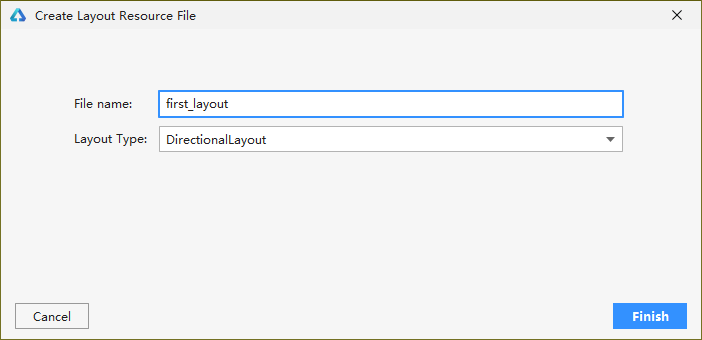

## 2、组件与布局


> 作者：韩茹
>
> 公司：程序咖（北京）科技有限公司
>
> 程序咖：IT职业技能评测平台
>
> 网址：https://www.chengxuka.com


HarmonyOS提供了Ability和AbilitySlice两个基础类，一个有界面的Ability可以由一个或多个AbilitySlice构成，AbilitySlice主要用于承载单个页面的具体逻辑实现和界面UI，是应用显示、运行和跳转的最小单元。AbilitySlice通过setUIContent为界面设置布局。

**表1** AbilitySlice的UI接口

| 接口声明                              | 接口描述                               |
| ------------------------------------- | -------------------------------------- |
| setUIContent(ComponentContainer root) | 设置界面入口，root为界面组件树根节点。 |

组件需要进行组合，并添加到界面的布局中。在Java UI框架中，提供了两种编写布局的方式：

- 在代码中创建布局：用代码创建Component和ComponentContainer对象，为这些对象设置合适的布局参数和属性值，并将Component添加到ComponentContainer中，从而创建出完整界面。
- 在XML中声明UI布局：按层级结构来描述Component和ComponentContainer的关系，给组件节点设定合适的布局参数和属性值，代码中可直接加载生成此布局。

这两种方式创建出的布局没有本质差别，在XML中声明布局，在加载后同样可在代码中对该布局进行修改。


### 一、组件分类

根据组件的功能，可以将组件分为布局类、显示类、交互类三类：

| 组件类别 | 组件名称                                                     | 功能描述                                                     |
| -------- | ------------------------------------------------------------ | ------------------------------------------------------------ |
| 布局类   | PositionLayout、DirectionalLayout、StackLayout、DependentLayout、TableLayout、AdaptiveBoxLayout | 提供了不同布局规范的组件容器，例如以单一方向排列的DirectionalLayout、以相对位置排列的DependentLayout、以确切位置排列的PositionLayout等。 |
| 显示类   | Text、Image、Clock、TickTimer、ProgressBar                   | 提供了单纯的内容显示，例如用于文本显示的Text，用于图像显示的Image等。 |
| 交互类   | TextField、Button、Checkbox、RadioButton/RadioContainer、Switch、ToggleButton、Slider、Rating、ScrollView、TabList、ListContainer、PageSlider、PageFlipper、PageSliderIndicator、Picker、TimePicker、DatePicker、SurfaceProvider、ComponentProvider | 提供了具体场景下与用户交互响应的功能，例如Button提供了点击响应功能，Slider提供了进度选择功能等。 |

框架提供的组件使应用界面开发更加便利，这些组件的具体功能说明及属性设置详见[API参考](https://developer.harmonyos.com/cn/docs/documentation/doc-references/overview-0000001054120033)。


### 二、代码创建布局

开发如下图所示界面，需要添加一个Text组件和Button组件。由于两个组件从上到下依次居中排列，可以选择使用竖向的DirectionalLayout布局来放置组件。


代码创建布局需要在AbilitySlice中分别创建组件和布局，并将它们进行组织关联。

#### 2.1 创建组件


1. 声明组件

   ```java
   Button button = new Button(getContext());
   ```

2. 设置组件大小

   ```java
   button.setWidth(ComponentContainer.LayoutConfig.MATCH_CONTENT);button.setHeight(ComponentContainer.LayoutConfig.MATCH_CONTENT);
   ```

3. 设置组件属性

   ```java
   button.setText("My name is Button.");button.setTextSize(50);
   ```

#### 2.2 创建布局并使用

1. 声明布局

   ```java
   DirectionalLayout directionalLayout = new DirectionalLayout(getContext());
   ```

2. 设置布局大小

   ```java
   directionalLayout.setWidth(ComponentContainer.LayoutConfig.MATCH_PARENT);directionalLayout.setHeight(ComponentContainer.LayoutConfig.MATCH_PARENT);
   ```

3. 设置布局属性

   ```java
   directionalLayout.setOrientation(Component.VERTICAL);
   ```

4. 将组件添加到布局中（视布局需要对组件设置布局属性进行约束）

   ```java
   directionalLayout.addComponent(button);
   ```

5. 将布局添加到组件树中

   ```java
   setUIContent(directionalLayout);
   ```

示例代码如下：

```java
public class ExampleAbilitySlice extends AbilitySlice {
    @Override
    public void onStart(Intent intent) {
        super.onStart(intent);
        // 声明布局
        DirectionalLayout directionalLayout = new DirectionalLayout(getContext());
        // 设置布局大小
        directionalLayout.setWidth(ComponentContainer.LayoutConfig.MATCH_PARENT);
        directionalLayout.setHeight(ComponentContainer.LayoutConfig.MATCH_PARENT);
        // 设置布局属性
        directionalLayout.setOrientation(Component.VERTICAL);
        directionalLayout.setPadding(32, 32, 32, 32);

        Text text = new Text(getContext());
        text.setText("My name is Text.");
        text.setTextSize(50);
        text.setId(100);
        // 为组件添加对应布局的布局属性
        DirectionalLayout.LayoutConfig layoutConfig = new DirectionalLayout.LayoutConfig(ComponentContainer.LayoutConfig.MATCH_CONTENT, ComponentContainer.LayoutConfig.MATCH_CONTENT);
        layoutConfig.alignment = LayoutAlignment.HORIZONTAL_CENTER;
        text.setLayoutConfig(layoutConfig);

        // 将Text添加到布局中
        directionalLayout.addComponent(text);

        // 类似的添加一个Button
        Button button = new Button(getContext());
        layoutConfig.setMargins(0, 50, 0, 0);
        button.setLayoutConfig(layoutConfig);
        button.setText("My name is Button.");
        button.setTextSize(50);
        ShapeElement background = new ShapeElement();
        background.setRgbColor(new RgbColor(0, 125, 255));
        background.setCornerRadius(25);
        button.setBackground(background);
        button.setPadding(10, 10, 10, 10);
        button.setClickedListener(new Component.ClickedListener() {
            @Override
            // 在组件中增加对点击事件的检测
            public void onClick(Component component) {
                // 此处添加按钮被点击需要执行的操作
            }
        });
        directionalLayout.addComponent(button);

        // 将布局作为根布局添加到视图树中
        super.setUIContent(directionalLayout);
    }
}
```

根据以上步骤创建组件和布局后的界面显示效果如[图1](https://developer.harmonyos.com/cn/docs/documentation/doc-guides/ui-java-component-layout-code-0000000000580072#ZH-CN_TOPIC_0000001065046954__fig3670192481817)所示。其中，代码示例中为组件设置了一个按键回调，在按键被按下后，应用会执行自定义的操作。

在代码示例中，可以看到设置组件大小的方法有两种：

- 通过setWidth/setHeight直接设置宽高。
- 通过setLayoutConfig方法设置布局属性来设定宽高。

这两种方法的区别是后者还可以增加更多的布局属性设置，例如：使用“alignment”设置水平居中的约束。另外，这两种方法设置的宽高以最后设置的作为最终结果。它们的取值一致，可以是以下取值：

- 具体以像素为单位的数值。
- MATCH_PARENT：表示组件大小将扩展为父组件允许的最大值，它将占据父组件方向上的剩余大小。
- MATCH_CONTENT：表示组件大小与它内容占据的大小范围相适应。


### 三、XML创建布局

XML声明布局的方式更加简便直观。每一个Component和ComponentContainer对象大部分属性都支持在XML中进行设置，它们都有各自的XML属性列表。某些属性仅适用于特定的组件，例如：只有Text支持“text_color”属性，但不支持该属性的组件如果添加了该属性，该属性则会被忽略。具有继承关系的组件子类将继承父类的属性列表，Component作为组件的基类，拥有各个组件常用的属性，比如：ID、布局参数等。

**ID**

```xml
ohos:id="$+id:text"
```

在XML中使用此格式声明一个对开发者友好的ID，它会在编译过程中转换成一个常量。尤其在DependentLayout布局中，组件之间需要描述相对位置关系，描述时要通过ID来指定对应组件。

布局中的组件通常要设置独立的ID，以便在程序中查找该组件。如果布局中有不同组件设置了相同的ID，在通过ID查找组件时会返回查找到的第一个组件，因此尽量保证在所要查找的布局中为组件设置独立的ID值，避免出现与预期不符合的问题。

**布局参数**

```xml
ohos:width="20vp"ohos:height="10vp"
```

与代码中设置组件的宽度和高度类似，在XML中它们的取值可以是：

- 具体的数值：10（以像素为单位）、10vp（以屏幕相对像素为单位）。
- match_parent：表示组件大小将扩展为父组件允许的最大值，它将占据父组件方向上的剩余大小。
- match_content：表示组件大小与它的内容占据的大小范围相适应。

#### 3.1 创建XML布局文件


1. 在DevEco Studio的“Project”窗口，打开“entry > src > main > resources > base”，右键点击“layout”文件夹，选择“New > Layout Resource File”，命名为“first_layout”。

   

2. 打开新创建的first_layout.xml布局文件，修改其中的内容，对布局和组件的属性和层级进行描述。

   ```xml
   <?xml version="1.0" encoding="utf-8"?>
   <DirectionalLayout
       xmlns:ohos="http://schemas.huawei.com/res/ohos"
       ohos:width="match_parent"
       ohos:height="match_parent"
       ohos:orientation="vertical"
       ohos:padding="32">
       <Text
           ohos:id="$+id:text"
           ohos:width="match_content"
           ohos:height="match_content"
           ohos:layout_alignment="horizontal_center"
           ohos:text="My name is Text."
           ohos:text_size="25fp"/>
       <Button
           ohos:id="$+id:button"
           ohos:margin="50"
           ohos:width="match_content"
           ohos:height="match_content"
           ohos:layout_alignment="horizontal_center"
           ohos:text="My name is Button."
           ohos:text_size="50"/>
   </DirectionalLayout>
   ```

   

#### 3.2 加载XML布局


在代码中需要加载XML布局，并添加为根布局或作为其他布局的子Component。

```java
package com.example.myapplication.slice;

import com.example.myapplication.ResourceTable;
import ohos.aafwk.ability.AbilitySlice;
import ohos.aafwk.content.Intent;
import ohos.agp.colors.RgbColor;
import ohos.agp.components.*;
import ohos.agp.components.element.ShapeElement;

public class ExampleAbilitySlice extends AbilitySlice {
    @Override
    public void onStart(Intent intent) {
        super.onStart(intent);
        // 加载XML布局作为根布局
        super.setUIContent(ResourceTable.Layout_first_layout);
        Button button = (Button) findComponentById(ResourceTable.Id_button);
        if (button != null) {
            // 设置组件的属性
            ShapeElement background = new ShapeElement();
            background.setRgbColor(new RgbColor(0, 125, 255));
            background.setCornerRadius(25);
            button.setBackground(background);

            button.setClickedListener(new Component.ClickedListener() {
                @Override
                // 在组件中增加对点击事件的检测
                public void onClick(Component component) {
                    // 此处添加按钮被点击需要执行的操作
                }
            });
        }
    }
}
```

