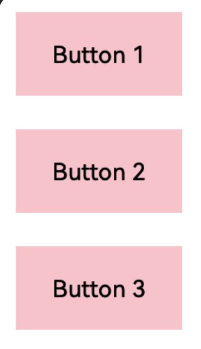
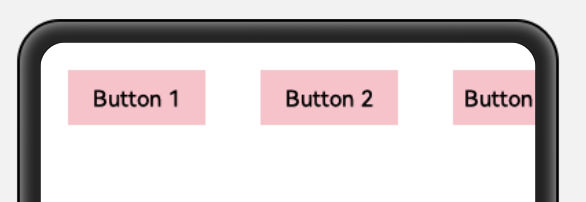
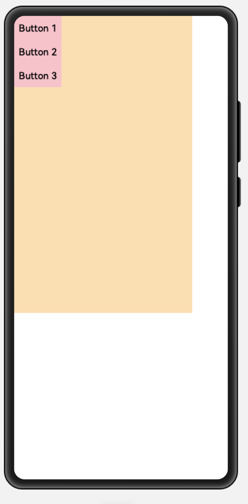
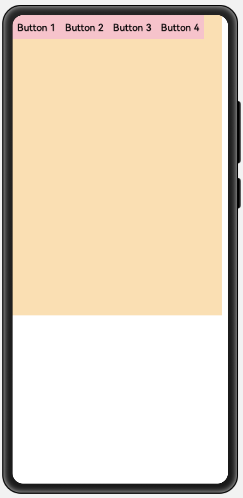

## 3、定向布局DirectionLayout


> 作者：韩茹
>
> 公司：程序咖（北京）科技有限公司
>
> 程序咖：IT职业技能评测平台
>
> 网址：https://www.chengxuka.com


DirectionalLayout是Java UI中的一种重要组件布局，用于将一组组件(Component)按照水平或者垂直方向排布，能够方便地对齐布局内的组件。该布局和其他布局的组合，可以实现更加丰富的布局方式。

DirectionalLayout示意图


### 一、支持的XML属性

DirectionalLayout的共有XML属性继承自：[Component](https://developer.harmonyos.com/cn/docs/documentation/doc-guides/ui-java-component-common-xml-0000001138483639)


| 属性名称   | 中文描述                                         | 取值                                   | 取值说明               | 使用案例                                                     |
| ---------- | ------------------------------------------------ | -------------------------------------- | ---------------------- | ------------------------------------------------------------ |
| id         | 控件identity，用以识别不同控件对象，每个控件唯一 | integer类型                            | 仅可用于配置控件的id。 | ohos:id="$+id:component_id"                                  |
| theme      | 样式                                             | 引用                                   | 仅可引用pattern资源。  | ohos:theme="$pattern:button_pattern"                         |
| width      | 宽度，必填项                                     | float类型，match_parent，match_content |                        | ohos:width="20"<br />ohos:width="10vp"<br />ohos:width="$float:size_value" |
| height     | 高度，必填项                                     | float类型，match_parent，match_content |                        | ohos:height="20" <br />ohos:height="20vp" <br />ohos:height="$float:size_value" |
| min_width  | 最小宽度                                         | float类型                              |                        | ohos:min_width="20"<br />ohos:min_width="20vp"<br />ohos:min_width="$float:size_value" |
| min_height | 最小高度                                         | float类型                              |                        | ohos:min_height="20"<br />ohos:min_height="20vp"<br />ohos:min_height="$float:size_value" |
| alpha      | 透明度                                           | float类型                              | 取值范围在0~1。        | ohos:alpha="0.86"<br />ohos:alpha="$float:value"             |
| enabled    | 是否启用                                         | boolean类型                            |                        | ohos:enabled="true"<br />ohos:enabled="$boolean:true"        |
| visibility | 可见性                                           | visible，invisible，hide               |                        | ohos:visibility="visible"                                    |
| padding    | 内间距                                           | float类型                              |                        |                                                              |
| margin     | 外边距                                           | float类型                              |                        |                                                              |


DirectionalLayout的自有XML属性见下表：详见[官方文档](https://developer.harmonyos.com/cn/docs/documentation/doc-guides/ui-java-layout-directionallayout-0000001050769565)：


| 属性名称     | 中文描述             | 取值              | 取值说明                                          | 使用案例                                                     |
| ------------ | -------------------- | ----------------- | ------------------------------------------------- | ------------------------------------------------------------ |
| orientation  | 子布局排列方向       | horizontal        | 表示水平方向布局。                                | ohos:orientation="horizontal"                                |
|              |                      | vertical          | 表示垂直方向布局。                                | ohos:orientation="vertical"                                  |
| alignment    | 对齐方式             | left              | 表示左对齐。                                      | 可以设置取值项如表中所列，也可以使用“\|”进行多项组合。ohos:alignment="top\|left"<br />ohos:alignment="left" |
|              |                      | top               | 表示顶部对齐。                                    |                                                              |
|              |                      | right             | 表示右对齐。                                      |                                                              |
|              |                      | bottom            | 表示底部对齐。                                    |                                                              |
|              |                      | horizontal_center | 表示水平居中对齐。                                |                                                              |
|              |                      | vertical_center   | 表示垂直居中对齐。                                |                                                              |
|              |                      | center            | 表示居中对齐。                                    |                                                              |
|              |                      | start             | 表示靠起始端对齐。                                |                                                              |
|              |                      | end               | 表示靠结束端对齐。                                |                                                              |
| total_weight | 所有子视图的权重之和 | float类型         | 可以直接设置浮点数值，也可以引用float浮点数资源。 | ohos:total_weight="2.5"<br />ohos:total_weight="$float:total_weight" |


DirectionalLayout所包含组件可支持的XML属性见下表：

**表2** DirectionalLayout所包含组件可支持的XML属性

| 属性名称         | 中文描述 | 取值              | 取值说明                                          | 使用案例                                                     |
| ---------------- | -------- | ----------------- | ------------------------------------------------- | ------------------------------------------------------------ |
| layout_alignment | 对齐方式 | left              | 表示左对齐。                                      | 可以设置取值项如表中所列，<br />也可以使用“\|”进行多项组合。<br />ohos:layout_alignment="top"<br />ohos:layout_alignment="top\|left" |
|                  |          | top               | 表示顶部对齐。                                    |                                                              |
|                  |          | right             | 表示右对齐。                                      |                                                              |
|                  |          | bottom            | 表示底部对齐。                                    |                                                              |
|                  |          | horizontal_center | 表示水平居中对齐。                                |                                                              |
|                  |          | vertical_center   | 表示垂直居中对齐。                                |                                                              |
|                  |          | center            | 表示居中对齐。                                    |                                                              |
| weight           | 比重     | float类型         | 可以直接设置浮点数值，也可以引用float浮点数资源。 | ohos:weight="1"<br />ohos:weight="$float:weight"             |

### 二、排列方式

DirectionalLayout的排列方向（orientation）分为水平（horizontal）或者垂直（vertical）方向。使用orientation设置布局内组件的排列方式，默认为垂直排列。

- **垂直排列**

垂直方向排列三个按钮，效果如下：




```xml
<?xml version="1.0" encoding="utf-8"?>
<DirectionalLayout
    xmlns:ohos="http://schemas.huawei.com/res/ohos"
    ohos:width="match_parent"
    ohos:height="match_content"
    ohos:orientation="horizontal">


<!--
    ohos:orientation="vertical"，垂直排列
    ohos:orientation="horizontal"，水平排列
-->
    <Button
        ohos:width="80vp"
        ohos:height="40vp"
        ohos:margin="20vp"
        ohos:text_size="16fp"
        ohos:background_element="$graphic:color_pink_element"
        ohos:text="Button 1"/>
    <Button
        ohos:width="80vp"
        ohos:height="40vp"
        ohos:margin="20vp"
        ohos:text_size="16fp"
        ohos:background_element="$graphic:color_pink_element"
        ohos:text="Button 2"/>
    <Button
        ohos:width="80vp"
        ohos:height="40vp"
        ohos:margin="20vp"
        ohos:text_size="16fp"
        ohos:background_element="$graphic:color_pink_element"
        ohos:text="Button 3"/>
</DirectionalLayout>
```

新增一个graphic文件，color_pink_element.xml：

```xml
<?xml version="1.0" encoding="utf-8"?>
<shape xmlns:ohos="http://schemas.huawei.com/res/ohos"
       ohos:shape="rectangle">
    <solid
        ohos:color="#FFC0CB"/>
</shape>
```


- **水平排列**

水平方向排列三个按钮，效果如下：


只需要修改上面的DirectionalLayout布局中的`ohos:orientation`属性即可：由`vertical`改为`horizontal`。

```xml
<DirectionalLayout
    xmlns:ohos="http://schemas.huawei.com/res/ohos"
    ohos:width="match_parent"
    ohos:height="match_content"
    ohos:orientation="horizontal">
  <!--
    ohos:orientation="vertical"，垂直排列
    ohos:orientation="horizontal"，水平排列
-->
```

要注意：

DirectionalLayout不会自动换行，其子组件会按照设定的方向依次排列，若超过布局本身的大小，超出布局大小的部分将不会被显示，例如：

```xml
<?xml version="1.0" encoding="utf-8"?>
<DirectionalLayout
    xmlns:ohos="http://schemas.huawei.com/res/ohos"
    ohos:width="match_parent"
    ohos:height="match_content"
    ohos:orientation="horizontal">


<!--
    ohos:orientation="vertical"，垂直排列
    ohos:orientation="horizontal"，水平排列
-->
    <Button
        ohos:width="100vp"
        ohos:height="40vp"
        ohos:margin="20vp"
        ohos:text_size="16fp"
        ohos:background_element="$graphic:color_pink_element"
        ohos:text="Button 1"/>
    <Button
        ohos:width="100vp"
        ohos:height="40vp"
        ohos:margin="20vp"
        ohos:text_size="16fp"
        ohos:background_element="$graphic:color_pink_element"
        ohos:text="Button 2"/>
    <Button
        ohos:width="100vp"
        ohos:height="40vp"
        ohos:margin="20vp"
        ohos:text_size="16fp"
        ohos:background_element="$graphic:color_pink_element"
        ohos:text="Button 3"/>
</DirectionalLayout>
```

还是之前的代码，我们将Button的宽度由80调整为100，效果如下：




### 三、对齐方式

DirectionalLayout中的组件使用layout_alignment控制自身在布局中的对齐方式，**当对齐方式与[排列方式](https://developer.harmonyos.com/cn/docs/documentation/doc-guides/ui-java-layout-directionallayout-0000001050769565#ZH-CN_TOPIC_0000001064278886__section134315425217)方向一致时，对齐方式不会生效**，如设置了水平方向的排列方式，则左对齐、右对齐将不会生效。


```xml
<?xml version="1.0" encoding="utf-8"?>
<DirectionalLayout
    xmlns:ohos="http://schemas.huawei.com/res/ohos"
    ohos:height="500vp"
    ohos:width="300vp"
    ohos:background_element="#FFDEAD"
    ohos:orientation="vertical"
    >
    <Button
        ohos:width="80vp"
        ohos:height="40vp"
        ohos:text_size="16fp"
        ohos:background_element="$graphic:color_pink_element"
        ohos:text="Button 1"/>
    <Button
        ohos:width="80vp"
        ohos:height="40vp"
        ohos:text_size="16fp"
        ohos:background_element="$graphic:color_pink_element"
        ohos:text="Button 2"/>
    <Button
        ohos:width="80vp"
        ohos:height="40vp"
        ohos:text_size="16fp"
        ohos:background_element="$graphic:color_pink_element"
        ohos:text="Button 3"/>
</DirectionalLayout>
```

默认效果如下：




现在是垂直方向的布局，3个按钮呈纵向排列，那么我们可以通过`layout_alignment`属性来设置他们的对齐方式就是横向上的，所以有效的属性值是：left，right，horizontal_center，center。

```xml
<?xml version="1.0" encoding="utf-8"?>
<DirectionalLayout
    xmlns:ohos="http://schemas.huawei.com/res/ohos"
    ohos:height="500vp"
    ohos:width="300vp"
    ohos:background_element="#FFDEAD"
    ohos:orientation="vertical"
    >
    <Button
        ohos:width="80vp"
        ohos:height="40vp"
        ohos:text_size="16fp"
        ohos:layout_alignment="left"
        ohos:background_element="$graphic:color_cyan_element"
        ohos:text="Button 1"/>
    <Button
        ohos:width="80vp"
        ohos:height="40vp"
        ohos:text_size="16fp"
        ohos:layout_alignment="horizontal_center"
        ohos:background_element="$graphic:color_cyan_element"
        ohos:text="Button 2"/>
    <Button
        ohos:width="80vp"
        ohos:height="40vp"
        ohos:text_size="16fp"
        ohos:layout_alignment="right"
        ohos:background_element="$graphic:color_cyan_element"
        ohos:text="Button 3"/>
</DirectionalLayout>
```

效果图：


如果是水平方向的布局，3个按钮呈横向排列，那么我们可以通过`layout_alignment`属性来设置他们的对齐方式就是纵向上的，所以有效的属性值是：top，bottom，vertical_center，center。

效果图：



设置对齐方式后：

```xml
<?xml version="1.0" encoding="utf-8"?>
<DirectionalLayout
    xmlns:ohos="http://schemas.huawei.com/res/ohos"
    ohos:height="500vp"
    ohos:width="350vp"
    ohos:background_element="#FFDEAD"
    ohos:orientation="horizontal"
    >
    <Button
        ohos:width="80vp"
        ohos:height="40vp"
        ohos:text_size="16fp"
        ohos:layout_alignment="top"
        ohos:background_element="$graphic:color_cyan_element"
        ohos:text="Button 1"/>
    <Button
        ohos:width="80vp"
        ohos:height="40vp"
        ohos:text_size="16fp"
        ohos:layout_alignment="vertical_center"
        ohos:background_element="$graphic:color_cyan_element"
        ohos:text="Button 2"/>
    <Button
        ohos:width="80vp"
        ohos:height="40vp"
        ohos:text_size="16fp"
        ohos:layout_alignment="center"
        ohos:background_element="$graphic:color_cyan_element"
        ohos:text="Button 3"/>
    <Button
        ohos:width="80vp"
        ohos:height="40vp"
        ohos:text_size="16fp"
        ohos:layout_alignment="bottom"
        ohos:background_element="$graphic:color_cyan_element"
        ohos:text="Button 4"/>
</DirectionalLayout>
```

效果图：


在DirectionLayout上使用alignment属性，也可以控制里面的内容的对齐方式：

```xml
<?xml version="1.0" encoding="utf-8"?>
<DirectionalLayout
    xmlns:ohos="http://schemas.huawei.com/res/ohos"
    ohos:height="match_parent"
    ohos:width="match_parent"
    ohos:orientation="vertical"
    ohos:alignment="bottom|right"
    >

    <Text
        ohos:height="200vp"
        ohos:width="200vp"
        ohos:background_element="#ff00ff"
        />
    <Text
        ohos:height="200vp"
        ohos:width="200vp"
        ohos:background_element="#ffff00"
        />
</DirectionalLayout>
```

效果图：


**写个例子，画个五饼：**其实这个例子使用DependentLayout布局，特别容易实现，但是此处为了练习，我们用DirectionLayout布局实现。


示例代码：

```xml
<?xml version="1.0" encoding="utf-8"?>
<DirectionalLayout
    xmlns:ohos="http://schemas.huawei.com/res/ohos"
    ohos:width="match_parent"
    ohos:height="match_parent"
    ohos:orientation="vertical">
<!--上面两个饼-->
    <DirectionalLayout
        ohos:width="match_parent"
        ohos:height="match_content"
        ohos:orientation="horizontal"
        >
        <Text
            ohos:width="80vp"
            ohos:height="80vp"
            ohos:background_element="$media:binggan"
            ohos:layout_alignment="left"
            />
        <DirectionalLayout
            ohos:height="match_content"
            ohos:weight="1"
            ohos:width="0vp"
            ohos:orientation="vertical">
            <Text
                ohos:width="80vp"
                ohos:height="80vp"
                ohos:background_element="$media:binggan"
                ohos:layout_alignment="right"
                />
        </DirectionalLayout>
    </DirectionalLayout>

<!--中间的饼-->

    <DirectionalLayout
        ohos:height="0vp"
        ohos:width="match_parent"
        ohos:weight="1"
        ohos:alignment="center"
        ohos:orientation="vertical">
        <Text
            ohos:width="80vp"
            ohos:height="80vp"
            ohos:background_element="$media:binggan"
            />
    </DirectionalLayout>


    <!--下面两个饼-->
    <DirectionalLayout
        ohos:width="match_parent"
        ohos:height="match_content"
        ohos:orientation="horizontal"
        >
        <Text
            ohos:width="80vp"
            ohos:height="80vp"
            ohos:background_element="$media:binggan"
            ohos:layout_alignment="left"
            />
        <DirectionalLayout
            ohos:height="match_content"
            ohos:weight="1"
            ohos:width="0vp"
            ohos:alignment="bottom|right"
            ohos:orientation="vertical">
            <Text
                ohos:width="80vp"
                ohos:height="80vp"
                ohos:background_element="$media:binggan"
                />
        </DirectionalLayout>
    </DirectionalLayout>
</DirectionalLayout>

```


### 四、权重

权重（weight）就是按比例来分配组件占用父组件的大小，在水平布局下计算公式为：

父布局可分配宽度=父布局宽度-所有子组件width之和；

组件宽度=组件weight/所有组件weight之和*父布局可分配宽度；

实际使用过程中，建议使用width=0来按比例分配父布局的宽度，1:1:1效果如下：


代码：

```xml
<?xml version="1.0" encoding="utf-8"?>
<DirectionalLayout
    xmlns:ohos="http://schemas.huawei.com/res/ohos"
    ohos:width="match_parent"
    ohos:height="match_content"
    ohos:orientation="horizontal">
    <Button
        ohos:width="0vp"
        ohos:height="20vp"
        ohos:weight="1"
        ohos:top_margin="20vp"
        ohos:background_element="$graphic:color_pink_element"
        ohos:text="Button 1"/>
    <Button
        ohos:width="0vp"
        ohos:height="20vp"
        ohos:weight="1"
        ohos:top_margin="20vp"
        ohos:background_element="$graphic:color_gray_element"
        ohos:text="Button 2"/>
    <Button
        ohos:width="0vp"
        ohos:height="20vp"
        ohos:weight="1"
        ohos:top_margin="20vp"
        ohos:background_element="$graphic:color_pink_element"
        ohos:text="Button 3"/>
</DirectionalLayout>
```

新增一个graphic文件：color_gray_element.xml：

```xml
<?xml version="1.0" encoding="utf-8"?>
<shape xmlns:ohos="http://schemas.huawei.com/res/ohos"
    ohos:shape="rectangle">
    <solid
        ohos:color="#878787"/>
</shape>
```


权重的例子，效果图如下：


示例代码：

```xml
<?xml version="1.0" encoding="utf-8"?>
<DirectionalLayout xmlns:ohos="http://schemas.huawei.com/res/ohos"
                   ohos:width="match_parent"
                   ohos:height="match_parent"
                   ohos:orientation="vertical">

    <!--
    上半部分：水平的DirectionalLayout
     -->
    <DirectionalLayout
        ohos:width="match_parent"
        ohos:height="0vp"
        ohos:weight="1"
        ohos:orientation="horizontal"
        >
        <Text
            ohos:width="0vp"
            ohos:height="match_parent"
            ohos:weight="1"
            ohos:background_element="#59D887"
            ohos:text_alignment="center"
            ohos:text="1"
            ohos:text_size="28fp"
            />
        <Text
            ohos:width="0vp"
            ohos:height="match_parent"
            ohos:weight="1"
            ohos:background_element="#88558D"
            ohos:text_alignment="center"
            ohos:text="2"
            ohos:text_size="28fp"
            />
        <Text
            ohos:width="0vp"
            ohos:height="match_parent"
            ohos:weight="1"
            ohos:background_element="#FCCF20"
            ohos:text_alignment="center"
            ohos:text="3"
            ohos:text_size="28fp"
            />
        <Text
            ohos:width="0vp"
            ohos:height="match_parent"
            ohos:weight="1"
            ohos:background_element="#6C8CE0"
            ohos:text_alignment="center"
            ohos:text="4"
            ohos:text_size="28fp"
            />


    </DirectionalLayout>

    <!--
    下半部分：垂直的DirectionalLayout
     -->
    <DirectionalLayout
        ohos:width="match_parent"
        ohos:height="0vp"
        ohos:weight="1"
        ohos:orientation="vertical"
        >
        <Text
            ohos:width="match_parent"
            ohos:height="0vp"
            ohos:weight="1"
            ohos:background_element="#59D887"
            ohos:text_alignment="center"
            ohos:text="a"
            ohos:text_size="28fp"
            />
        <Text
            ohos:width="match_parent"
            ohos:height="0vp"
            ohos:weight="1"
            ohos:background_element="#88558D"
            ohos:text_alignment="center"
            ohos:text="b"
            ohos:text_size="28fp"
            />
        <Text
            ohos:width="match_parent"
            ohos:height="0vp"
            ohos:weight="1"
            ohos:background_element="#FCCF20"
            ohos:text_alignment="center"
            ohos:text="c"
            ohos:text_size="28fp"
            />
        <Text
            ohos:width="match_parent"
            ohos:height="0vp"
            ohos:weight="1"
            ohos:background_element="#6C8CE0"
            ohos:text_alignment="center"
            ohos:text="d"
            ohos:text_size="28fp"
            />
    </DirectionalLayout>

</DirectionalLayout>

```


利用文本组件实现一个标题栏和详细内容的界面。


源码示例：

```xml
<?xml version="1.0" encoding="utf-8"?>
<DependentLayout
    xmlns:ohos="http://schemas.huawei.com/res/ohos"
    ohos:width="match_parent"
    ohos:height="match_parent"
    ohos:background_element="$graphic:color_light_gray_element">
    <Text
        ohos:id="$+id:text1"
        ohos:width="match_parent"
        ohos:height="match_content"
        ohos:text_size="25fp"
        ohos:top_margin="15vp"
        ohos:left_margin="15vp"
        ohos:right_margin="15vp"

        ohos:top_padding="10vp"
        ohos:bottom_padding="10vp"

        ohos:background_element="$graphic:background_text"
        ohos:text="Title"
        ohos:text_weight="1000"
        ohos:text_alignment="horizontal_center"/>
    <Text
        ohos:id="$+id:text2"
        ohos:width="match_parent"
        ohos:height="640vp"
        ohos:text_size="25fp"
        ohos:background_element="$graphic:background_text"
        ohos:text="Content"
        ohos:top_margin="15vp"
        ohos:left_margin="15vp"
        ohos:right_margin="15vp"
        ohos:bottom_margin="15vp"
        ohos:text_alignment="center"
        ohos:below="$id:text1"
        ohos:text_font="serif"/>
    <Button
        ohos:id="$+id:button1"
        ohos:width="100vp"
        ohos:height="match_content"
        ohos:text_size="15fp"
        ohos:background_element="$graphic:background_text"
        ohos:text="Previous"
        ohos:right_margin="15vp"
        ohos:bottom_margin="15vp"
        ohos:padding="5vp"
        ohos:below="$id:text2"
        ohos:left_of="$id:button2"
        ohos:text_font="serif"/>
    <Button
        ohos:id="$+id:button2"
        ohos:width="100vp"
        ohos:height="match_content"
        ohos:text_size="15fp"
        ohos:background_element="$graphic:background_text"
        ohos:text="Next"
        ohos:right_margin="15vp"
        ohos:bottom_margin="15vp"
        ohos:padding="5vp"
        ohos:align_parent_end="true"
        ohos:below="$id:text2"
        ohos:text_font="serif"/>
</DependentLayout>
```

color_light_gray_element.xml：

```xml
<?xml version="1.0" encoding="utf-8"?>
<shape xmlns:ohos="http://schemas.huawei.com/res/ohos"
    ohos:shape="rectangle">
    <solid
        ohos:color="#EDEDED"/>
</shape>
```

background_text.xml：

```xml
<?xml version="1.0" encoding="UTF-8" ?>
<shape xmlns:ohos="http://schemas.huawei.com/res/ohos"
       ohos:shape="rectangle">
    <corners
        ohos:radius="30"/>
    <solid
        ohos:color="#C0C0C0"/>
</shape>
```

