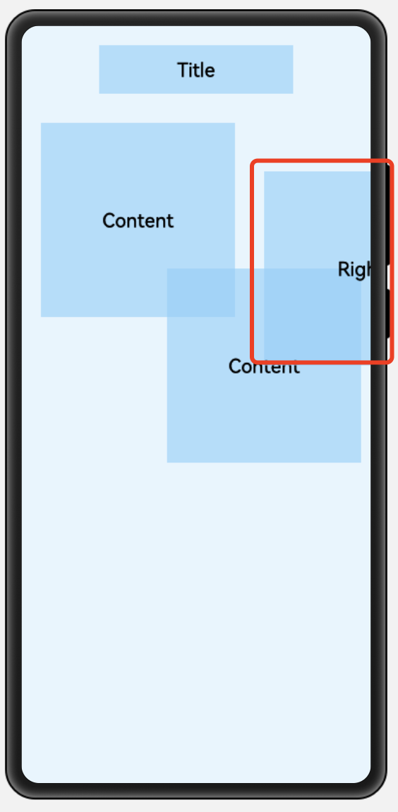

## 7、定位布局PositionLayout


> 作者：韩茹
>
> 公司：程序咖（北京）科技有限公司
>
> 程序咖：IT职业技能评测平台
>
> 网址：https://www.chengxuka.com

在PositionLayout中，子组件通过指定准确的x/y坐标值在屏幕上显示。(0, 0)为左上角；当向下或向右移动时，坐标值变大；允许组件之间互相重叠。


### 一、支持的XML属性

PositionLayout的共有XML属性继承自：[Component](https://developer.harmonyos.com/cn/docs/documentation/doc-guides/ui-java-component-common-xml-0000001138483639)


| 属性名称   | 中文描述                                         | 取值                                   | 取值说明               | 使用案例                                                     |
| ---------- | ------------------------------------------------ | -------------------------------------- | ---------------------- | ------------------------------------------------------------ |
| id         | 控件identity，用以识别不同控件对象，每个控件唯一 | integer类型                            | 仅可用于配置控件的id。 | ohos:id="$+id:component_id"                                  |
| theme      | 样式                                             | 引用                                   | 仅可引用pattern资源。  | ohos:theme="$pattern:button_pattern"                         |
| width      | 宽度，必填项                                     | float类型，match_parent，match_content |                        | ohos:width="20"<br />ohos:width="10vp"<br />ohos:width="$float:size_value" |
| height     | 高度，必填项                                     | float类型，match_parent，match_content |                        | ohos:height="20" <br />ohos:height="20vp" <br />ohos:height="$float:size_value" |
| min_width  | 最小宽度                                         | float类型                              |                        | ohos:min_width="20"<br />ohos:min_width="20vp"<br />ohos:min_width="$float:size_value" |
| min_height | 最小高度                                         | float类型                              |                        | ohos:min_height="20"<br />ohos:min_height="20vp"<br />ohos:min_height="$float:size_value" |
| alpha      | 透明度                                           | float类型                              | 取值范围在0~1。        | ohos:alpha="0.86"<br />ohos:alpha="$float:value"             |
| enabled    | 是否启用                                         | boolean类型                            |                        | ohos:enabled="true"<br />ohos:enabled="$boolean:true"        |
| visibility | 可见性                                           | visible，invisible，hide               |                        | ohos:visibility="visible"                                    |
| padding    | 内间距                                           | float类型                              |                        |                                                              |
| margin     | 外边距                                           | float类型                              |                        |                                                              |


### 二、布局方式

**PositionLayout以坐标的形式控制组件的显示位置，允许组件相互重叠。**

示例代码：

```xml
<?xml version="1.0" encoding="utf-8"?>
<PositionLayout
    xmlns:ohos="http://schemas.huawei.com/res/ohos"
    ohos:height="match_parent"
    ohos:width="match_parent"
    ohos:background_element="#3387CEFA"
    >

    <Text
        ohos:height="50vp"
        ohos:width="200vp"
        ohos:background_element="#9987CEFA"
        ohos:layout_alignment="horizontal_center"
        ohos:text="Title"
        ohos:text_size="20fp"
        ohos:text_alignment="center"
        ohos:position_x="80vp"
        ohos:position_y="20vp"
        />
    <Text
        ohos:height="200vp"
        ohos:width="200vp"
        ohos:background_element="#9987CEFA"
        ohos:position_x="20vp"
        ohos:position_y="100vp"
        ohos:text="Content"
        ohos:text_alignment="center"
        ohos:text_size="20fp"/>
    <Text
        ohos:height="200vp"
        ohos:width="200vp"
        ohos:background_element="#9987CEFA"
        ohos:position_x="150vp"
        ohos:position_y="250vp"
        ohos:text="Content"
        ohos:text_alignment="center"
        ohos:text_size="20fp"/>
</PositionLayout>
```


效果：


对于超过布局本身大小的组件，超出部分将不显示。

```xml
<?xml version="1.0" encoding="utf-8"?>
<PositionLayout
    ...
    >

    ...
    <Text

        ohos:height="200vp"
        ohos:width="200vp"
        ohos:background_element="#9987CEFA"
        ohos:position_x="250vp"
        ohos:position_y="150vp"
        ohos:text="Right"
        ohos:text_alignment="center"
        ohos:text_size="20fp"/>

</PositionLayout>
```

效果图：




设置子组件的坐标时（position_x和position_y属性），除了上述示例中的XML方式，还可以在对应的AbilitySlice中通过setPosition(int x, int y)接口设置。

重新创建一个布局文件：position_layout.xml

```xml
<?xml version="1.0" encoding="utf-8"?>
<PositionLayout
    xmlns:ohos="http://schemas.huawei.com/res/ohos"
    ohos:height="match_parent"
    ohos:width="match_parent"
    ohos:background_element="#99FDF5E6"
    >

    <Text
        ohos:id="$+id:text1"
        ohos:height="50vp"
        ohos:width="200vp"
        ohos:background_element="#99FFE4B5"
        ohos:layout_alignment="horizontal_center"
        ohos:text="Title"
        ohos:text_size="20fp"
        ohos:text_alignment="center"
        />
    <Text
        ohos:id="$+id:text2"
        ohos:height="200vp"
        ohos:width="200vp"
        ohos:background_element="#99FFE4B5"
        ohos:text="Content"
        ohos:text_alignment="center"
        ohos:text_size="20fp"/>
    <Text

        ohos:id="$+id:text3"
        ohos:height="200vp"
        ohos:width="200vp"
        ohos:background_element="#99FFE4B5"
        ohos:text="Content"
        ohos:text_alignment="center"
        ohos:text_size="20fp"/>
</PositionLayout>
```

然后打开slice下的MainAbilitySlice文件，首先修改一下要加载的布局文件：

```java
super.setUIContent(ResourceTable.Layout_position_layout);
```

然后获取Text组件，并设置positon，Java示例代码如下：

```java
package com.example.positionlayout.slice;

import com.example.positionlayout.ResourceTable;
import ohos.aafwk.ability.AbilitySlice;
import ohos.aafwk.content.Intent;
import ohos.agp.components.AttrHelper;
import ohos.agp.components.Text;

public class MainAbilitySlice extends AbilitySlice {
    @Override
    public void onStart(Intent intent) {
        super.onStart(intent);
        super.setUIContent(ResourceTable.Layout_position_layout);

        //获取Text组件
        Text title = (Text)findComponentById(ResourceTable.Id_text1);
        Text content1 = (Text)findComponentById(ResourceTable.Id_text2);
        Text content2 = (Text)findComponentById(ResourceTable.Id_text3);
//        ohos:position_x="200"
//        ohos:position_y="60"
        //这里的参数200，60，单位都是像素px。
        title.setPosition(200, 60);
        /*
        因为在xml布局文件中，我们使用的是vp，不是px，但是setPosition()方法的单位是px，所以这里我们转换一下。需要使用AttrHelper类。

        ohos.agp.components.AttrHelper类：
        提供了vp，fp到px的转换
        vp2px(float value, float density)-->static int基于屏幕密度将虚拟像素（vp）转换为像素值。
         */
        //AttrHelper.vp2px(20, AttrHelper.getDensity(this));//将20vp转为px

//        ohos:position_x="20vp"
//        ohos:position_y="100vp"
        content1.
          (AttrHelper.vp2px(20, AttrHelper.getDensity(this)), AttrHelper.vp2px(100, AttrHelper.getDensity(this)));
//        ohos:position_x="150vp"
//        ohos:position_y="250vp"
        content2.setPosition(AttrHelper.vp2px(150, AttrHelper.getDensity(this)), AttrHelper.vp2px(250, AttrHelper.getDensity(this)));
    }

}

```

然后启动模拟器运行：


这里关于vp，fp，px的单位转换，我们会在另一篇文章中，详细讲解。

