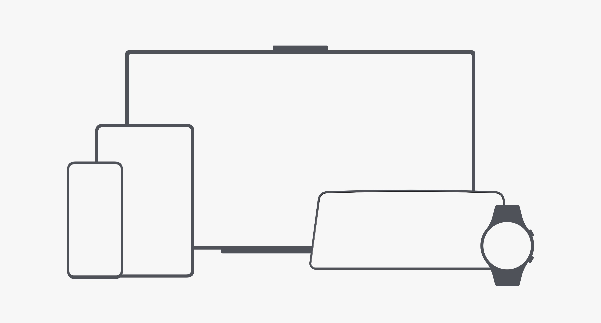

# HarmonyOS-100天从新手到大师

> 最近有很多小伙伴都在寻找HarmonyOS的学习资料，但是录制视频和设计教程都需要不少的时间，平时也在筹备[鸿蒙巴士](https://www.harmonybus.net/)的事情，所以时间上比较紧张，我和春哥分别负责一部分HarmonyOS内容的产出。从技术文章，到视频，到项目代码。也都公布在各大平台上，但是知乎上就只方便看技术文章，B站上就只方便看视频。所以我们在github上上传了我们所有的学习资料，从最基础的入门到项目设计，希望帮助更多想了解和学习HarmonyOS的伙伴，为方便大家交流学习，可以加入QQ群探讨。

因为是持续创作，所以也会持续更新。有些章节目录还没有内容，敬请期待。。创作不易，感谢大家的支持。也可以关注下方我们的公众号

这是华为官方对鸿蒙系统的定义。

**系统定位**

HarmonyOS是一款“面向未来”、面向全场景（移动办公、运动健康、社交通信、媒体娱乐等）的分布式操作系统。在传统的单设备系统能力的基础上，HarmonyOS提出了基于同一套系统能力、适配多种终端形态的分布式理念，能够支持手机、平板、智能穿戴、智慧屏、车机等多种终端设备。

- 对消费者而言，HarmonyOS能够将生活场景中的各类终端进行能力整合，可以实现不同的终端设备之间的快速连接、能力互助、资源共享，匹配合适的设备、提供流畅的全场景体验。

- 对应用开发者而言，HarmonyOS采用了多种分布式技术，使得应用程序的开发实现与不同终端设备的形态差异无关。这能够让开发者聚焦上层业务逻辑，更加便捷、高效地开发应用。
- 对设备开发者而言，HarmonyOS采用了组件化的设计方案，可以根据设备的资源能力和业务特征进行灵活裁剪，满足不同形态的终端设备对于操作系统的要求。

**什么是鸿蒙？什么能力？技术架构是什么样的？**

HarmonyOS 是面向未来的分布式操作系统，作为全场景战略举措的一部分向您开放，适用于移动办公、健身和健康、社交通信和媒体娱乐等。与运行在独立设备上的传统操作系统不同，鸿蒙操作系统建立在基于一组系统能力设计的分布式架构上。它能够在各种设备形式上运行。

对于应用开发者而言，鸿蒙采用分布式技术，让应用开发在不同的设备形态上成为可能。使用鸿蒙，您可以选择专注于上层服务逻辑，以更轻松、更高效的方式开发应用程序。

对于设备开发者来说，鸿蒙采用基于组件的软件设计，根据各自的资源能力和服务特性，针对特定的设备形态进行定制。

**HarmonyOS的哲学理念：“One as all，All as One”。一生万物，万物归一。**

HarmonyOS 设计理念，构建和谐的数字世界。概括为三个单词，One Harmonious Universe，简单的翻译就是一个和谐的宇宙。

 - One,万物归一，回归本源。鸿蒙OS强调以人为本的设计，通过严谨的实验探究体验背后的人因，并将其结论融入到鸿蒙OS的设计当中。
 - Harmonious，一生为二，平衡共生。万物皆有两面，虚与实、阴与阳、正与反...二者有所不同，但却可以很好地融合，达至平衡。
 - Universe，三生万物，演化自如。HarmonyOS 是面向多设备体验的操作系统，因此，给用户提供舒适便捷的多设备操作体验，是鸿蒙OS区别于其他操作系统的核心要点。

   

HarmonyOS 是一款面向全场景智慧生活方式的分布式操作系统。在传统的单设备系统能力的基础上，HarmonyOS 提出了基于同一套系统能力、适配多种终端形态的分布式理念，能够支持手机、平板、PC、智慧屏、智能穿戴、智能音箱、车机、耳机、AR/VR眼镜等多种终端设备。

对消费者而言，HarmonyOS 能够将生活场景中的各类终端进行能力整合，形成“One Super Device”，实现不同终端设备之间的极速连接、能力互助、资源共享，匹配合适的设备、提供流畅的全场景体验。

**给初学者的几个建议：**

- Make English as your working language.
- Practice makes perfect.
- All experience comes from mistakes.
- Don't be one of the leeches.
- Either stand out or kicked out.

### Day01~15 - [语言基础](./Day01-15 - 语言基础)

HarmonyOS提供了支持多种开发语言的API，供开发者进行应用开发。支持的开发语言包括Java、XML（Extensible Markup Language）、C/C++ 、 JS（JavaScript）、CSS（Cascading Style Sheets）和HML（HarmonyOS Markup Language）。

所以你要会一种编程语言。呃，15天，努努力应该差不多的吧。这里我们以Java语言为例。

#### Day01~05 - [Java语言基础入门](./Day01-15 - 语言基础/Day01-05 - Java语言基础入门)

##### Day01 - [Java语言初识](./Day01-15 - 语言基础/Day01-05 - Java语言基础入门/Day01 - Java语言初识.md)

- 1、正式学习前的扫盲 
- 2、Java介绍 - Java的历史 / Java语言的特点 / Java语言的应用场景
- 3、手把手教你搭建Java环境 - Windows系统 / Linux系统 / MacOS系统
- 4、带你安装编辑器 - Sublime Text / EditPlus / notepad++ 
- 5、人生中的第一个Java程序：HelloWorld
- 6、Java编码规范

##### Day02 - [基本语法](./Day01-15 - 语言基础/Day01-05 - Java语言基础入门/Day02 - 基本语法.md)

- 1、变量/常量 - 变量使用 / 变量的分析 / 变量的注意事项 / 常量的使用
- 2、基本数据类型 - byte / short / int /l ong / float / double / char / boolean 
- 3、运算符 - 赋值运算符 / 比较运算符 / 逻辑运算符 / 位运算符 / 位移运算符 / 三元运算符
- 4、键盘输入和打印输出 - 键盘输入 / 屏幕输出

##### Day03 - [分之语句和循环语句](./Day01-15(Go语言基础)/day03_数据类型&运算符.md)

- 1、循环结构的应用场景 - 条件 / 结构 / 代码块 / 流程图
- 2、分支语句 - if语句 / switch语句
- 3、局部变量的作用域
- 4、分之语句的注意事项
- 5、循环结构的应用场景 - 条件 / 结构 / 代码块 / 流程图
- 6、for循环 - 基本结构  / 循环中的分支结构 / 嵌套的循环 / for的其他写法
- 7、while循环 - 基本结构  / 循环中的分支结构 / 嵌套的循环 
- 8、do-while循环 - 基本结构  / 循环中的分支结构 / 嵌套的循环
- 9、循环控制语句 - break / continue

##### Day04 - [函数/方法](./Day01-15(Go语言基础)/day04_分支语句.md)

- 1、函数 - 函数的概念 / 函数的作用

- 2、函数的语法 - 定义函数 / 调用函数

- 3、函数的参数 - 参数的使用 / 可变参数 / 参数传递

- 4、函数的返回值 - 返回值 / return语句 / 没有返回值

- 5、变量作用域 - 局部变量 / 全局变量

- 6、递归函数 - 递归算法 / 递归函数实现

##### Day05 - [数组](./Day01-15(Go语言基础)/day05_循环语句.md)

- 1、数组 - 数组的概念 / 数组的使用 / 数组的语法 / 数组的长度 / 数组的注意点
- 2、数组的遍历 - 数组的下标 / 普通for遍历数组 / 增强for循环遍历
- 3、数组的排序 - 冒泡排序 / 选择排序 / 插入排序 。。。
- 4、多维数组 - 二维数组 / 二维数组的使用 / 二维数组的遍历
- 5、数组的数据类型 -引用类型的数据
- 6、数组的内存分析
- 7、工具类Arrays

#### Day06~08 - [面向对象](./Day01-15(Go语言基础))

##### Day06 - [面向对象初级](./Day01-15(Go语言基础)/day06_数组.md)

- 1、安装eclipse工具
- 2、包Package
- 3、面向对象的思想
- 4、类和对象
- 5、构造方法和this关键字

##### Day07 - [面向对象核心](./Day01-15(Go语言基础)/day07_Slice的使用.md)

- 1、面向对象之封装性
- 2、面向对象之继承性
- 3、面向对象之多态性

##### Day08 - [面向对象高级](./Day01-15(Go语言基础)/day08_Map的使用.md)

- 1、Object类
- 2、static和final
- 3、抽象类和接口
- 4、接口
- 5、内部类

#### Day09 - [常用类](./Day01-15(Go语言基础)/day09_string.md)

- 1、8种基本类型和对应的包装类
- 2、字符串
- 3、Math类
- 4、Random类
- 5、BigDecimal类
- 6、日期操作
- 7、Runtime类
- 8、System类
- 9、正则表达式
- 10、枚举类型

#### Day10 - [集合框架](./Day01-15(Go语言基础)/day10_函数.md)

- 1、集合框架结构
- 2、泛型的使用
- 3、List集合
- 4、Set集合
- 5、Queue队列
- 6、Deque双端队列
- 7、Map集合
- 8、Collections工具类

#### Day11 - [异常处理](./Day01-15(Go语言基础)/day11_包的管理.md)

- 1、异常的概念 - 什么是异常
- 2、异常的分类 - 按照严重程度分类 / 按照异常性质分类
- 3、捕获处理 - try...catch...finally语句 / 注意事项
- 4、抛出异常 - throws / throw / 二者的区别
- 5、自定义异常 - 什么是自定义异常 / 如何使用

#### Day12 - [I/O操作](./goon.md)

- 1、I/O的概念

- 2、File文件类

- 3、未完待续

  

#### Day13 - [多线程](./goon.md)

#### Day14 - [网络编程](./goon.md)

#### Day15 - [Java8/9/10](./goon.md)

#### Day16~18 - [基础加强](./goon.md)

##### Day16 - [json解析](./goon.md)

##### Day17 - [xml解析](./goon.md)

##### Day18 - [http网络访问](./goon.md)

#### Day19 - [HarmonyOS鸿蒙开发课前准备](./goon.md)

- 1、HarmonyOS鸿蒙开发概述
- 2、搭建环境和HelloWorld程序
- 3、真机运行

#### Day20~24 - [UI布局](./Day20-24 - UI布局)

##### Day20 - [界面布局](./Day20-24 - UI布局/Day20(界面布局)/Day20(界面布局).md)

- 1、Java UI框架概述
- 2、组件与布局
- 3、定向布局DirectionLayout
- 4、依赖布局DependentLayout
- 5、堆栈布局StackLayout
- 6、表格布局TableLayout
- 7、定位布局PositionLayout
- 8、自适应盒子布局AdaptivBoxLayout

##### Day21 - [常用UI组件1](./goon.md)

- 1、单位vp、fp、px
- 2、常用组件Text
- 3、组件Button
- 4、组件TextField
- 5、组件Image

##### Day22 - [常用UI组件2](./goon.md)

- 1、组件RadioButton和RadioContainer
- 2、组件Checkbox

##### Day23 - [常用UI组件3](./goon.md)

#### Day24 - [待定](./goon.md)

#### Day25 - [待定](./goon.md)

#### Day26~31 - [待定](./goon.md)

##### Day26 - [待定](./goon.md)

##### Day27 - [待定](./goon.md)

#### Day28~30 - [待定](./goon.md)

#### Day31 - [待定](./goon.md)

#### Day32~35 - [待定](./goon.md)

##### Day32 - [待定](./goon.md)

##### Day33 - [待定](./goon.md)

##### Day34 - [待定](./goon.md)

##### Day35 - [待定](./goon.md)

#### Day36~37 - [待定](./goon.md)

##### Day36 - [待定](./goon.md)

##### Day37 - [待定](./goon.md)

#### Day38~41 - [待定](./goon.md)

##### Day38 - [待定](./goon.md)

##### Day39 - [待定](./goon.md)

##### Day40 - [待定](./goon.md)

##### Day41 - [待定](./goon.md)

#### Day42~43 - [待定](./goon.md)

#### Day44 - [待定](./goon.md)

#### Day45 - [待定](./goon.md)

#### Day46~50 - [待定](./goon.md)

#### Day51 - [待定](./goon.md)

#### Day52 - [待定](./goon.md)

#### Day53 - [待定](./goon.md)

#### Day54~55 - [待定](../goon.md)

##### Day54 - [待定](../goon.md)

##### Day55 - [待定](./goon.md)

#### Day56~60 - [待定](./goon.md)

#### Day61 - [待定](./goon.md)

#### Day62~64 - [待定](./goon.md)

##### Day62 - [待定](./goon.md)

##### Day63 - [待定](./goon.md)

##### Day64 - [待定)](./goon.md)

#### Day65~75 - [待定](./goon.md)

##### Day65 - [待定](./goon.md)

##### Day66~67 - [待定](./goon.md)

#### Day68 - [待定](./goon.md)

#### Day69~70 - [待定](./goon.md)

#### Day60~75 - [待定](./goon.md)

#### Day76~95 - [待定](./goon.md)

#### Day76 - [待定](./goon.md)

#### Day77 - [待定](./goon.md)

#### Day78~79 - [待定](./goon.md)

#### Day78 - [待定](./goon.md)

#### Day79 - [待定](./goon.md)

 

### Day80 - [ 待定](./goon.md)

### Day81~82 - [待定](./goon.md)

#### Day81 - [待定](./goon.md)

#### Day82 - [待定](./goon.md)

### Day83~85 - [待定](./goon.md)

#### Day83 - [待定](./goon.md)

#### Day84 - [待定](./goon.md)

#### Day85 - [待定](./goon.md)

### Day86 - [待定](./goon.md)

### Day87 - [待定](./goon.md)

### Day88 - [待定](./goon.md5)

#### Day89~95 - [待定](./goon.md)

#### Day97 - [待定](./goon.md)

### Day97~100 - [完美收官](./goon.md)

#### Day97 - [项目部署和性能调优](./goon.md)

#### Day98 - [项目总结](./goon.md)

#### Day99 - [面试指导](./goon.md)

#### Day100 - [英文面试](./goon.md)

> 致谢：
>
> ​	感谢的程序咖以及鸿蒙巴士的所有同事，在技术上给与的指导和帮助。
